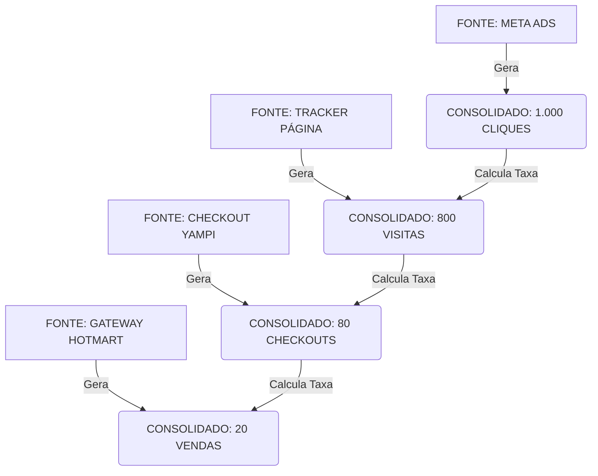

### O Conceito: "Agnosticismo de Fonte"
(Para o Dev ler)
> *Não importa se o dado veio da API do Facebook, de um CSV ou de um Webhook JSON. O seu trabalho é converter essa bagunça em **Números Consolidados**. O painel visual só enxerga esses números e as taxas que existem entre eles.*

---

**Para o Div. Arthur:**
1.  Você não cruza o banco da Trivvo com o banco do Facebook.
2.  Você gera o **Número B** (independente de como) e o **Número D** (independente de como).
3.  A visualização é apenas `B` comparado com `D`.

### O Esquema da Query Mestra (O Processador)

Imagine que existe um funil. A Query pega o banco de dados bruto e "esmaga" tudo até sair apenas uma linha por Anúncio.

**Visualização Lógica da Query:**

`AGRUPAR POR: ID_DO_ANUNCIO (Origem)`

| Nível / Camada | O que a Query Calcula (Consolidado) | Como ela calcula (A Lógica) | Conexão com o Nível Anterior (A Taxa) |
| :--- | :--- | :--- | :--- |
| **1. NÍVEL ADS** | **Métrica: TRÁFEGO BRUTO** *(Total de Cliques)* | Soma todos os `events` do tipo 'clique' vindos da API de Ads. | *N/A (É o início)* |
| **2. NÍVEL PÁGINA** | **Métrica: VISITANTES REAIS** *(Total de PageViews)* | Soma todos os logs do pixel/script da página com aquele ID. | **Connect Rate:** `Visitantes / Tráfego Bruto` |
| **3. NÍVEL CHECKOUT** | **Métrica: INTENÇÃO DE COMPRA** *(Total de Initiate Checkouts)* | Soma todos os webhooks de 'checkout_open' da plataforma. | **Conv. Página:** `Intenção / Visitantes` |
| **4. NÍVEL VENDA** | **Métrica: RESULTADO LÍQUIDO** *(Total de Vendas Confirmadas)* | Soma (Vendas Aprovadas + Upsells) SUBTRAINDO (Reembolsos). | **Conv. Checkout:** `Resultado / Intenção` |

---

### Como os Consolidados se Comunicam (O Fluxo de Dados)

Aqui está o desenho de como a informação flui. Note que cada camada produz um **Input** para a próxima.

---

### A Visualização Final (O Produto da Query)

Essa é a tabela que o sistema vai gerar na tela (frontend). Ela é **linear**, mas construída com dados de fontes totalmente diferentes.

**Exemplo de uma linha da Tabela Final:**

| ANÚNCIO (ID) | 1. TRÁFEGO (Ads) | ➡️ Taxa | 2. VISITAS (Pág) | ➡️ Taxa | 3. CHECKOUTS | ➡️ Taxa | 4. VENDAS (Liq) | ROAS |
| :--- | :--- | :--- | :--- | :--- | :--- | :--- | :--- | :--- |
| **Ad_Criativo_01** | **1.000** | *80%* | **800** | *10%* | **80** | *25%* | **20** | **3.5** |

**Legenda das Setas (➡️):**
*   As colunas em **Negrito** são os DADOS CONSOLIDADOS (Somas puras vindas das fontes).
*   As colunas em *Itálico* são as CÉLULAS CALCULADAS (Geradas pelo frontend/query dividindo a coluna da direita pela da esquerda).

### Resumo da Ordem de Serviço

1.  **Entrada:** Extrair dados de N fontes.
2.  **Processamento:** Ignorar detalhes do usuário. Somar tudo agrupado pelo `ID_ANUNCIO`.
3.  **Saída da Query:** Entregar 4 números inteiros para cada anúncio (Cliques, Visitas, ICs, Vendas).
4.  **Visualização:** Exibir os 4 números em sequência e colocar uma coluna de % (Taxa) entre eles automaticamente.

Essa estrutura isola os problemas. Se a "Taxa entre 1 e 2" estiver ruim, não importa a fonte do dado, sabemos que o problema é **carregamento/infra**. Se a "Taxa entre 2 e 3" estiver ruim, o problema é **copy/oferta**.