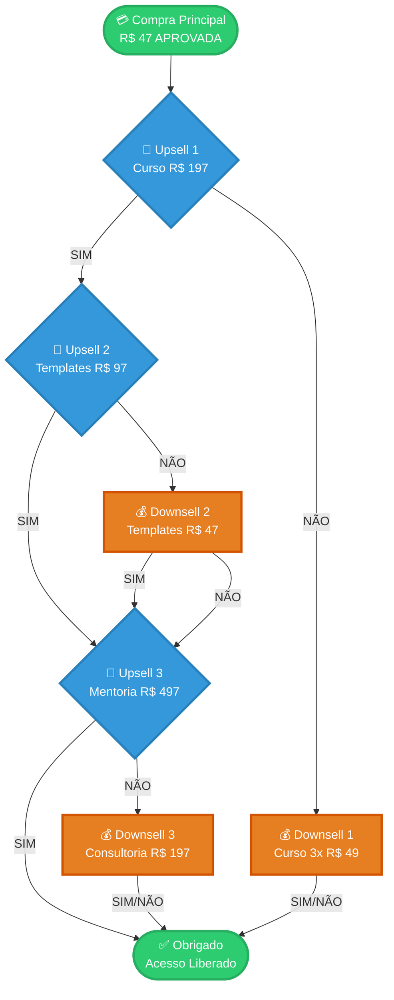
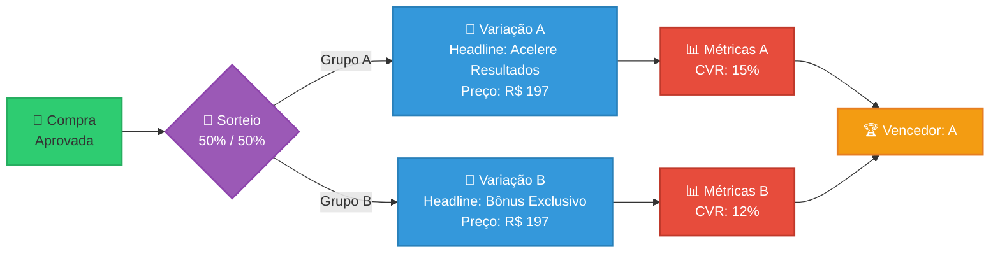

# 🎯 Guia Prático: Upsell & Downsell para Desenvolvedores

> **Para:** Equipe de Desenvolvimento
> **Objetivo:** Entender e implementar funil pós-compra com A/B Testing
> **Leitura:** 10 minutos

---

## 📌 Regra de Ouro

```
┏━━━━━━━━━━━━━━━━━━━━━━━━━━━━━━━━━━━━━━━━━━━━━┓
┃  MESMO PRODUTO ≠ MESMA OFERTA                ┃
┃                                              ┃
┃  O que importa é:                            ┃
┃  • QUANDO você oferece                       ┃
┃  • COMO o cliente chegou ali                 ┃
┃  • QUAL foi o comportamento anterior         ┃
┗━━━━━━━━━━━━━━━━━━━━━━━━━━━━━━━━━━━━━━━━━━━━┛
```

---

## 🔑 Conceitos Essenciais

### Upsell

**O que é:** Oferta de maior valor apresentada quando o cliente está **aquecido** (acabou de comprar)

**Quando mostrar:**
- ✅ Logo após compra aprovada
- ✅ Cliente demonstrou poder de compra
- ✅ Está no momento de decisão

**Exemplo:**
```
Cliente comprou: Ebook "Emagrecimento" por R$ 47
Upsell oferecido: Curso completo em vídeo por R$ 197
```

### Downsell

**O que é:** Oferta alternativa de **menor valor** quando o cliente **rejeitou** uma oferta maior

**Quando mostrar:**
- ✅ Cliente disse "não" ao upsell
- ✅ Última chance de monetização
- ✅ Recuperar venda perdida

**Exemplo:**
```
Cliente rejeitou: Mentoria por R$ 497
Downsell oferecido: Curso em vídeo por 3x R$ 49
```

---

## 🧠 Entendendo o Contexto

### Mesmo Produto = Ofertas Diferentes

| Situação | Produto | Preço | Contexto | Tipo |
|----------|---------|-------|----------|------|
| **A** | Curso "Marketing Digital" | R$ 297 à vista | Cliente acabou de comprar Ebook básico | **UPSELL** ⬆️ |
| **B** | Curso "Marketing Digital" | 6x R$ 49 | Cliente rejeitou Mentoria R$ 997 | **DOWNSELL** ⬇️ |

**Por que é diferente?**

```javascript
// Situação A: UPSELL
const context = {
  trigger: 'purchase_completed',
  customerMood: 'excited',
  previousAction: 'bought_cheap_product',
  psychology: 'momentum + desire_for_more'
}

// Situação B: DOWNSELL
const context = {
  trigger: 'offer_rejected',
  customerMood: 'hesitant',
  previousAction: 'declined_expensive_offer',
  psychology: 'price_sensitivity + fear_of_loss'
}
```

---

## 📊 Fluxo Completo: 3 Upsells + Downsells

### Visualização do Funil



### Tabela de Decisões

| Etapa | Cliente Aceita | Cliente Recusa | Próximo Passo |
|-------|----------------|----------------|---------------|
| **Upsell 1** | Vai para Upsell 2 | Vai para Downsell 1 | 🔀 |
| **Upsell 2** | Vai para Upsell 3 | Vai para Downsell 2 | 🔀 |
| **Upsell 3** | FIM (Obrigado) | Vai para Downsell 3 | 🏁 |
| **Downsell 1** | FIM (Obrigado) | FIM (Obrigado) | 🏁 |
| **Downsell 2** | Vai para Upsell 3 | Vai para Upsell 3 | ⚡ Estratégia! |
| **Downsell 3** | FIM (Obrigado) | FIM (Obrigado) | 🏁 |

### ⚡ Destaque: Estratégia do Downsell 2

```
┌─────────────────────────────────────────────────────┐
│ 💡 POR QUE D2 SEMPRE VAI PARA U3?                   │
├─────────────────────────────────────────────────────┤
│                                                     │
│  Se cliente:                                        │
│  • Aceitou D2 = Demonstrou interesse $             │
│  • Recusou D2 = Já viu 2 ofertas, última chance    │
│                                                     │
│  Resultado: Sempre mostrar U3 antes de terminar    │
│  Goal: Maximizar valor final do carrinho           │
│                                                     │
└─────────────────────────────────────────────────────┘
```

---

## 🧪 Sistema de A/B Testing

### Como Funciona



### Regras do A/B Test

1. **Sorteio Acontece 1 VEZ** por usuário
2. **Usuário fica no mesmo grupo** durante toda jornada
3. **Teste APENAS 1 variável** por vez
4. **Medir conversão E receita** (não só cliques)

```

### KPIs para Dashboard

| Métrica | Cálculo | Objetivo |
|---------|---------|----------|
| **Taxa de Conversão** | (Aceites ÷ Visualizações) × 100 | > 15% |
| **AOV** | Receita Total ÷ Nº Pedidos | > R$ 350 |
| **Taxa de Recuperação** | Aceites Downsell ÷ Recusas Upsell | > 10% |
| **Receita por Visitante** | Receita Funil ÷ Total Visitantes | > R$ 50 |

---

## 🎨 Interface: O que Mostrar

### Página de Upsell


┌────────────────────────────────────────────┐
│                                            │
│    [LOGO]                                  │
│                                            │
│    ⏰ Oferta Expira em 5:00               │
│                                            │
│    🎯 HEADLINE PODEROSA                   │
│    Subtítulo explicativo                   │
│                                            │
│    [Imagem do Produto]                     │
│                                            │
│    ✓ Benefício 1                          │
│    ✓ Benefício 2                          │
│    ✓ Benefício 3                          │
│                                            │
│    De: R$ 497                              │
│    Por apenas: R$ 197                      │
│                                            │
│    [🟢 SIM, EU QUERO! ]  (grande)         │
│                                            │
│    [ Não, obrigado ]     (pequeno)        │
│                                            │
└────────────────────────────────────────────┘

### Página de Downsell

┌────────────────────────────────────────────┐
│                                            │
│    [LOGO]                                  │
│                                            │
│    ⚡ ÚLTIMA CHANCE                        │
│                                            │
│    ⚠️ Espere! Antes de ir...              │
│    Headline de Urgência                    │
│                                            │
│    [Imagem do Produto]                     │
│                                            │
│    ❌ Preço original: R$ 197              │
│    ✅ Seu preço: 3x R$ 49                 │
│                                            │
│    🎁 Bônus inclusos                      │
│                                            │
│    [🟡 GARANTIR DESCONTO ]  (grande)      │
│                                            │
│    [ Continuar sem desconto ] (pequeno)   │
│                                            │
└────────────────────────────────────────────┘

---

## 📚 Referências

Este guia foi baseado em pesquisas de mercado e melhores práticas de 2025:

### Estratégias de Funil
- [Upsell Funnels: How to Create & Examples](https://www.flycart.org/blog/woocommerce/upsell-funnels)
- [Top 10 Upselling Techniques 2025](https://funnelkit.com/upselling-techniques/)
- [Shopify Post-Purchase Upsell Design Strategy](https://gempages.net/blogs/shopify/shopify-post-purchase-upsell-design)
- [WooCommerce Upsells Guide](https://funnelkit.com/woocommerce-upsells/)

### A/B Testing
- [A/B Split Testing to Optimize Sales Funnels](https://getwpfunnels.com/split-testing/)
- [A/B Testing Strategy: Data-Driven Revenue](https://funnelkit.com/ab-testing-strategy-one-click-upsells/)
- [What is A/B Testing - VWO Guide](https://vwo.com/ab-testing/)

### Contexto e Comportamento
- [Upsell vs Downsell Strategic Guide](https://optizenapp.com/shopify-questions/upsell-vs-downsell)
- [Upsell vs Downsell: Secrets to Boosting Sales](https://campaignrefinery.com/upsell-vs-downsell/)
- [Cross-Selling, Upselling & Downselling Differences](https://thrivethemes.com/cross-selling-upselling-and-downselling/)

---

## 💡 Resumo em 30 Segundos

```
1️⃣  Upsell = Oferta maior quando cliente está aquecido
2️⃣  Downsell = Oferta menor quando cliente rejeitou
3️⃣  Mesmo produto pode ser ambos (contexto importa!)
4️⃣  Máximo: 3 upsells + 3 downsells
5️⃣  A/B Test: Testar 1 variável, medir conversão + receita
6️⃣  Estratégia: D2 sempre leva para U3
7️⃣  Track TUDO: views, accepts, declines, revenue
```

---

<div align="center">

**🚀 Pronto para implementar!**

*Dúvidas? Revise os diagramas e exemplos de código acima*

</div>
