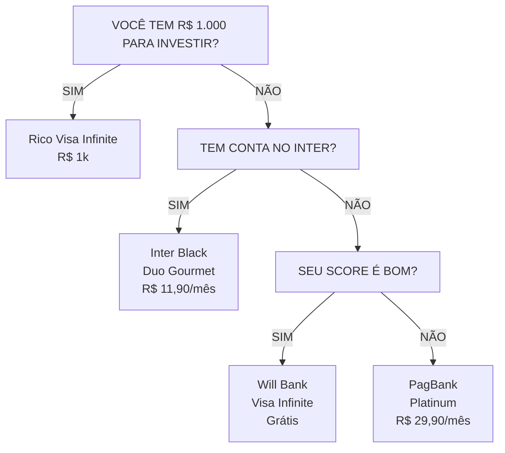
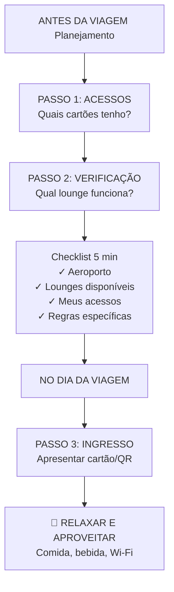

#  Guia Completo Sala VIP 0800™


*Por Lari Colares (@laricolares)*


## ✨ Boas-vindas à sua nova realidade de viagem!

E aí, futuro viajante VIP! Sou a Lari Colares.

Se você chegou até aqui, provavelmente está cansado de esperar seu voo em cadeiras desconfortáveis, pagando uma fortuna por um pão de queijo e um café aguado. Eu te entendo perfeitamente. Por anos, essa também foi a minha realidade.

Mas e se eu te dissesse que existe um universo paralelo dentro dos aeroportos? Um lugar com comida e bebida de graça, Wi-Fi que realmente funciona, poltronas que parecem abraços e até chuveiros para se refrescar antes de um voo longo.

**Esse lugar existe, são as Salas VIP. E você pode entrar nelas de graça.**

Não, você não precisa ter um cartão black ou ser milionário. Eu mesma, usando as técnicas que vou te ensinar, fiz 13 viagens em 10 meses, economizando mais de 200 mil reais e aproveitando o melhor que os aeroportos têm a oferecer.

Neste guia, eu vou te entregar o mapa da mina. Vou abrir a caixa-preta e te mostrar as **funções escondidas nos seus cartões comuns**, os apps gratuitos que são verdadeiras chaves mágicas e as regras que as companhias aéreas não fazem questão de divulgar.

Prepare-se para transformar a sua forma de viajar para sempre. Vamos começar?


## Capítulo 1: Vencendo as Barreiras de Entrada

Antes de mergulharmos nas técnicas, preciso falar sobre algo que eu vejo acontecer o tempo todo: pessoas que PODERIAM estar nas salas VIP, mas não estão. E sabe por quê? **Não é falta de dinheiro. Não é falta de cartão. É falta de INFORMAÇÃO e, principalmente, de CORAGEM.**

### A Síndrome do "Isso Não é Pra Mim"

Deixa eu adivinhar. Você já pensou alguma dessas coisas?

- "Sala VIP é coisa de rico, não é pro meu perfil"
- "Eu não tenho cartão Black, então nem adianta tentar"
- "Deve ser super complicado conseguir acesso"
- "Vão me julgar se eu entrar lá"
- "E se eu chegar na porta e não me deixarem entrar?"

**Eu sei exatamente como você se sente. Porque EU já senti isso.**

Na minha primeira vez tentando entrar numa sala VIP, eu quase desisti. Fiquei uns 10 minutos andando em círculos no aeroporto, com o coração na mão, pensando: "E se não funcionar? E se a recepcionista me olhar com cara de 'você não deveria estar aqui'?"

Mas sabe o que aconteceu quando eu finalmente juntei coragem? A moça da recepção passou meu cartão, sorriu e disse: "Seja bem-vinda! A senhora pode entrar." E pronto. **Era só isso.**

Todo aquele medo, toda aquela insegurança... eram só na minha cabeça.

### Por Que as Pessoas Não Tentam?

Depois de ensinar centenas de pessoas a acessarem salas VIP, identifiquei 3 barreiras principais que impedem as pessoas de começar:

#### 1. **Barreira do Desconhecimento**

A maioria das pessoas simplesmente NÃO SABE que tem direito a esses acessos. Os bancos não divulgam abertamente. Você tem que ir atrás.

Eu mesma tinha um cartão há 2 anos que me dava acesso a salas VIP e **nunca ninguém me contou isso**. Descobri por acaso lendo um artigo na internet. Dois anos jogados fora!

#### 2. **Barreira do "Não Sou Bom o Suficiente"**

Muita gente acha que precisa ter um "status" especial. Que precisa andar de terno, voar de executiva, ter uma renda altíssima.

**MENTIRA.**

Eu já entrei de chinelo, bermuda e camiseta (voo pro Nordeste, gente!). Ninguém me barrou. Ninguém me olhou torto. Porque o que vale é o SEU CARTÃO, não a sua roupa.

Se você tem o acesso, você TEM O DIREITO. Ponto final.

#### 3. **Barreira do "Não Sei por Onde Começar"**

"Ok Lari, eu quero. Mas como? Qual cartão eu pego? Como eu descubro se já tenho acesso? É muito burocrático?"

Essa é a barreira que este guia vai DESTRUIR. Porque eu vou te dar o passo a passo EXATO. Nada de teoria complicada. Só ação.

### Do Zero ao Primeiro Acesso: O Caminho Prático

Se você está começando do ZERO - sem cartão com benefícios, talvez com score baixo, talvez sem grande poder aquisitivo - aqui está o seu plano:

#### Passo 1: Construa ou Melhore Seu Histórico de Crédito

Se o seu score está baixo, você precisa trabalhar nisso ANTES de tentar cartões premium.

**Como melhorar seu score em 3-6 meses:**

1. **Pague tudo em dia**: Todas as contas. Água, luz, internet, celular. TUDO.
2. **Use cartões básicos de forma inteligente**: Pegue um cartão sem anuidade e use para pequenas compras. Pague sempre a fatura completa.
3. **Mantenha dívidas baixas**: Evite usar mais de 30% do seu limite.
4. **Não solicite vários cartões de uma vez**: Isso derruba seu score.

**Tempo estimado**: 3-6 meses de disciplina para ver melhora significativa.

#### Passo 2: Escolha Seu "Cartão Porta de Entrada"

Você não precisa começar com um Black. Existem cartões MUITO mais acessíveis que já te dão acessos a salas VIP.

**Opções para iniciantes (conforme pesquisa atualizada 2025):**

- **XP Visa Infinite**: Sem renda mínima, só precisa de R$ 5.000 investidos. Dá 2 acessos gratuitos/ano.
- **Inter Black (via Duo Gourmet)**: Se assinar o programa Duo Gourmet, consegue o cartão SEM os requisitos tradicionais + 6 acessos/ano LoungeKey.
- **Rico Visa Infinite**: Não exige renda mínima, investimento mínimo de R$ 1.000.

Vou detalhar todos esses cartões mais à frente. Por agora, saiba que **o caminho existe e é mais fácil do que parece**.

#### Passo 3: Faça Seu Primeiro Acesso (E Vença o Medo)

Depois de conseguir seu primeiro cartão com benefício, chegou a hora da verdade. E aqui vai a regra de ouro:

**🎯 Aja como se você já soubesse o que está fazendo.**

Não precisa mentir ou fingir ser rico. Mas também não precisa chegar tímido, pedindo desculpas por estar ali. Você TEM O DIREITO. Você pagou (seja com anuidade, investimentos ou gastos). Você MERECE estar lá.

**Script mental para o primeiro acesso:**

1. Localize a sala (use o app do programa ou pergunte a algum funcionário do aeroporto)
2. Chegue na recepção com confiança
3. Apresente seu cartão ou QR Code do app
4. Quando a recepcionista validar, diga apenas: "Obrigado(a)!"
5. Entre e aproveite

**É SÓ ISSO.** Não tem pegadinha. Não tem teste secreto. Se o seu acesso está valendo, você entra. Simples assim.

### O Mindset de Um Viajante VIP

Aqui está a verdade que ninguém te conta: **A diferença entre quem usa salas VIP e quem não usa não é dinheiro. É ATITUDE.**

Eu conheço gente que ganha R$ 30 mil por mês e nunca entrou numa sala VIP porque "acha difícil". E conheço gente que ganha R$ 5 mil, tem um cartão de cooperativa e aproveita TODOS os acessos.

A diferença? **Um acredita que merece. O outro não.**

Então, deixa eu te fazer uma pergunta direta:

**Você merece viajar com conforto?**

Se a resposta for "sim" (e deveria ser!), então o que está te impedindo? Medo de parecer "metido"? Medo de errar? Medo de ser julgado?

Esquece isso. Ninguém está olhando pra você. Ninguém está julgando. Todo mundo ali dentro está ocupado comendo, trabalhando ou descansando. **Ninguém liga pra você.**

E isso é LIBERTADOR.

### Próximos Passos

Agora que você entendeu que **você PODE e MERECE** estar nas salas VIP, vamos ao que interessa:

✅ Como descobrir se você já tem acessos escondidos nos seus cartões atuais
✅ Como escolher o cartão certo pro seu perfil e orçamento
✅ Como maximizar seus acessos ao longo do ano
✅ Como entrar e aproveitar ao máximo

É hora de sair da zona de conforto e entrar na **ZONA VIP**.

---

## Parte 1: O Sistema Acesso VIP™ - Seu Ingresso para o Conforto

Chega de teoria. Vamos direto ao ponto. O que você precisa é de um método. Um passo a passo claro que funciona sempre.

Eu chamo esse método de **Sistema A.V.I.** (Acessos, Verificação e Ingresso). É simples, prático e à prova de falhas.

### **A** de **ACESSOS**: Descubra o Ouro que Você Já Tem

A primeira coisa que você precisa entender é: você provavelmente **JÁ TEM** acessos a Salas VIP e não sabe. Eles estão escondidos em:

*   **Cartões de Crédito (até os mais básicos!):** Muitos cartões, mesmo sem anuidade, oferecem acessos através de programas parceiros como LoungeKey, Priority Pass ou Dragon Pass. Você vai aprender a identificar essas parcerias.
*   **Apps Gratuitos:** Existem aplicativos que, ao se cadastrar, te dão acessos gratuitos como cortesia.
*   **Companhias Aéreas e Alianças:** Dependendo da sua passagem ou categoria no programa de fidelidade, a porta do lounge pode estar aberta para você.

> 🚀 **Sua primeira missão:** Pegue todos os seus cartões de crédito. TODOS. Até aquele que está esquecido na gaveta. Nós vamos investigar cada um deles.

No nosso material extra **AcessoMap™**, você encontrará um guia visual para identificar rapidamente essas oportunidades em aeroportos brasileiros.

### **V** de **VERIFICAÇÃO**: O Checklist de 5 Minutos

De que adianta ter a chave se você não sabe qual porta ela abre? Antes de **CADA VIAGEM**, você vai fazer uma verificação rápida. É um processo de 5 minutos que vai te poupar horas de perrengue no aeroporto.

1.  **Aeroporto de Partida/Conexão:** Qual é o aeroporto?
2.  **Lounges Disponíveis:** Quais salas existem lá? (Consulte nosso **Lounge Unlocker™**).
3.  **Meus Acessos:** Quais dos meus cartões/apps me dão acesso a essas salas?
4.  **Regras de Acesso:** Preciso estar voando por uma cia específica? Posso levar acompanhante? O acesso é gratuito ou "paga pra usar"?

Com nosso **Checklist Pré-Viagem**, esse processo se torna automático. Você nunca mais vai chegar no aeroporto sem saber exatamente onde ir.

### **I** de **INGRESSO**: A Hora de Entrar e Aproveitar

Você chegou no aeroporto, passou pelo raio-x e já sabe para qual lounge ir. E agora?

É a hora mais fácil e gratificante!

1.  **Localize o Lounge:** Siga as placas. Eles geralmente ficam em áreas mais reservadas.
2.  **Apresente seu Acesso:** Chegue na recepção e apresente com confiança seu cartão de crédito elegível ou o QR Code do seu aplicativo. A recepcionista vai validar seu acesso.
3.  **Relaxe e Aproveite:** Entre e sinta-se em casa. Pegue uma bebida, conecte no Wi-Fi, escolha sua poltrona e relaxe. Você conseguiu!


> 😉 **Dica de Ouro:** A primeira vez pode dar um friozinho na barriga. É normal. Aja com naturalidade. Você tem o direito de estar ali. Em poucos minutos, você vai estar se perguntando como viveu tanto tempo sem isso.

---

## 🗺️ FLUXOGRAMA DECISÓRIO: QUAL CARTÃO COMEÇAR?

Use este fluxograma visual para descobrir POR ONDE COMEÇAR sua jornada VIP:



### 🎯 DECISÃO SIMPLIFICADA:

| SEU PERFIL | COMECE COM | PRÓXIMO PASSO |
|------------|-----------|---------------|
| **Iniciante total** | Rico (R$ 1k) ou Inter Duo | C6 Carbon em 1 ano |
| **Já invisto regularmente** | XP ou BTG (R$ 5k) | Genial (R$ 10k) |
| **Score baixo** | PagBank ou Méliuz | Will Bank → C6 |
| **Gasto alto/mês** | C6 Carbon ou Nubank Ultra | Inter Black full |
| **Quero o melhor** | Sicoob Merit ou Sicredi | Stackar com outro |

---

## 📊 TABELA VISUAL: ESTRUTURA DE PROGRAMAS DE LOUNGE


---

## 🔄 FLUXO DO SISTEMA A.V.I. EM AÇÃO



### 💡 POR QUE ESSE FLUXO FUNCIONA?

**Problema comum:** "Cheguei no aeroporto e não sabia que tinha acesso"
**Solução A.V.I.:** Você SEMPRE verifica ANTES de viajar

**Problema comum:** "Fui barrado porque meu cartão não era aceito"
**Solução A.V.I.:** Você verifica compatibilidade no passo 2

**Problema comum:** "Perdi tempo procurando o lounge"
**Solução A.V.I.:** Você já sabe exatamente onde fica (AcessoMap™)

---

## Parte 2: Desvendando os Mitos

*   **"Preciso de Cartão Black":** **MITO.** Muitos cartões Gold e Platinum, e até alguns sem categoria específica, dão acesso. O segredo está na bandeira e no programa parceiro, não no "status" do cartão.
*   **"É muito caro":** **MITO.** Estamos falando de acessos 0800, gratuitos. Você não vai pagar nada para entrar. O único investimento é o conhecimento que você está adquirindo agora.
*   **"É só para quem viaja de executiva":** **MITO.** Seu acesso via cartão ou app é independente da classe que você está voando. Você pode voar na econômica e esperar o voo como um rei.

---

## Capítulo 2: Anatomia de um Cartão de Crédito - Desvendando a Letra Miúda

Agora vamos falar sério sobre cartões de crédito. Porque não adianta ter um monte de cartões no bolso se você não sabe O QUE procurar.

A maioria das pessoas olha pra um cartão e vê apenas: "é Visa ou é Mastercard". Mas existe um UNIVERSO de informação escondida ali que pode significar a diferença entre você pagar R$ 200 de anuidade ou viajar de graça pro exterior.

### A Tríade dos Cartões: Bandeira, Emissor e Programa

Toda vez que você olha um cartão, existem 3 "personagens" envolvidos:

#### 1. **A BANDEIRA** (Visa, Mastercard, Elo, Amex)

É quem processa as transações. Pensa nelas como as "redes" de cartões.

**Por que isso importa pra você:**

- **Visa**: Tem o programa **Dragon Pass** (app Visa Airport Companion). Cartões Visa Platinum, Infinite e Signature podem ter acessos.
- **Mastercard**: Tem o programa **LoungeKey**. Cartões Mastercard Black geralmente dão acesso ilimitado ao Lounge Mastercard Black em Guarulhos.
- **Elo**: Parcerias com **LoungeKey** e **Priority Pass**. Cartões Elo Nanquim e Elo Diners Club costumam ter ótimos benefícios.
- **American Express (Amex)**: Tem as próprias salas (American Express Lounge). Mas atenção: no Brasil, Amex é mais restrito.

**Regra de Ouro**: TODO Mastercard Black e TODO Visa Infinite tem ALGUM tipo de acesso a sala VIP. A questão é: gratuito ou pago?

#### 2. **O EMISSOR** (Banco, Fintech, Cooperativa)

É quem emite o cartão pra você. Ex: Bradesco, Itaú, C6 Bank, Nubank, Sicoob, etc.

**Por que isso importa pra você:**

Dois cartões com a MESMA bandeira (ex: ambos Visa Infinite) podem ter benefícios COMPLETAMENTE diferentes dependendo do emissor.

**Exemplo prático:**
- **Itaú Visa Infinite**: Pode ter 4 acessos LoungeKey/ano
- **XP Visa Infinite**: Tem 2-4 acessos Dragon Pass/ano + é grátis

Mesmo bandeira, benefícios diferentes. Por quê? Porque cada emissor negocia seus próprios pacotes de benefícios.

#### 3. **O PROGRAMA DE BENEFÍCIOS** (LoungeKey, Priority Pass, Dragon Pass)

É o programa que de fato te dá acesso às salas VIP.

**Os 3 principais no Brasil:**

| Programa | Como Funciona | Quais Cartões Costumam Ter |
|----------|---------------|---------------------------|
| **LoungeKey** | Maior rede no Brasil. Mais de 1.100 lounges no mundo. | Mastercard Black, C6 Carbon, Inter Black, Sicoob/Sicredi Black |
| **Priority Pass** | Rede global com 1.400+ lounges. Muito forte nos EUA e Europa. | Poucos cartões brasileiros (Elo Diners, alguns Black específicos) |
| **Dragon Pass** (Visa Airport Companion) | Rede da Visa. 1.700+ lounges + restaurantes. | Visa Platinum, Visa Infinite, Visa Signature |

**Dica Matadora**: Um cartão pode ter acesso a MAIS DE UM programa ao mesmo tempo. Ex: O BRB Dux Visa Infinite dá acesso aos 3 (LoungeKey + Priority Pass + Dragon Pass) com até 3 convidados. É o unicórnio dos cartões!

### Hierarquia de Cartões - Descomplicada

Você deve ter ouvido falar de Gold, Platinum, Black, Infinite, Signature... Mas o que diabos isso significa na prática?

Aqui está a hierarquia do MENOS pro MAIS premium:

```
1. Standard / Clássico (sem categoria)
   └─ Benefício VIP: Raro / Nenhum

2. Gold / Ouro
   └─ Benefício VIP: Raro, alguns têm

3. Platinum
   └─ Benefício VIP: **SIM!** (geralmente 2-4 acessos/ano)

4. Infinite / Signature (Visa)
   └─ Benefício VIP: **SIM!** (geralmente 2-6 acessos/ano, às vezes ilimitado)

5. Black (Mastercard)
   └─ Benefício VIP: **SIM, ILIMITADO** (LoungeKey na maioria)

6. Nanquim / Diners (Elo)
   └─ Benefício VIP: **SIM** (Priority Pass ou LoungeKey)

7. The Platinum Card (Amex)
   └─ Benefício VIP: **SIM** (Lounges Amex + Priority Pass)
```

**⚠️ IMPORTANTE**: Essa hierarquia é GERAL. Existem exceções. Alguns Platinum são melhores que alguns Infinite. Sempre confira os benefícios ESPECÍFICOS do seu cartão!

### Como Ler os Benefícios: O Que Realmente Importa

Quando você está pesquisando um cartão, foque nessas 5 perguntas:

#### 1. **Quantos acessos gratuitos por ano?**

- "Ilimitado" = JACKPOT!
- "4-6 acessos/ano" = Ótimo pra quem viaja ocasionalmente
- "2 acessos/ano" = Melhor que nada, mas limitado
- "Acesso pago" = Você TEM acesso, mas paga uns US$ 32 por entrada. Evite.

#### 2. **Acompanhantes entram de graça?**

Muitos cartões só liberam o TITULAR de graça. Acompanhantes pagam.

**Exceção incrível**: Sicoob Mastercard Black Merit → titular + 5 adicionais + acompanhantes ilimitados. É basicamente "leve a família inteira".

#### 3. **O acesso é por programa (LK, PP, DP) ou por sala específica?**

- **Por programa**: Você pode usar em qualquer lounge da rede. MELHOR.
- **Por sala específica**: Só funciona em 1 ou 2 salas. Exemplo: "Acesso ao Lounge Mastercard Black em GRU". Limitado, mas ainda assim útil.

#### 4. **Quando os acessos renovam?**

- **Ano calendário** (1º de janeiro): Mais fácil de lembrar.
- **Aniversário do cartão**: Precisa anotar a data!

#### 5. **A anuidade é grátis, negociável ou fixa?**

Falaremos MUITO sobre isso na próxima seção.

### Os 5 Scripts de Negociação de Anuidade

Chegou a hora do OURO. Como negociar (e muitas vezes ZERAR) a anuidade do seu cartão.

Esses scripts foram testados por mim e por centenas de pessoas da minha comunidade. **Eles funcionam.**

---

#### **SCRIPT 1: O Cliente Insatisfeito (Ameaça de Cancelamento)**

**Quando usar**: Você tem o cartão há pelo menos 1 ano, usa regularmente e paga em dia.

**Como fazer**: Ligue para a central do cartão.

**O que dizer:**

> "Olá, eu sou cliente há [X anos] e sempre paguei minha fatura em dia. Porém, a anuidade de R$ [valor] está pesada pro meu orçamento. Eu vi que o banco [nome do concorrente] oferece um cartão similar sem anuidade. Estou considerando cancelar o meu cartão e migrar pra lá. Vocês têm alguma condição especial pra me manter como cliente?"

**O que vai acontecer:**

1ª rodada: Vão oferecer 50% de desconto.
2ª rodada (você recusa): Vão oferecer isenção por 12 meses ou isenção total.

**Taxa de sucesso**: ~70% conseguem pelo menos 50% de desconto. ~40% conseguem isenção total.

---

#### **SCRIPT 2: O Bom Pagador com Gastos Altos**

**Quando usar**: Você gasta pelo menos R$ 3.000-5.000/mês no cartão.

**Como fazer**: Ligue para a central.

**O que dizer:**

> "Olá, eu uso bastante o meu cartão. Meu gasto médio é de R$ [valor]/mês. Eu gostaria de saber se há alguma condição especial de isenção de anuidade para clientes com esse perfil de uso?"

**O que vai acontecer:**

Bancos ADORAM clientes que gastam. Você está gerando receita pra eles (via taxas dos lojistas). É muito provável que concedam isenção.

**Taxa de sucesso**: ~80% de isenção se gastar acima de R$ 5k/mês.

---

#### **SCRIPT 3: O Investidor (Para Bancos Digitais e Corretoras)**

**Quando usar**: Você tem investimentos no banco/corretora que emite o cartão.

**Como fazer**: Fale com seu gerente ou ligue para a central.

**O que dizer:**

> "Eu tenho R$ [valor] investidos aqui. Eu vi que clientes com investimentos acima de [X] têm isenção de anuidade do cartão [nome]. Como eu faço pra conseguir essa isenção?"

**O que vai acontecer:**

Eles vão te dar a isenção ou te dizer o valor exato que precisa investir. Muitas vezes, investir R$ 5-10 mil pode te dar um cartão Black grátis. Vale MUITO a pena.

**Taxa de sucesso**: ~90% se atingir o valor mínimo.

---

#### **SCRIPT 4: O Upgrade Estratégico**

**Quando usar**: Você tem um cartão "inferior" (ex: Gold) e quer o Black/Infinite de graça.

**Como fazer**: Ligue para a central.

**O que dizer:**

> "Olá, eu sou cliente há [X anos] e tenho o cartão [nome]. Eu gostaria de fazer um upgrade para o cartão [Black/Infinite]. Porém, só me interessa se a anuidade for isenta. Vocês conseguem fazer esse upgrade com isenção?"

**O que vai acontecer:**

Se você tem bom histórico, muitas vezes fazem o upgrade E isentam a anuidade por 12 meses (ou permanentemente). Você não perde nada tentando.

**Taxa de sucesso**: ~50%. Depende muito do seu relacionamento com o banco.

---

#### **SCRIPT 5: A Negociação Pós-Cobrança**

**Quando usar**: Você JÁ foi cobrado da anuidade e quer reverter.

**Como fazer**: Ligue IMEDIATAMENTE após a cobrança (até 7 dias depois).

**O que dizer:**

> "Olá, eu fui cobrado da anuidade de R$ [valor] e gostaria de negociar. Eu não concordo com esse valor. Quais são as opções que vocês têm pra mim? Posso solicitar o estorno dessa cobrança e a isenção futura?"

**O que vai acontecer:**

Muitos bancos ESTORNAM a cobrança se você reclamar logo. É um hack pouco conhecido, mas funciona.

**Taxa de sucesso**: ~60% conseguem estorno + algum desconto futuro.

---

### Quando Pedir Isenção e Quando Pedir Upgrade

**Peça ISENÇÃO se:**
- Você já tem o cartão que quer e só precisa zerar a anuidade
- Seus gastos mensais são altos (acima de R$ 5 mil)
- Você tem investimentos no banco

**Peça UPGRADE se:**
- Você tem um cartão básico e quer mais benefícios
- Seu perfil de crédito melhorou
- Você quer consolidar benefícios em menos cartões

**Nunca peça upgrade se**: Você não tem como justificar (renda, gastos, investimentos). Vai ser negado e vai piorar suas chances futuras.

### Checklist: Está Na Hora de Pedir Novo Cartão?

Use este checklist pra saber se você está pronto:

- [ ] Seu score de crédito está acima de 600 (idealmente 700+)
- [ ] Você não solicitou nenhum cartão nos últimos 3 meses
- [ ] Você paga suas contas em dia há pelo menos 6 meses
- [ ] Você tem renda/investimentos que atendem aos requisitos mínimos do cartão
- [ ] Você realmente VAI usar os benefícios (não é só "pra ter")

Se marcou 4-5 itens: **PODE IR!**
Se marcou 2-3: Trabalhe mais alguns meses no seu perfil.
Se marcou 0-1: Foque em melhorar seu score primeiro.

---

### Resumo do Capítulo

Agora você sabe:

✅ A diferença entre Bandeira, Emissor e Programa
✅ Como a hierarquia de cartões realmente funciona
✅ O que procurar nos benefícios (acessos, acompanhantes, renovação)
✅ **5 scripts testados pra negociar anuidade**
✅ Quando pedir isenção vs upgrade

Com esse conhecimento, você não é mais refém dos bancos. Você sabe exatamente o que perguntar, o que exigir e como conseguir o melhor deal possível.

Próximo passo? Vamos montar sua **estratégia de organização** para você nunca mais se perder no meio de tantos cartões e benefícios.

---

## Capítulo 3: Estratégias de Organização e Stacking - O Sistema que Multiplica Seus Benefícios

Você já sabe COMO conseguir cartões. Agora vou te ensinar a ORGANIZAR e COMBINAR eles de forma que você maximize todos os benefícios sem ficar louco no processo.

Porque não adianta ter 5 cartões se você não lembra qual dá acesso onde, quando renovam os acessos ou qual usar em cada situação.

### O Problema dos Múltiplos Cartões

Deixa eu adivinhar o que acontece com você:

- Você tem 2-3 cartões mas só usa 1 (porque é o que você lembra)
- Você já perdeu acessos porque esqueceu de usar antes de renovar
- Você não sabe de cabeça quantos acessos ainda tem disponíveis
- Na hora de viajar, você fica na dúvida: "qual cartão eu uso aqui mesmo?"

**Isso acaba HOJE.**

### O Sistema de Organização em 3 Camadas

Vou te ensinar um sistema simples que eu uso (e centenas de alunos também):

#### **Camada 1: O Inventário (Saber O Que Você Tem)**

Primeira coisa: você precisa de um lugar central onde você vê TODOS os seus cartões e benefícios.

**Ferramenta**: Planilha Google Sheets ou Notion (qualquer um serve, desde que você acesse de qualquer lugar).

**Template do Inventário**:

| Cartão | Bandeira | Programa | Acessos/Ano | Já Usei | Restantes | Data Renovação | Anuidade | Status |
|--------|----------|----------|-------------|---------|-----------|----------------|----------|--------|
| C6 Carbon | Mastercard Black | LoungeKey | 4 | 2 | 2 | 15/03/2026 | R$ 0 | Ativo |
| XP Infinite | Visa Infinite | Dragon Pass | 2 | 0 | 2 | 01/01/2026 | R$ 0 | Ativo |
| Inter Black | Mastercard Black | LoungeKey | Ilimitado | 8 | ∞ | - | R$ 0* | Ativo |

**Preencha isso AGORA** com seus cartões atuais.

*Dica*: Coloque um lembrete no celular 30 dias ANTES da renovação pra usar os acessos que estão sobrando!

#### **Camada 2: A Estratégia (Saber QUANDO Usar Cada Um)**

Agora que você sabe o que tem, precisa de um plano de uso.

**Regra de Ouro: Use o Cartão CERTO na Hora CERTA**

**Exemplo de Estratégia:**

1. **Para viagens domésticas frequentes**: Use o cartão com acesso ILIMITADO (ex: Inter Black, Sicoob Black Merit)
2. **Para viagens internacionais**: Guarde os acessos limitados (ex: 2-4 acessos/ano) para aeroportos no exterior onde você realmente precisa
3. **Final do ano**: QUEIME todos os acessos que não usou (porque vão renovar mesmo)

**Caso Real**: Eu tinha 4 acessos do C6 Carbon que renovariam em janeiro. Em dezembro, fiz 2 viagens domésticas SÓ pra usar esses acessos. Aproveitei e visitei amigos. Win-win!

#### **Camada 3: O Controle (Rastrear o Uso)**

Toda vez que você usar um acesso, atualize sua planilha.

**Por quê?** Porque apps de bancos às vezes demoram a atualizar. Se você não anotar, vai esquecer.

**Sistema rápido:**
- Usou um acesso? Abra a planilha e atualize na hora (leva 10 segundos)
- Ou tire um print da tela do lounge confirmando o uso

### Stacking de Benefícios: A Arte de Combinar Cartões

Aqui é onde a mágica acontece. "Stacking" significa empilhar benefícios pra maximizar retorno.

#### **Estratégia 1: O Combo "Pontos + Acesso"**

Use cartões que acumulam pontos/milhas E dão acesso a salas VIP.

**Exemplo**:
- **Nubank Ultravioleta**: Acumula pontos Nubank + 4 acessos Priority Pass/ano + lounge próprio ilimitado
- **LATAM Pass Itaú Black**: Acumula pontos LATAM + acesso ao LATAM Lounge

**Como fazer**:
1. Concentre seus gastos no cartão que gera pontos
2. Use os acessos VIP desse mesmo cartão
3. Com os pontos, compre passagens aéreas
4. Use os acessos das salas VIP nessas viagens

**Resultado**: Você viaja gastando ZERO e ainda relaxa nas salas VIP. É o ciclo perfeito.

#### **Estratégia 2: A "Escada de Cartões"**

Comece com cartões fáceis e vá evoluindo conforme seu perfil melhora.

**Rota Sugerida**:

```
ANO 1: Cartão Básico (sem benefícios)
   └─> Objetivo: Construir score e histórico
   └─> Ex: Cartão Nubank padrão, C6 Bank básico

ANO 2: Primeiro Cartão com Benefício
   └─> Objetivo: Primeiros acessos VIP
   └─> Ex: XP Visa Infinite (R$ 5k investidos), Rico Infinite (R$ 1k investidos)

ANO 3: Upgrade pra Black/Infinite de Cooperativa
   └─> Objetivo: Acesso ilimitado
   └─> Ex: Sicoob Black Merit, Sicredi Infinite

ANO 4: Diversificação Estratégica
   └─> Objetivo: Ter backup e cobrir mais programas
   └─> Ex: Adicionar um Visa Infinite (Dragon Pass) + um Mastercard Black (LoungeKey)
```

**Por que essa ordem?**
- Você não vai direto pro topo (seria negado)
- Você constrói relacionamento e histórico
- Cada cartão serve de "trampolim" pro próximo

#### **Estratégia 3: O Calendário de Maximização**

Planeje o ANO INTEIRO de acessos.

**Como fazer**:

1. **Janeiro**: Faça um inventário de TODOS os seus acessos disponíveis no ano
2. **Liste suas viagens planejadas** (ou planeje viagens baseado nos acessos!)
3. **Distribua os acessos limitados** nas viagens mais importantes
4. **Guarde os ilimitados** para usar à vontade

**Exemplo de Planejamento**:

| Mês | Viagem | Aeroporto | Cartão a Usar | Motivo |
|-----|--------|-----------|---------------|--------|
| Mar | SP → RJ | GRU/SDU | Inter Black (ilimitado) | Viagem rápida, uso ilimitado |
| Jul | SP → Miami | GRU/MIA | XP Infinite (2/4 acessos) | Internacional, vale a pena |
| Set | SP → POA | GRU/POA | Inter Black (ilimitado) | Doméstico, uso ilimitado |
| Dez | SP → Orlando | GRU/MCO | C6 Carbon (4/4 acessos) | Último do ano, queimar acessos |

**Sacou a lógica?** Você PLANEJA onde vai usar cada acesso pra não desperdiçar.

### A Planilha Mestra (Template Completo)

Aqui está o template completo que você pode copiar pro Google Sheets:

**ABA 1: Inventário de Cartões**
```
Cartão | Bandeira | Programa | Acessos/Ano | Data Renovação | Anuidade | Investimento Necessário | Status
```

**ABA 2: Controle de Uso**
```
Data | Aeroporto | Lounge | Cartão Usado | Acessos Restantes | Observações
```

**ABA 3: Planejamento Anual**
```
Mês | Viagem | Aeroportos | Cartão Planejado | Executado? | Acessos Usados
```

**ABA 4: Metas e To-Dos**
```
- [ ] Renovar cartão X até [data]
- [ ] Usar 2 acessos restantes do cartão Y até dezembro
- [ ] Solicitar upgrade do cartão Z
- [ ] Negociar anuidade do cartão W
```

### Erros Comuns de Organização (E Como Evitar)

#### **Erro 1: Solicitar Cartões Demais de Uma Vez**

**O problema**: Cada solicitação derruba seu score. Se você solicitar 3 cartões num mês, seu score cai MUITO e você pode ser negado em todos.

**A solução**: Máximo de 1 cartão a cada 3 meses. Seja paciente.

#### **Erro 2: Não Usar os Acessos Antes de Renovar**

**O problema**: Acessos não usados = dinheiro jogado fora (se você paga anuidade) ou oportunidade perdida (se é grátis).

**A solução**: Alarme no celular 45 dias antes da renovação. Use ou planeje usar TODOS os acessos.

#### **Erro 3: Manter Cartões que Você Não Usa**

**O problema**: Anuidade cobrando, limite de crédito travado, bagunça mental.

**A solução**: Regra: "Se eu não usei em 6 meses E não vou usar nos próximos 6, CANCELO." Seja brutal.

#### **Erro 4: Não Acompanhar Mudanças de Benefícios**

**O problema**: Bancos mudam regras. Aquele cartão que dava acesso ilimitado pode virar "4 acessos/ano" da noite pro dia.

**A solução**: A cada 6 meses, cheque os benefícios no app ou site oficial. Se mudou pra pior, negocie ou cancele.

### O Método "FIRE" de Maximização

Inspirado no movimento FIRE (Financial Independence, Retire Early), criei o método FIRE pra cartões:

**F**oco: Concentre gastos em 1-2 cartões principais
**I**nventário: Mantenha inventário atualizado sempre
**R**otação: Rode entre cartões conforme estratégia
**E**liminação: Cancele o que não serve

**Exemplo prático**:

- **Foco**: 80% dos gastos no Nubank Ultravioleta (gera pontos + tem acessos)
- **Inventário**: Planilha atualizada toda semana
- **Rotação**: Uso Sicoob Black pros voos domésticos (ilimitado), XP Infinite pros internacionais (2 acessos guardados)
- **Eliminação**: Cancelei 2 cartões que não usava há 1 ano

**Resultado**: Simplicidade + maximização. O melhor dos dois mundos.

### Checklist: Seu Sistema Está Funcionando?

Use este checklist mensal:

- [ ] Minha planilha está atualizada?
- [ ] Eu sei quantos acessos ainda tenho em cada cartão?
- [ ] Eu usei pelo menos 1 acesso este mês? (Se viajei)
- [ ] Eu cancelei cartões que não uso há 6+ meses?
- [ ] Eu negociei anuidades nos últimos 6 meses?
- [ ] Tenho viagens planejadas para os próximos 3 meses?

Se marcou 5-6: **Você é um MESTRE!**
Se marcou 3-4: No caminho certo, ajuste alguns pontos.
Se marcou 0-2: Hora de reorganizar tudo.

---

### Resumo do Capítulo

Agora você tem:

✅ Um sistema de 3 camadas pra organizar cartões
✅ Template de planilha mestra
✅ Estratégias de stacking (combinar benefícios)
✅ A "escada de cartões" pra evoluir com segurança
✅ Calendário de maximização anual
✅ Método FIRE de gestão

Com isso, você não só TEM cartões com benefícios, você USA eles no máximo potencial. **Zero desperdício. Máximo retorno.**

---

## 🚀 SEU PLANO DE AÇÃO: 30/60/90 DIAS

Agora que você tem TODO o conhecimento, vamos transformar isso em AÇÃO. Este é o seu roadmap prático para sair do ZERO e estar usando lounges VIP em menos de 90 dias.

---

### 📅 PRIMEIROS 30 DIAS: DESCOBERTA E PREPARAÇÃO

**Objetivo:** Mapear o que você já tem e preparar o terreno

#### **SEMANA 1: Auditoria Completa (2-3 horas)**

✅ **DIA 1-2: Inventário de Cartões**
- [ ] Separe TODOS os seus cartões de crédito (até os esquecidos)
- [ ] Para cada cartão, anote:
  - Bandeira (Visa, Mastercard, Elo, Amex)
  - Categoria (Platinum, Infinite, Black, etc.)
  - Emissor (Banco ou fintech)
  - Anuidade (quanto paga ou se é isento)
- [ ] **Use a planilha do Capítulo 3** para organizar

✅ **DIA 3-4: Pesquisa de Benefícios**
- [ ] Baixe os 3 apps essenciais:
  - [ ] Visa Airport Companion (para Visa)
  - [ ] Mastercard Airport Experiences (para Mastercard)
  - [ ] LoungeKey (se tiver Mastercard Black)
- [ ] Cadastre CADA cartão nos apps correspondentes
- [ ] Anote quantos acessos gratuitos você já tem HOJE

✅ **DIA 5-7: Identificação de Gaps**
- [ ] Você JÁ tem acessos? → Pule para Semana 2
- [ ] Você NÃO tem acessos? → Defina qual cartão vai solicitar (use o Fluxograma Decisório)

#### **SEMANA 2: Primeira Ação (1-2 horas)**

**Se você JÁ tem acessos:**
- [ ] Planeje uma "viagem teste" (mesmo que doméstica curta)
- [ ] Use o Checklist Pré-Viagem para preparar
- [ ] Marque no calendário: "Primeiro acesso VIP"

**Se você NÃO tem acessos ainda:**
- [ ] Solicite seu primeiro cartão (Rico, Inter Duo ou PagBank - ver Nível 1)
- [ ] Enquanto espera aprovação, estude:
  - [ ] Leia a Lista Completa de Cartões (todos os 20)
  - [ ] Defina sua "Rota de Evolução" para os próximos 2 anos

#### **SEMANA 3-4: Negociação e Otimização (1 hora)**

- [ ] Para CADA cartão que você paga anuidade:
  - [ ] Ligue e use um dos **5 Scripts de Negociação** do Capítulo 2
  - [ ] Peça isenção total ou pelo menos 50% de desconto
  - [ ] Anote os resultados (quantos você conseguiu isentar?)
- [ ] **Meta:** Economizar pelo menos R$ 500-1.000 em anuidades

**🎯 RESULTADO DOS PRIMEIROS 30 DIAS:**
- ✅ Inventário completo de acessos
- ✅ Apps instalados e cartões cadastrados
- ✅ Primeiro cartão solicitado (se necessário)
- ✅ Anuidades negociadas
- ✅ Primeiro acesso planejado

---

### 📅 DIAS 31-60: PRIMEIRA EXPERIÊNCIA E REFINAMENTO

**Objetivo:** Fazer seu primeiro acesso VIP e aprender na prática

#### **SEMANA 5: Preparação Final**

✅ **Antes da viagem (3-5 dias antes):**
- [ ] Execute o **Checklist Pré-Viagem** completo
- [ ] Identifique TODOS os lounges disponíveis no seu aeroporto
- [ ] Tire print da tela do app mostrando seus acessos válidos
- [ ] Assista vídeos no YouTube do lounge que você vai visitar (busque: "nome do lounge review")

✅ **1 dia antes:**
- [ ] Confirme que o cartão físico está na carteira
- [ ] Confirme que os apps estão logados no celular
- [ ] Celular 100% carregado

#### **SEMANA 6: O DIA D - SEU PRIMEIRO ACESSO VIP** 🎉

✅ **No aeroporto:**
- [ ] Passe pelo check-in e segurança normalmente
- [ ] Localize o lounge (siga as placas ou use o mapa do AcessoMap™)
- [ ] Chegue na recepção com confiança
- [ ] Apresente seu cartão ou QR Code do app
- [ ] Diga: *"Hi, I have access through [LoungeKey/Dragon Pass/Priority Pass]"*
- [ ] RELAXE E APROVEITE! Você conseguiu!

✅ **Depois do acesso:**
- [ ] Tire uma foto discreta do lounge (para memória)
- [ ] Anote na planilha: Data, Aeroporto, Lounge, Cartão usado, Experiência (1-5 estrelas)

#### **SEMANA 7-8: Análise e Planejamento**

✅ **Reflexão:**
- [ ] Como foi a experiência? (1-10)
- [ ] O que você comeu/bebeu?
- [ ] Quanto você economizou? (compare com preços da praça de alimentação)
- [ ] O que você faria diferente?

✅ **Próximos passos:**
- [ ] Já tem viagem marcada nos próximos 60 dias? → Planeje o próximo acesso
- [ ] Não tem viagem? → Considere uma viagem "bate-volta" só para usar o lounge de novo
- [ ] Compartilhe com 1 amigo: "Descobri que posso usar sala VIP de graça!"

**🎯 RESULTADO DOS DIAS 31-60:**
- ✅ Primeiro acesso VIP realizado ✈️
- ✅ Economia real calculada
- ✅ Confiança adquirida
- ✅ Aprendizado prático sobre o processo

---

### 📅 DIAS 61-90: MAXIMIZAÇÃO E EVOLUÇÃO

**Objetivo:** Otimizar sua estratégia e planejar upgrades

#### **SEMANA 9-10: Stacking e Organização Avançada**

✅ **Análise de portfolio:**
- [ ] Você já fez 2-3 acessos? → Calcule seu ROI real
- [ ] Compare: quanto você gastaria vs quanto economizou
- [ ] Está satisfeito com a quantidade de acessos? Ou quer mais?

✅ **Decisão estratégica:**
- [ ] **Se você quer MAIS acessos:**
  - [ ] Revise a Lista de Cartões (Nível 2 ou 3)
  - [ ] Escolha o próximo cartão da sua "Rota de Evolução"
  - [ ] Solicite o upgrade ou novo cartão
- [ ] **Se está satisfeito:**
  - [ ] Foque em usar TODOS os acessos anuais (não desperdice!)
  - [ ] Configure lembretes no calendário para renovações

#### **SEMANA 11: Stacking Avançado**

✅ **Combine benefícios:**
- [ ] Se você tem 2+ cartões com acessos, use o **Método FIRE**:
  - **F**oco: Defina qual é seu cartão "principal"
  - **I**nventário: Mantenha a planilha atualizada
  - **R**otação: Alterne entre cartões conforme necessidade
  - **E**liminação: Cancele o que não usa há 6 meses

✅ **Planeje o ano:**
- [ ] Quantas viagens você faz por ano? (média)
- [ ] Calcule: acessos disponíveis vs acessos que você realmente vai usar
- [ ] Se tiver acessos "sobrando", convide amigos/família

#### **SEMANA 12: Evangelização e Celebração** 🎉

✅ **Compartilhe o conhecimento:**
- [ ] Ensine 1-2 pessoas próximas a usar salas VIP
- [ ] Mostre sua planilha e sua estratégia
- [ ] Leve alguém especial ao lounge com você

✅ **Celebre suas conquistas:**
- [ ] Calcule economia total dos 90 dias: R$ _______
- [ ] Quantos acessos você fez? _______
- [ ] Você negocia anuidades? Quanto economizou? R$ _______
- [ ] **TOTAL ECONOMIZADO EM 90 DIAS:** R$ _______

**🎯 RESULTADO DOS DIAS 61-90:**
- ✅ Sistema de organização implementado
- ✅ Estratégia de stacking definida
- ✅ ROI calculado e comprovado
- ✅ Próximos cartões/upgrades planejados
- ✅ Você é oficialmente um(a) viajante VIP! 👑

---

## 📊 CHECKLIST MASTER: VOCÊ ESTÁ PRONTO?

Marque cada item conforme completa:

### ✅ CONHECIMENTO (Fundação)
- [ ] Li todo o e-book
- [ ] Entendi o Método A.V.I.
- [ ] Conheço os 3 programas principais (LoungeKey, Priority Pass, Dragon Pass)
- [ ] Sei a diferença entre Bandeira, Emissor e Programa

### ✅ FERRAMENTAS (Arsenal)
- [ ] Apps instalados (Visa AC, Mastercard AE, LoungeKey)
- [ ] Planilha de controle criada
- [ ] Checklist Pré-Viagem impresso/salvo
- [ ] AcessoMap™ e Lounge Unlocker™ consultados

### ✅ CARTÕES (Acesso)
- [ ] Fiz inventário de todos os meus cartões
- [ ] Cadastrei todos nos apps correspondentes
- [ ] Solicitei pelo menos 1 cartão de entrada (se necessário)
- [ ] Negociei anuidades (economizei R$ _____)

### ✅ EXPERIÊNCIA (Prática)
- [ ] Fiz meu 1º acesso VIP
- [ ] Calculei minha economia real
- [ ] Planejei próximos acessos
- [ ] Ensinei pelo menos 1 pessoa

### ✅ OTIMIZAÇÃO (Maximização)
- [ ] Defini minha Rota de Evolução (próximos 2 anos)
- [ ] Implementei sistema de organização (FIRE ou similar)
- [ ] Calculei meu ROI
- [ ] Tenho estratégia de longo prazo definida

---

## 🎯 MARCOS DE SUCESSO

### 🥉 **BRONZE: O Desbravador**
✅ Primeiro acesso VIP realizado
✅ Economia de pelo menos R$ 100
✅ Confiança adquirida

### 🥈 **PRATA: O Estrategista**
✅ 5+ acessos realizados
✅ 2+ cartões com benefícios
✅ Economia de R$ 500+ no primeiro ano

### 🥇 **OURO: O Expert**
✅ 15+ acessos/ano
✅ Sistema de stacking implementado
✅ Anuidades zeradas via negociação
✅ Economia de R$ 2.000+/ano

### 💎 **DIAMANTE: O Mestre VIP**
✅ Acessos ilimitados (Sicoob/Sicredi/Inter Black)
✅ Leva família inteira aos lounges
✅ Ensina outras pessoas
✅ Economia de R$ 5.000+/ano + valor intangível imensurável

---

## 💬 MENSAGEM FINAL: VOCÊ ESTÁ A 90 DIAS DE TRANSFORMAR SUAS VIAGENS

Olha só o que você vai conquistar nos próximos 3 meses:

**DIA 1 (HOJE):** Você está lendo este guia, provavelmente cético, pensando "será que é pra mim?"

**DIA 30:** Você tem todos os seus cartões organizados, apps instalados, e SABE exatamente quantos acessos você tem.

**DIA 60:** Você já fez seu primeiro acesso VIP, postou uma foto no stories e seus amigos perguntaram "COMO VOCÊ CONSEGUIU ISSO?"

**DIA 90:** Você é oficialmente um(a) viajante VIP. Você nunca mais vai sentar em banco duro de aeroporto comendo Subway de R$ 50. Seus amigos te perguntam dicas. Sua família viaja mais confortável. **Você mudou o jogo.**

---

**A pergunta não é "será que funciona?"**
**A pergunta é: "você vai AGIR?"**

Nos vemos no lounge! 🥂

---

## Parte 3: Próximos Passos e Materiais de Apoio

Este guia é o seu ponto de partida. Agora, é hora de mergulhar nas ferramentas que eu preparei para você. Elas são o seu arsenal para nunca mais passar perrengue em aeroporto.

*   ➡️ **AcessoMap™:** Seu mapa dos acessos gratuitos no Brasil.
*   ➡️ **Lista de Cartões Gratuitos:** Uma lista atualizada de cartões sem anuidade que são verdadeiras chaves VIP.
*   ➡️ **Lounge Unlocker™:** A lista definitiva de salas no Brasil e no mundo e como entrar em cada uma.
*   ➡️ **Quiet Zones Finder™:** Seu plano B para quando um lounge não for uma opção.
*   ➡️ **Checklist Pré-Viagem:** Seu guia rápido para nunca perder uma oportunidade.
*   ➡️ **Apps Gratuitos e Armadilhas:** A lista de apps que liberam acesso e os cuidados que você deve ter.
*   ➡️ **Casos Reais de Economia:** Inspire-se com quem já está usando o método.
*   ➡️ **Guia dos Principais Lounges do Brasil:** Um review completo dos lounges que você mais vai usar.

**Todo este material está disponível para download imediato.** Mergulhe neles e comece a planejar sua próxima viagem VIP.

Nos vemos no lounge! 🥂

---
**Garantia Incondicional de 7 Dias:** Lembre-se, seu investimento é de apenas R$10 e você tem 7 dias para pedir 100% do seu dinheiro de volta se não achar que este material vai transformar suas viagens. O risco é todo meu.


---

# AcessoMap™ – O Mapa dos Acessos Gratuitos no Brasil

*Ferramenta exclusiva do Guia Sala VIP 0800™*

---

## 🗺️ Como usar este mapa

Este guia visual foi criado para te dar respostas rápidas. Em vez de pesquisar em mil sites, encontre aqui os principais "hacks" para acessar lounges nos maiores aeroportos do Brasil.

**Legenda de Ícones:**
*   💳 **Cartão de Crédito:** Acesso via programas como LoungeKey (LK), Priority Pass (PP), Dragon Pass (DP).
*   📱 **App Gratuito:** Acesso via cadastro em aplicativos parceiros.
*   ✈️ **Companhia Aérea:** Acesso por status no programa de fidelidade ou tipo de passagem.

---

### **GRU - Aeroporto de Guarulhos (São Paulo)**


**Terminal 2 (Voos Domésticos):**

*   **Bradesco Cartões Lounge:**
    *   💳 **Acesso:** Clientes Bradesco com cartões selecionados (Amex TPC, Elo Diners Club, Elo Nanquim, Visa Aeternum). Verifique seu cartão!
*   **GOL Smiles Club:**
    *   ✈️ **Acesso:** Clientes Diamante da Smiles ou voando em classe Premium Economy da GOL.
    *   💳 **Acesso:** Cartões GOL Smiles Infinite.

**Terminal 3 (Voos Internacionais):**

*   **LATAM VIP Lounge:**
    *   ✈️ **Acesso:** Clientes LATAM Pass Black Signature/Black ou voando em Business/Premium Economy.
    *   💳 **Acesso:** Cartões LATAM Pass Itaú Mastercard Black e Visa Infinite.
*   **Mastercard Black Lounge:**
    *   💳 **Acesso:** **QUALQUER** cartão Mastercard Black. Sim, até os de cooperativas ou versões "básicas" do Black. Acesso ilimitado e gratuito para o titular.
*   **American Express Lounge:**
    *   💳 **Acesso:** Apenas para portadores do The Platinum Card (TPC) e Centurion emitidos pelo Bradesco ou Santander.
*   **Visa Infinite Lounge:**
    *   📱 **App:** Acesso via app **Visa Airport Companion** (que usa a base Dragon Pass). Verifique no app quantos acessos seu cartão Visa Infinite te dá por ano. Muitos são gratuitos!

---

### **GIG - Aeroporto do Galeão (Rio de Janeiro)**

**Terminal 2 (Doméstico e Internacional):**

*   **Plaza Premium Lounge (Doméstico):**
    *   💳 **Acesso:** LoungeKey, Priority Pass, Dragon Pass. Verifique os convênios do seu Visa Platinum/Infinite ou Mastercard Platinum/Black.
    *   📱 **App:** Visa Airport Companion.
*   **GOL Smiles Club (Internacional):**
    *   ✈️ **Acesso:** Clientes Diamante da Smiles ou voando em classe Premium Economy da GOL.
    *   💳 **Acesso:** Cartões GOL Smiles Infinite.
*   **Plaza Premium Lounge (Internacional):**
    *   💳 **Acesso:** Amex TPC e vários cartões com LK, PP, DP.
    *   📱 **App:** Visa Airport Companion.

---

### **CNF - Aeroporto de Confins (Belo Horizonte)**

*   **Ambaar Lounge (Doméstico e Internacional):**
    *   💳 **Acesso:** LoungeKey, Priority Pass, Dragon Pass. É um dos lounges mais democráticos! Dê uma olhada nos seus cartões C6, Inter, XP, etc.
    *   📱 **App:** Visa Airport Companion.

---

### **BSB - Aeroporto de Brasília**

*   **VIP Club (Doméstico e Internacional):**
    *   💳 **Acesso:** LoungeKey, Priority Pass, Dragon Pass. Outro aeroporto com excelentes opções para portadores de cartões intermediários.
    *   📱 **App:** Visa Airport Companion.

> 🔥 **Hack de Ouro:** Muitos não sabem, mas alguns cartões **Visa Platinum** já oferecem acessos via Dragon Pass (pelo app Visa Airport Companion). Não é privilégio apenas do Infinite! Verifique o seu agora mesmo.


---

# Apps Gratuitos que Liberam Acesso + Alertas de Armadilhas

*Ferramenta exclusiva do Guia Sala VIP 0800™*

---

## 📱 Apps que são Chaves Mágicas

Além dos apps dos programas (LoungeKey, etc.), existem outros que podem te dar benefícios. Fique de olho:

*   **Visa Airport Companion (VAC):**
    *   **O que é:** Plataforma da Visa que usa o programa Dragon Pass.
    *   **Como funciona:** Baixe o app e cadastre seus cartões Visa Platinum e Infinite. O app dirá se você tem acessos gratuitos a salas VIP, restaurantes, etc.
    *   **O pulo do gato:** Muitos restaurantes em aeroportos (principalmente nos EUA) dão um crédito de US$28 a US$30 para consumir, e isso conta como "1 acesso". Às vezes é melhor que um lounge!

*   **Mastercard Airport Experiences:**
    *   **O que é:** Plataforma similar da Mastercard, fornecida pela LoungeKey.
    *   **Como funciona:** Cadastre seus cartões Mastercard Platinum e Black. O app mostra os lounges e ofertas.
    *   **Diferencial:** Além de lounges, oferece descontos em lojas e restaurantes.

---

## 💣 Cuidado! Armadilhas e Pegadinhas Comuns

O mundo dos benefícios de viagem é incrível, mas existem armadilhas. Fique atento para não transformar o gratuito em prejuízo.

*   **ARMADILHA 1: "Acesso" vs. "Acesso Gratuito"**
    *   **A pegadinha:** Ter acesso a um programa (LoungeKey, por exemplo) não significa que toda entrada é gratuita. Muitos cartões te dão o direito de **entrar pagando** uma taxa (geralmente US$32).
    *   **Como evitar:** No seu checklist pré-viagem, verifique no app a política do SEU cartão. Deve estar explícito "Cortesias: X" ou "Visitas gratuitas: X".

*   **ARMADILHA 2: Acompanhantes Pagos**
    *   **A pegadinha:** Seu acesso pode ser gratuito, mas o do seu acompanhante (marido, esposa, amigo) pode ser cobrado no seu cartão sem aviso prévio.
    *   **Como evitar:** Sempre pergunte na recepção do lounge: *"My access is complimentary. Is my guest also complimentary?"* ("Meu acesso é cortesia. Meu acompanhante também é?"). Confirme antes de passar o cartão.

*   **ARMADILHA 3: Cartão de Débito ou Múltiplo**
    *   **A pegadinha:** Se seu cartão é múltiplo (crédito e débito), a máquina da sala VIP pode, por engano, tentar passar no débito. Se você não tiver saldo, o acesso é negado.
    *   **Como evitar:** Avise na recepção: *"Please, run as CREDIT."* ("Por favor, passe no CRÉDITO.").

*   **ARMADILHA 4: Acessos por Ano Calendário vs. Ano do Cartão**
    *   **A pegadinha:** Você acha que seus 4 acessos anuais renovaram em 1º de janeiro, mas na verdade eles só renovam na data de aniversário do seu cartão.
    *   **Como evitar:** Controle seus acessos e, na dúvida, consulte a central do seu cartão para saber a data exata de renovação do benefício. O app Visa Airport Companion geralmente mostra a data de validade dos acessos.

> 🚨 **REGRA DE OURO:** Na dúvida, **PERGUNTE**. Não tenha vergonha. Perguntar na recepção do lounge é a forma mais segura de garantir que você não terá surpresas na sua fatura.


---

# Casos Reais de Quem Já Economizou R$5.000+ com o Método A.V.I.

*Inspiração real para você começar agora!*

---

## 💰 O Conforto que se Paga (e dá lucro!)

Às vezes, os números falam mais alto. Veja como pessoas comuns, como você, aplicaram o **Sistema A.V.I.** e transformaram suas viagens, economizando uma grana preta.

---

### **Caso 1: A Família da Mariana F. (Viagem para Orlando)**

*   **Perfil:** Mariana, marido e dois filhos (8 e 11 anos).
*   **Viagem:** Guarulhos (GRU) -> Cidade do Panamá (PTY) -> Orlando (MCO).
*   **Cartões que ela TINHA e não sabia:**
    *   XP Visa Infinite (do marido) com 4 acessos/ano.
    *   C6 Carbon (dela) com 4 acessos/ano.

**A Economia na Prática:**

1.  **Jantar em Guarulhos (GRU):**
    *   *Sem o Guia:* Gastariam uns R$300 na praça de alimentação.
    *   *Com o Guia:* Usaram os acessos do C6 Carbon no **LATAM VIP Lounge** (em voo LATAM). Jantaram, as crianças brincaram, e não gastaram NADA.
    *   **Economia: R$300**

2.  **Conexão de 4 horas no Panamá (PTY):**
    *   *Sem o Guia:* Sofrimento no saguão, lanches caros (pelo menos US$60).
    *   *Com o Guia:* Usaram os acessos do XP Visa Infinite no **Copa Club**. Descansaram, tomaram um bom café e até um drink.
    *   **Economia: R$310** (US$60)

3.  **Lanche da volta em Orlando (MCO):**
    *   *Sem o Guia:* Mais uns US$50 de gastos com lanches e água.
    *   *Com o Guia:* Usaram os últimos acessos no **The Club MCO**.
    *   **Economia: R$260** (US$50)

> **Resultado da Mariana:** Em UMA única viagem, ela economizou **R$870** só com alimentação e bebidas. Isso sem contar o conforto, a paz de espírito e a experiência muito melhor para as crianças. Ao longo de 2 anos e 6 viagens, a economia dela ultrapassou **R$5.220!**

---

### **Caso 2: O Nômade Digital Bruno S. (Viagens pelo Brasil)**

*   **Perfil:** Bruno, desenvolvedor, viaja a trabalho toda semana.
*   **Cartão principal:** Inter Black (conseguido em uma promoção).

**A Economia na Prática:**

*   Bruno faz em média 4 voos por mês (ida e volta).
*   Ele usava a Sala VIP em todos os trechos para trabalhar com Wi-Fi bom e fazer reuniões no silêncio.
*   Custo de 1 café da manhã no aeroporto: R$50. Custo de 1 almoço: R$80.
*   Em um mês, ele fazia pelo menos 4 cafés da manhã e 4 almoços nos lounges.

> **Resultado do Bruno:**
> *   Economia mensal com alimentação: (4 x R$50) + (4 x R$80) = R$200 + R$320 = **R$520/mês**.
> *   Em um ano, a economia é de **R$6.240!**
> *   Isso pagou com folga o investimento que ele tinha no Inter para manter o cartão Black e ainda "lucrou" com o conforto e a produtividade.


---

### **Caso 3: A Estudante Carla M. (Intercâmbio com Orçamento Apertado)**

*   **Perfil:** Carla, 22 anos, estudante que foi fazer intercâmbio em Portugal durante 6 meses.
*   **Cartão usado:** Rico Visa Infinite (investiu R$ 1.000 na corretora).
*   **Viagem:** São Paulo (GRU) → Lisboa (LIS) | Volta: Lisboa → São Paulo (com conexão em Guarulhos).

**A Economia na Prática:**

1.  **Ida - Espera de 3h em Guarulhos:**
    *   *Sem o Guia:* Passaria o tempo no saguão, compraria um lanche caro (R$ 60).
    *   *Com o Guia:* Usou 1 acesso do Rico Infinite no **Ambaar Lounge** via Dragon Pass. Jantou, carregou notebook e celular, descansou.
    *   **Economia: R$ 60**

2.  **Volta - Espera de 4h em Lisboa:**
    *   *Sem o Guia:* Gastaria facilmente €15 (R$ 80) em comida no aeroporto.
    *   *Com o Guia:* Usou o último acesso no **ANA Lounge** em Lisboa. Comeu os famosos pastéis de nata, tomou café e usou Wi-Fi.
    *   **Economia: R$ 80**

> **Resultado da Carla:** Com apenas R$ 1.000 investidos na Rico, ela teve o cartão Visa Infinite e economizou **R$ 140** na viagem de intercâmbio. Além disso, evitou o estresse de ficar horas em aeroportos lotados carregando mochilão pesado. Para um orçamento de estudante, cada real conta!

---

### **Caso 4: O Executivo Senior Paulo R. (Stacking de Cartões)**

*   **Perfil:** Paulo, 48 anos, executivo de multinacional, viaja 2x/mês para reuniões internacionais.
*   **Cartões que ele stacka:**
    *   Sicoob Mastercard Black Merit (acessos ilimitados)
    *   Itaú Nanquim (acessos ilimitados)
    *   C6 Carbon (4 acessos/ano como backup)

**A Economia na Prática:**

*   Paulo viaja constantemente para Miami, Nova York, Buenos Aires e Madrid.
*   Ele usa os lounges SEMPRE: antes do voo, durante conexões e até na volta.
*   Em média, ele faz **24 acessos por ano** (2 viagens/mês x 1 ida + 1 volta).
*   Valor médio de 1 refeição + bebidas em aeroporto internacional: US$ 40 (R$ 200).

> **Resultado do Paulo:**
> *   Economia anual com alimentação: 24 acessos x R$ 200 = **R$ 4.800/ano**
> *   **MAS tem mais:** Ele usa os lounges para trabalhar (internet rápida), fazer reuniões em ambiente silencioso, e até tomar banho antes de reuniões importantes após voos longos.
> *   Valor intangível: **Qualidade de vida, produtividade e imagem profissional.**
> *   Paulo não paga anuidade nos cartões (negocia isenção todo ano usando os scripts). **ROI infinito.**

---

### **Caso 5: A Aposentada Dona Rosa (Viajando Mais Depois dos 60)**

*   **Perfil:** Rosa, 67 anos, aposentada que sempre sonhou em viajar e agora realiza esse sonho.
*   **Cartão usado:** PagBank Visa Platinum (R$ 29,90/mês, conseguiu isenção negociando).
*   **Viagem:** Porto Alegre (POA) → Buenos Aires (EZE) | Viagem com as amigas.

**A Economia na Prática:**

1.  **Ida - Porto Alegre:**
    *   *Sem o Guia:* Chegaria muito cedo (3h antes) e ficaria sentada esperando.
    *   *Com o Guia:* Usou 1 acesso do PagBank no lounge. Tomou café da manhã tranquilo, descansou em poltrona confortável (pernas inchadas do voo anterior).
    *   **Economia: R$ 40** (café + lanches)
    *   **Valor real:** Conforto para quem tem limitações de mobilidade.

2.  **Volta - Buenos Aires (conexão de 5h):**
    *   *Sem o Guia:* Conexão longa, bancos desconfortáveis, muito cansativo.
    *   *Com o Guia:* Usou o último acesso no lounge do aeroporto. Descansou, comeu, tomou um banho rápido e se refrescou.
    *   **Economia: R$ 100** (refeição em aeroporto internacional)
    *   **Valor real:** Dignidade e conforto aos 67 anos. Ela chegou em casa descansada.

> **Resultado da Dona Rosa:** Economia direta de **R$ 140**, mas o valor REAL foi **imensurável**. Ela me mandou mensagem dizendo: *"Lari, eu me senti especial. Eu sempre achei que sala VIP não era pra mim. Obrigada por me mostrar que eu mereço!"*

---

## 📊 COMPARAÇÃO DE PERFIS E ROI

| Perfil | Cartão Usado | Investimento | Economia Anual | ROI |
|--------|--------------|--------------|----------------|-----|
| **Mariana (Família)** | XP + C6 Carbon | R$ 5.000 (investido) | R$ 2.610+ | ~52% |
| **Bruno (Nômade)** | Inter Black | R$ 0 (promoção) | R$ 6.240 | Infinito |
| **Carla (Estudante)** | Rico Infinite | R$ 1.000 (investido) | R$ 140 + conforto | 14% + valor intangível |
| **Paulo (Executivo)** | Sicoob Merit | R$ 0 (anuidade isenta) | R$ 4.800 + produtividade | Infinito |
| **Dona Rosa (Aposentada)** | PagBank | R$ 0 (anuidade isenta) | R$ 140 + dignidade | Infinito |

### 💡 O QUE APRENDER COM ESSES CASOS:

1. **Não existe perfil único:** Do estudante ao executivo, TODOS podem aproveitar.
2. **ROI vai além do dinheiro:** Conforto, produtividade, dignidade, qualidade de vida.
3. **Comece pequeno:** Carla investiu R$ 1.000 e já teve resultados.
4. **Stackar funciona:** Paulo combina 3 cartões e nunca fica sem acesso.
5. **Você MERECE estar ali:** Independente da idade, profissão ou orçamento.

---

Esses são apenas cinco exemplos. Agora imagine VOCÊ. Quanto você gasta em cada viagem? Quanto vale a sua paz? Quanto vale não passar 4 horas sentado em banco duro comendo Subway de R$ 40? **O potencial é gigantesco.**

---

# Checklist Pré-Viagem – Verifique Seus Acessos em 5 Minutos

*Ferramenta exclusiva do Guia Sala VIP 0800™*

---

## ✅ Nunca mais perca um acesso!

Faça este checklist 2-3 dias antes de **TODA VIAGEM**. Leva 5 minutos e garante que você vai aproveitar o máximo de conforto possível.

---

### **Passo 1: Identifique seus Aeroportos**

*   **Aeroporto de Partida:** `_________________` (Ex: GRU)
*   **Aeroporto(s) de Conexão (se houver):** `_________________` (Ex: PTY - Cidade do Panamá)
*   **Aeroporto de Destino:** `_________________` (Ex: MCO - Orlando)

### **Passo 2: Verifique Seus Cartões e Apps**

*   [ ] **Abra o app Visa Airport Companion:**
    *   [ ] Verifique se seu cartão está ativo.
    *   [ ] Verifique o número de acessos gratuitos restantes.
    *   [ ] Busque pelos aeroportos da sua viagem e veja os lounges conveniados.

*   [ ] **Abra o app LoungeKey:**
    *   [ ] Verifique se seu cartão está ativo.
    *   [ ] Verifique as regras de acesso (alguns são gratuitos, outros cobram taxa).
    *   [ ] Busque pelos aeroportos da sua viagem.

*   [ ] **Abra o app Priority Pass (se tiver):**
    *   [ ] Verifique a validade da sua assinatura.
    *   [ ] Busque pelos aeroportos da sua viagem.

*   [ ] **Outros cartões (Mastercard Black, Elo Nanquim, etc.):**
    *   [ ] Lembre-se: todo Mastercard Black dá acesso à sala da bandeira em GRU.
    *   [ ] Lembre-se: todo Elo Nanquim/Diners Club tem acessos via Priority Pass/LoungeKey.

### **Passo 3: Consolide suas Opções**

Anote suas descobertas.

*   **No aeroporto `_________` (Partida), eu posso usar:**
    *   Lounge: `_________________`, Acesso via: `_________________`
    *   Lounge: `_________________`, Acesso via: `_________________`

*   **No aeroporto `_________` (Conexão), eu posso usar:**
    *   Lounge: `_________________`, Acesso via: `_________________`

### **Passo 4: Prepare-se para o Ingresso**

*   [ ] O cartão de crédito físico está na carteira? (Essencial!)
*   [ ] O app com o QR Code está instalado e logado no celular?
*   [ ] O celular está com bateria?

---

> 📸 **Tire um Print!** Depois de fazer a pesquisa nos apps, tire um print da tela do lounge que você quer visitar, mostrando que seu acesso é válido. Isso pode ajudar caso o sistema da recepção do lounge esteja offline. É um backup simples que pode salvar seu conforto.


---

# Guia dos Principais Lounges do Brasil - O que Esperar Lá Dentro

*Um review sincero para você saber onde está pisando.*

---

## ⭐️ As Salas VIP que Você Mais Vai Usar no Brasil

Saber que você pode entrar é o primeiro passo. Saber o que te espera lá dentro é o que te transforma em um viajante experiente.

---

### **1. Mastercard Black Lounge (GRU - T3 Internacional)**

*   **Ambiente:** Moderno e espaçoso. Geralmente é o lounge "queridinho" de Guarulhos. Pode ficar bem cheio.
*   **Comida:** Ponto alto. Buffet variado, com opções quentes, saladas, e uma estação de massas ou risotos feitos na hora.
*   **Bebida:** Bar completo com drinks, espumante, vinhos e chopp Heineken.
*   **Diferenciais:** Área kids, estações de trabalho e até "casulos" para um cochilo rápido.
*   **Como Entrar:** Qualquer cartão Mastercard Black. É a regra mais simples e poderosa.

### **2. Visa Infinite Lounge (GRU - T3 Internacional)**

*   **Ambiente:** Inaugurado recentemente, é o lounge mais novo e moderno. Design sofisticado e vista para a pista.
*   **Comida:** Qualidade altíssima, com um menu à la carte via QR Code, além de um buffet mais enxuto e refinado.
*   **Bebida:** Bar de cinema, com bartenders profissionais preparando drinks autorais.
*   **Diferenciais:** Chuveiros disponíveis (sujeito a fila), barbearia e até sala de cinema. É uma experiência premium.
*   **Como Entrar:** Via app Visa Airport Companion, usando os acessos do seu cartão Visa Infinite.

### **3. Bradesco Cartões Lounge (GRU - T2 Doméstico)**

*   **Ambiente:** Menor, porém muito funcional para voos domésticos.
*   **Comida:** Bom buffet de café da manhã/tarde, com salgados, pães, bolos e frutas.
*   **Bebida:** Bebidas não alcoólicas, café, e às vezes, cerveja.
*   **Diferenciais:** Localização excelente, logo após o raio-x, facilitando o acesso ao seu portão de embarque.
*   **Como Entrar:** Cartões de alta renda do Bradesco/Bradescard (Elo Nanquim, Amex TPC, etc.).

### **4. Ambaar Lounge (CNF e BSB - Doméstico)**

*   **Ambiente:** Agradável e funcional. São a principal (e às vezes única) opção de lounge em muitos aeroportos.
*   **Comida:** Buffet honesto com salgados, sanduíches, sopa no inverno e doces.
*   **Bebida:** Refrigerantes, sucos, água e chopp.
*   **Diferenciais:** São os "salva-vidas" da maioria dos viajantes, pois são acessíveis via LoungeKey e Dragon Pass, presentes em muitos cartões intermediários.
*   **Como Entrar:** LoungeKey (C6 Carbon, Inter Black) e Dragon Pass/Visa Airport Companion (XP Infinite, cartões Like, etc.).

> **Dica de Etiqueta:** Lembre-se que a Sala VIP é um espaço compartilhado. Use fones de ouvido para chamadas ou vídeos, não pegue mais comida do que vai consumir e seja gentil com a equipe. Boas maneiras garantem que esses espaços continuem sendo um oásis para todos.


---

# Lista Completa de Cartões com Acesso a Salas VIP - Organizada por Nível

*Ferramenta exclusiva do Guia Sala VIP 0800™*

---

## 💳 De Iniciante a Expert: Sua Rota de Evolução

A maior mentira que te contaram é que você precisa pagar R$1.200 de anuidade ou ter renda de R$20 mil para ter conforto. Abaixo, uma lista de **20 cartões organizados por nível de dificuldade**, do mais acessível ao premium, para você traçar sua própria rota de evolução.

**Como usar este guia:**
- **Nível 1 (Porta de Entrada):** Comece aqui se você está começando ou tem score médio
- **Nível 2 (Intermediário):** Evolua para aqui quando tiver histórico ou investimentos moderados
- **Nível 3 (Premium):** O topo da pirâmide para quem quer maximizar benefícios

**Atenção:** As políticas dos bancos mudam. Use esta lista como ponto de partida e **SEMPRE** confirme os benefícios no momento da solicitação.

---

## 🎯 NÍVEL 1: PORTA DE ENTRADA
*Cartões para quem está começando ou quer acesso sem burocracia*

### **1. Inter Black (via Duo Gourmet)**
**Por que começar aqui:** O jeito mais rápido de ter acesso VIP sem grandes exigências
*   **Anuidade:** Grátis com assinatura Duo Gourmet (R$ 11,90/mês)
*   **Acesso VIP:** 6 acessos por ano via LoungeKey
*   **Requisito:** Conta no Inter + assinatura Duo Gourmet
*   **Renda mínima:** Não declarada
*   **🎯 Estratégia:** Perfeito para testar o mundo VIP sem compromisso. Cancele o Duo se não usar.

---

### **2. XP Investimentos - Visa Infinite**
**Por que começar aqui:** Exigência mínima de investimento
*   **Anuidade:** Grátis
*   **Acesso VIP:** 2 acessos por ano via Dragon Pass (app Visa Airport Companion)
*   **Requisito:** R$ 5.000 investidos na XP
*   **Renda mínima:** Não exigida
*   **🎯 Estratégia:** Invista R$ 5k em Tesouro Direto ou CDB e tenha o cartão de graça.

---

### **3. Rico Investimentos - Visa Infinite**
**Por que começar aqui:** Menor exigência de investimento do mercado
*   **Anuidade:** Grátis
*   **Acesso VIP:** 2 acessos por ano via Dragon Pass
*   **Requisito:** R$ 1.000 investidos na Rico
*   **Renda mínima:** Não exigida
*   **🎯 Estratégia:** O cartão mais acessível da lista. R$ 1k é pouco para começar.

---

### **4. PagBank - Visa Platinum**
**Por que começar aqui:** Aprovação facilitada, sem consulta ao SPC/Serasa em alguns casos
*   **Anuidade:** R$ 29,90/mês (pode isentar com gastos)
*   **Acesso VIP:** 2 acessos por ano via Dragon Pass
*   **Requisito:** Conta PagBank ativa
*   **Renda mínima:** R$ 800
*   **🎯 Estratégia:** Para quem tem score baixo ou está reconstruindo crédito.

---

### **5. Méliuz - Mastercard Gold**
**Por que começar aqui:** Cashback + acesso VIP
*   **Anuidade:** Grátis
*   **Acesso VIP:** 1 acesso por trimestre via LoungeKey (4 acessos/ano)
*   **Requisito:** Conta Méliuz + aprovação de crédito
*   **Renda mínima:** R$ 1.500
*   **🎯 Estratégia:** Combine acesso VIP com cashback em compras.

---

### **6. Will Bank - Visa Infinite**
**Por que começar aqui:** Sem burocracia, aprovação rápida
*   **Anuidade:** Grátis
*   **Acesso VIP:** 2 acessos por ano via Dragon Pass
*   **Requisito:** Abertura de conta Will Bank
*   **Renda mínima:** R$ 3.000
*   **🎯 Estratégia:** Banco digital com aprovação facilitada.

---

## 🔥 NÍVEL 2: INTERMEDIÁRIO
*Cartões para quem já tem histórico ou pode investir valores moderados*

### **7. C6 Bank - C6 Carbon (Mastercard Black)**
**Por que evoluir para aqui:** Um dos melhores custo-benefício do mercado
*   **Anuidade:** Grátis para gastos acima de R$ 8.000/mês OU R$ 50.000 investidos
*   **Acesso VIP:** 4 acessos gratuitos por ano via LoungeKey
*   **Requisito:** Conta C6 + atingir critérios
*   **Renda mínima:** R$ 5.000
*   **🎯 Estratégia:** Se você tem R$ 50k parado, invista no C6 e tenha um Black de graça.

---

### **8. Nubank - Ultravioleta (Mastercard Black)**
**Por que evoluir para aqui:** O Black do Nubank, acessível para clientes fiéis
*   **Anuidade:** R$ 89/mês OU grátis com R$ 8.000 gastos/mês OU R$ 50.000 investidos
*   **Acesso VIP:** Acessos ilimitados via LoungeKey para titular e até 5 acompanhantes/ano
*   **Requisito:** Convite do Nubank + aprovação
*   **Renda mínima:** R$ 8.000
*   **🎯 Estratégia:** Se você já usa Nubank, concentre gastos e investimentos para conseguir isenção.

---

### **9. BTG Pactual - BTG+ Black**
**Por que evoluir para aqui:** Banco de investimentos com cartão robusto
*   **Anuidade:** Grátis com R$ 5.000 investidos (mínimo)
*   **Acesso VIP:** 4 acessos gratuitos por ano via LoungeKey
*   **Requisito:** Conta BTG + investimentos
*   **Renda mínima:** R$ 5.000
*   **🎯 Estratégia:** Invista R$ 5k em fundos BTG e diversifique sua carteira.

---

### **10. PicPay - Mastercard Black**
**Por que evoluir para aqui:** Fintech com cartão Black acessível
*   **Anuidade:** R$ 19,90/mês (negociável)
*   **Acesso VIP:** 4 acessos por ano via LoungeKey
*   **Requisito:** Conta PicPay + aprovação
*   **Renda mínima:** R$ 3.000
*   **🎯 Estratégia:** Use o PicPay como carteira digital e tenha um Black barato.

---

### **11. Genial Investimentos - Visa Infinite**
**Por que evoluir para aqui:** Corretora com benefícios competitivos
*   **Anuidade:** Grátis
*   **Acesso VIP:** 4 acessos por ano via Dragon Pass
*   **Requisito:** R$ 10.000 investidos na Genial
*   **Renda mínima:** Não exigida
*   **🎯 Estratégia:** R$ 10k investidos dão mais acessos que XP/Rico.

---

### **12. BRB - Dux Visa Infinite**
**Por que evoluir para aqui:** Cartão regional com benefícios nacionais
*   **Anuidade:** R$ 600/ano (negociável)
*   **Acesso VIP:** Acessos ilimitados via Dragon Pass
*   **Requisito:** Relacionamento com BRB
*   **Renda mínima:** R$ 7.000
*   **🎯 Estratégia:** Negocie anuidade e tenha acessos ilimitados.

---

### **13. Bradesco - Prime Visa Infinite**
**Por que evoluir para aqui:** Banco tradicional com rede forte
*   **Anuidade:** R$ 1.080/ano (isenta com investimentos ou gastos)
*   **Acesso VIP:** 4 acessos por ano via Dragon Pass
*   **Requisito:** Relacionamento Bradesco Prime
*   **Renda mínima:** R$ 10.000
*   **🎯 Estratégia:** Se você já é cliente Bradesco, negocie a isenção.

---

## 💎 NÍVEL 3: PREMIUM
*Cartões para quem quer maximizar benefícios e tem alto relacionamento*

### **14. Sicoob - Mastercard Black Merit**
**Por que alcançar o topo:** O MELHOR custo-benefício Black do Brasil
*   **Anuidade:** Facilmente negociável ou isenta (dependendo da cooperativa)
*   **Acesso VIP:** **ACESSOS ILIMITADOS via LoungeKey para titular + até 5 cartões adicionais ILIMITADOS + acompanhantes ILIMITADOS**
*   **Requisito:** Ser cooperado Sicoob
*   **Renda mínima:** Variável por cooperativa
*   **🎯 Estratégia:** Associe-se ao Sicoob. Leve família inteira ao lounge sem pagar nada.

---

### **15. Sicredi - Visa Infinite**
**Por que alcançar o topo:** Acessos ilimitados com dois programas
*   **Anuidade:** Negociável (geralmente isenta para cooperados ativos)
*   **Acesso VIP:** **ACESSOS ILIMITADOS via LoungeKey E Dragon Pass**
*   **Requisito:** Ser cooperado Sicredi
*   **Renda mínima:** Variável por cooperativa
*   **🎯 Estratégia:** Dois programas = mais opções de lounges globalmente.

---

### **16. Banco Inter - Inter Black (versão full)**
**Por que alcançar o topo:** Acessos ilimitados sem investimento astronômico
*   **Anuidade:** Grátis com R$ 7.000 gastos/mês OU R$ 250.000 investidos
*   **Acesso VIP:** **ACESSOS ILIMITADOS via LoungeKey para titular**
*   **Requisito:** Conta Inter + atingir critérios
*   **Renda mínima:** R$ 8.000
*   **🎯 Estratégia:** Se você gasta R$ 7k/mês, concentre tudo no Inter Black.

---

### **17. Santander - Unique Mastercard Black**
**Por que alcançar o topo:** Banco tradicional com suporte premium
*   **Anuidade:** R$ 1.200/ano (isenta com relacionamento Select/Private)
*   **Acesso VIP:** **ACESSOS ILIMITADOS via LoungeKey**
*   **Requisito:** Cliente Santander Select ou Private
*   **Renda mínima:** R$ 15.000
*   **🎯 Estratégia:** Negocie isenção com investimentos ou conta salário.

---

### **18. Itaú - Mastercard Black Nanquim**
**Por que alcançar o topo:** O clássico Black brasileiro
*   **Anuidade:** R$ 1.400/ano (isenta com relacionamento Personnalité)
*   **Acesso VIP:** **ACESSOS ILIMITADOS via LoungeKey**
*   **Requisito:** Cliente Itaú Personnalité
*   **Renda mínima:** R$ 20.000
*   **🎯 Estratégia:** Se você já tem renda alta, peça upgrade direto para Nanquim.

---

### **19. Bradesco - The Platinum Card**
**Por que alcançar o topo:** Status + benefícios únicos
*   **Anuidade:** R$ 1.800/ano
*   **Acesso VIP:** **ACESSOS ILIMITADOS via LoungeKey + Priority Pass**
*   **Requisito:** Convite Bradesco
*   **Renda mínima:** R$ 25.000
*   **🎯 Estratégia:** Cartão de alto status com benefícios diferenciados.

---

### **20. Elo Diners Club Nanquim**
**Por que alcançar o topo:** Rede global de lounges + aceitação internacional
*   **Anuidade:** R$ 1.200/ano (varia por emissor)
*   **Acesso VIP:** **ACESSOS ILIMITADOS via LoungeKey + Priority Pass + Rede própria Diners Club**
*   **Requisito:** Relacionamento bancário premium
*   **Renda mínima:** R$ 15.000
*   **🎯 Estratégia:** Três redes de lounges em um único cartão.

---

## 📊 TABELA COMPARATIVA RÁPIDA

### **Cartões por Critério:**

| Critério | Recomendações |
|----------|---------------|
| **Mais Fácil de Conseguir** | Inter Black (Duo), Rico Infinite, PagBank |
| **Melhor Custo-Benefício** | Sicoob Merit, Sicredi Infinite, C6 Carbon |
| **Acessos Ilimitados** | Sicoob Merit, Sicredi Infinite, Inter Black, Santander Unique |
| **Menor Investimento** | Rico (R$ 1k), XP (R$ 5k), BTG (R$ 5k) |
| **Para Score Baixo** | PagBank, Méliuz, Will Bank |
| **Para Alto Patrimônio** | Bradesco Platinum, Itaú Nanquim, Elo Diners |

---

## 🎯 ROTA DE EVOLUÇÃO SUGERIDA

### **ANO 1: Começo**
→ Rico Infinite (R$ 1k investido) ou Inter Black Duo (R$ 11,90/mês)
→ **Objetivo:** Fazer 2-4 acessos e perder o medo

### **ANO 2: Consolidação**
→ C6 Carbon (R$ 50k investido) ou BTG+ Black (R$ 5k investido)
→ **Objetivo:** 4-6 acessos + começar a stackar com outro cartão

### **ANO 3: Maximização**
→ Sicoob Merit ou Sicredi Infinite (acessos ilimitados)
→ **Objetivo:** Levar família inteira, usar sempre que viajar

### **ANO 4: Diversificação (Opcional)**
→ Adicionar Nubank Ultravioleta ou Inter Black full para backup
→ **Objetivo:** Redundância + acessos em diferentes programas

---

## 💰 CALCULADORA SIMPLES DE ROI

### **Quanto vale cada acesso?**
- Consumo médio em aeroporto (família de 2): R$ 150-200
- Valor médio de 1 acesso VIP equivalente: R$ 150
- **4 acessos/ano = R$ 600 economizados**
- **Acessos ilimitados (10 viagens/ano) = R$ 1.500 economizados**

### **Vale a pena pagar anuidade?**
- Se você viaja **4+ vezes/ano**: SIM
- Se você viaja **1-2 vezes/ano**: Foque nos gratuitos
- Se você viaja **toda semana**: Acessos ilimitados são ESSENCIAIS

---

> 💥 **Estratégia Final:** Não tenha medo de ligar para o gerente ou para a central do cartão e **pedir isenção de anuidade**. Argumente seus gastos, seu relacionamento e investimentos. Na maioria das vezes, eles preferem te isentar a perder você como cliente. Os **Scripts de Negociação** do Capítulo 2 funcionam mais do que você imagina!

> 🚀 **Hack de Ouro:** Combine 2-3 cartões de níveis diferentes para ter opções em qualquer aeroporto. Exemplo: C6 Carbon (LoungeKey) + XP Infinite (Dragon Pass) = cobertura dupla.


---

# Lounge Unlocker™ – Lista Global de Lounges e Como Entrar de Graça

*Ferramenta exclusiva do Guia Sala VIP 0800™*

---

## 🔑 A Chave Mestra para Lounges no Mundo Todo

Esta é a sua enciclopédia de Salas VIP. Use-a para planejar suas viagens internacionais e descobrir paraísos escondidos em aeroportos pelo mundo.

**Como usar:** Pesquise pelo código do aeroporto (ex: MCO para Orlando) e veja as opções e como desbloqueá-las.

---

### **Principais Aeroportos Internacionais (Destinos Comuns para Brasileiros)**

#### **MCO - Orlando, Flórida, EUA**

*   **The Club MCO (Terminal A e B):**
    *   **Como Entrar:** LoungeKey (LK), Priority Pass (PP), Dragon Pass (DP).
    *   **Cartões Brasileiros que Acessam:** C6 Carbon, Inter Black, XP Infinite, e a maioria dos cartões Black/Infinite/Nanquim/Elo Diners.
    *   **Dica:** É um lounge funcional, ótimo para pegar um snack e uma bebida antes do voo. Pode ficar cheio em horários de pico.

#### **MIA - Miami, Flórida, EUA**

*   **Turkish Airlines Lounge (Concourse E):**
    *   **Como Entrar:** Priority Pass (PP).
    *   **Dica:** Um dos melhores lounges Priority Pass de Miami. Comida quente e um bar bem servido.
*   **LATAM VIP Lounge (Concourse J):**
    *   **Como Entrar:** Clientes LATAM Pass Black/Black Signature ou voando de executiva.
    *   **Cartões Brasileiros que Acessam:** LATAM Pass Itaú Black/Infinite.

#### **LIS - Lisboa, Portugal**

*   **ANA Lounge (Schengen e Não-Schengen):**
    *   **Como Entrar:** LoungeKey (LK), Priority Pass (PP), Dragon Pass (DP).
    *   **Dica:** Oferece os famosos pastéis de nata! Uma ótima forma de começar ou terminar sua viagem a Portugal.

#### **CDG - Paris-Charles de Gaulle, França**

*   **Star Alliance Lounge (Terminal 1):**
    *   **Como Entrar:** Priority Pass (PP) ou status Gold na Star Alliance.
    *   **Dica:** Lounge excelente, com uma área externa (terraço) para ver os aviões. Vale muito a pena.
*   **YotelAir (Terminal 2E):**
    *   **Como Entrar:** Priority Pass (PP).
    *   **Dica:** Não é um lounge tradicional, mas um hotel de trânsito. O acesso PP te dá direito a um "casulo" privativo para descansar por algumas horas. Perfeito para conexões longas!

---

> 🌐 **Ferramenta Online Essencial:** Para uma busca em tempo real, use os próprios aplicativos:
> *   **App LoungeKey**
> *   **App Priority Pass**
> *   **App Visa Airport Companion**
>
> Cadastre seus cartões neles e use o buscador do app para ver os lounges conveniados em qualquer aeroporto do mundo. Este guia te dá os destaques, mas o app te dá o universo completo na palma da mão.


---

# Quiet Zones Finder™ – Onde se Esconder Quando a Sala VIP Não é Opção

*Ferramenta exclusiva do Guia Sala VIP 0800™*

---

## 🤫 Encontre seu Oásis de Tranquilidade

Nem sempre você terá acesso a uma Sala VIP. Seja porque o aeroporto é pequeno, seu acesso não cobre aquele lounge específico ou a sala está lotada. E aí, vai voltar pro meio da muvuca? Jamais!

Use este guia para encontrar "Salas VIP alternativas" – espaços mais calmos e confortáveis que a maioria das pessoas ignora.

---

### **Aeroporto de Congonhas (CGH) - São Paulo**

*   **Onde se esconder:** A área de embarque de Congonhas é notoriamente lotada.
    *   **Hack 1: Andar Superior (praça de alimentação):** Suba as escadas rolantes. Longe dos portões de embarque, há mais espaço, mesas e tomadas disponíveis. Muitas pessoas nem se dão ao trabalho de subir.
    *   **Hack 2: Corredor dos banheiros:** Perto dos portões 13-20, há um corredor que leva aos banheiros e a uma área de serviço. Ali, costuma haver alguns assentos vazios e menos barulho.

### **Aeroporto Santos Dumont (SDU) - Rio de Janeiro**

*   **Onde se esconder:**
    *   **Bossa Nova Mall (fora do embarque):** Se tiver tempo, a praça de alimentação do shopping anexo é infinitamente mais agradável que a área de pré-embarque.
    *   **Segundo Andar do Embarque:** Depois de passar pelo raio-x, a maioria das pessoas fica no primeiro nível. Suba para o segundo andar. Lá em cima, especialmente nas extremidades, é muito mais tranquilo. Você encontrará poltronas e uma bela vista da Baía de Guanabara.

### **Dicas Universais para Encontrar sua "Quiet Zone"**

1.  **Vá para as Extremidades:** A maioria das pessoas se aglomera no centro da área de embarque. Caminhe até os portões mais distantes (os primeiros ou os últimos). A densidade de pessoas cai drasticamente.
2.  **Procure por Mezaninos e Andares Superiores:** Quase todo aeroporto tem um segundo andar ou mezanino na área de embarque que é menos movimentado.
3.  **Use Cafés "Escondidos":** Evite as grandes redes de fast-food. Procure por cafés menores e mais afastados. Compre uma água ou um café e use a mesa como seu escritório particular.
4.  **"Portões Fantasmas":** Fique de olho em portões de embarque onde não há voos programados para sair. Eles se tornam áreas de espera vazias e silenciosas.

> 
>
> Lembre-se: o objetivo é melhorar sua experiência. Mesmo sem o luxo de um lounge, um pouco de silêncio e uma tomada já fazem uma diferença enorme.


---

