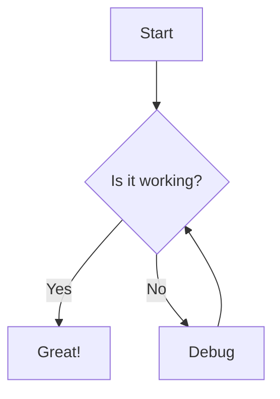

# Comprehensive Ebook Guide
## Chapter 1: Introduction to Markdown

Markdown is a lightweight markup language with plain text formatting syntax.

> "Simplicity is the ultimate sophistication." - Leonardo da Vinci

### Features
1. Easy to write
2. Easy to read
3. Converts to HTML

## Chapter 2: Coding and Diagrams

Here is a simple Javascript function:

```javascript
function sayHello(name) {
  console.log(`Hello, ${name}!`);
}
```

### Flowchart Example



## Chapter 3: Data Representation

| Name | Role | Level |
|------|------|-------|
| Alice | Developer | Senior |
| Bob | Designer | Mid |
| Charlie | Manager | Lead |

## Conclusion

This document demonstrates headers, lists, blockquotes, code blocks, mermaid diagrams, and tables.
