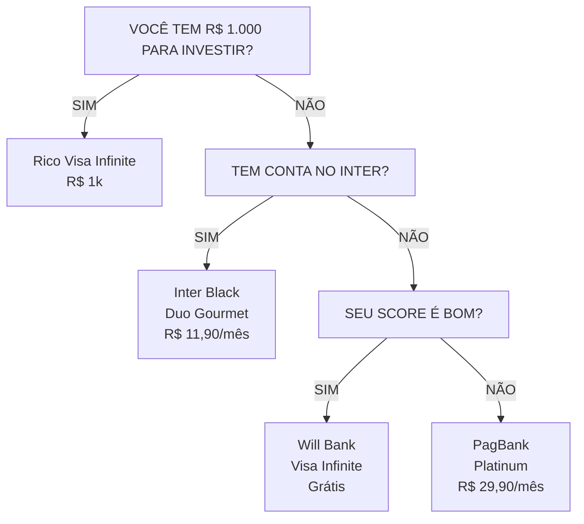
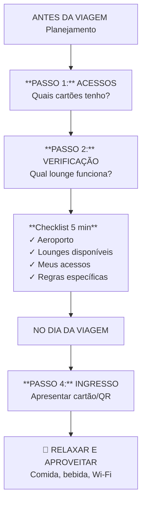

# ✈️ Guia Completo Sala VIP 0800™


*Capa do Ebook*

*Por Lari Colares (@laricolares)*

---

## 📋 Índice

1. [Boas-vindas à sua nova realidade de viagem!](#-boas-vindas-à-sua-nova-realidade-de-viagem)
2. [Capítulo 1: Vencendo as Barreiras de Entrada](#-capítulo-1-vencendo-as-barreiras-de-entrada)
3. [Parte 1: O Sistema Acesso VIP™](#-parte-1-o-sistema-acesso-vip)
4. [Parte 2: Desvendando os Mitos](#-parte-2-desvendando-os-mitos)
5. [Capítulo 2: Anatomia de um Cartão de Crédito](#-capítulo-2-anatomia-de-um-cartão-de-crédito)
6. [Capítulo 3: Estratégias de Organização e Stacking](#-capítulo-3-estratégias-de-organização-e-stacking)
7. [Seu Plano de Ação: 30/60/90 Dias](#-seu-plano-de-ação-306090-dias)
8. [Parte 3: Próximos Passos e Materiais de Apoio](#-parte-3-próximos-passos-e-materiais-de-apoio)
9. [AcessoMap™](#-acessomap)
10. [Apps Gratuitos e Armadilhas](#-apps-gratuitos-e-armadilhas)
11. [Casos Reais de Economia](#-casos-reais-de-economia)
12. [Checklist Pré-Viagem](#-checklist-pré-viagem)
13. [Guia dos Principais Lounges do Brasil](#-guia-dos-principais-lounges-do-brasil)
14. [Lista Completa de Cartões](#-lista-completa-de-cartões)
15. [Lounge Unlocker™](#-lounge-unlocker)
16. [Quiet Zones Finder™](#-quiet-zones-finder)

---

## ✨ Boas-vindas à sua nova realidade de viagem!

E aí, futuro viajante VIP! Sou a Lari Colares.

Se você chegou até aqui, provavelmente está cansado de esperar seu voo em cadeiras desconfortáveis, pagando uma fortuna por um pão de queijo e um café aguado. Eu te entendo perfeitamente. Por anos, essa também foi a minha realidade.

Mas e se eu te dissesse que existe um universo paralelo dentro dos aeroportos? Um lugar com comida e bebida de graça, Wi-Fi que realmente funciona, poltronas que parecem abraços e até chuveiros para se refrescar antes de um voo longo.

> **Esse lugar existe, são as Salas VIP. E você pode entrar nelas de graça.**

Não, você não precisa ter um cartão black ou ser milionário. Eu mesma, usando as técnicas que vou te ensinar, fiz 13 viagens em 10 meses, economizando mais de 200 mil reais e aproveitando o melhor que os aeroportos têm a oferecer.

Neste guia, eu vou te entregar o mapa da mina. Vou abrir a caixa-preta e te mostrar as **funções escondidas nos seus cartões comuns**, os apps gratuitos que são verdadeiras chaves mágicas e as regras que as companhias aéreas não fazem questão de divulgar.

Prepare-se para transformar a sua forma de viajar para sempre. Vamos começar?

---

## 🔓 Capítulo 1: Vencendo as Barreiras de Entrada

Antes de mergulharmos nas técnicas, preciso falar sobre algo que eu vejo acontecer o tempo todo: pessoas que PODERIAM estar nas salas VIP, mas não estão. E sabe por quê?

> **Não é falta de dinheiro. Não é falta de cartão. É falta de INFORMAÇÃO e, principalmente, de CORAGEM.**

### 🛑 A Síndrome do "Isso Não é Pra Mim"

Deixa eu adivinhar. Você já pensou alguma dessas coisas?

- "Sala VIP é coisa de rico, não é pro meu perfil"
- "Eu não tenho cartão Black, então nem adianta tentar"
- "Deve ser super complicado conseguir acesso"
- "Vão me julgar se eu entrar lá"
- "E se eu chegar na porta e não me deixarem entrar?"

**Eu sei exatamente como você se sente. Porque EU já senti isso.**

Na minha primeira vez tentando entrar numa sala VIP, eu quase desisti. Fiquei uns 10 minutos andando em círculos no aeroporto, com o coração na mão, pensando: *"E se não funcionar? E se a recepcionista me olhar com cara de 'você não deveria estar aqui'?"*

Mas sabe o que aconteceu quando eu finalmente juntei coragem? A moça da recepção passou meu cartão, sorriu e disse: *"Seja bem-vinda! A senhora pode entrar."* E pronto. **Era só isso.**

Todo aquele medo, toda aquela insegurança... eram só na minha cabeça.

### ❓ Por Que as Pessoas Não Tentam?

Depois de ensinar centenas de pessoas a acessarem salas VIP, identifiquei 3 barreiras principais que impedem as pessoas de começar:

#### 1. **Barreira do Desconhecimento**

A maioria das pessoas simplesmente NÃO SABE que tem direito a esses acessos. Os bancos não divulgam abertamente. Você tem que ir atrás.

Eu mesma tinha um cartão há 2 anos que me dava acesso a salas VIP e **nunca ninguém me contou isso**. Descobri por acaso lendo um artigo na internet. Dois anos jogados fora!

#### 2. **Barreira do "Não Sou Bom o Suficiente"**

Muita gente acha que precisa ter um "status" especial. Que precisa andar de terno, voar de executiva, ter uma renda altíssima.

> **MENTIRA.** Eu já entrei de chinelo, bermuda e camiseta (voo pro Nordeste, gente!). Ninguém me barrou. Ninguém me olhou torto. Porque o que vale é o SEU CARTÃO, não a sua roupa.

Se você tem o acesso, você TEM O DIREITO. Ponto final.

#### 3. **Barreira do "Não Sei por Onde Começar"**

"Ok Lari, eu quero. Mas como? Qual cartão eu pego? Como eu descubro se já tenho acesso? É muito burocrático?"

Essa é a barreira que este guia vai DESTRUIR. Porque eu vou te dar o passo a passo EXATO. Nada de teoria complicada. Só ação.

### 🚀 Do Zero ao Primeiro Acesso: O Caminho Prático

Se você está começando do ZERO - sem cartão com benefícios, talvez com score baixo, talvez sem grande poder aquisitivo - aqui está o seu plano:

#### Passo 1: Construa ou Melhore Seu Histórico de Crédito

Se o seu score está baixo, você precisa trabalhar nisso ANTES de tentar cartões premium.

**Como melhorar seu score em 3-6 meses:**

1.  **Pague tudo em dia**: Todas as contas. Água, luz, internet, celular. TUDO.
2.  **Use cartões básicos de forma inteligente**: Pegue um cartão sem anuidade e use para pequenas compras. Pague sempre a fatura completa.
3.  **Mantenha dívidas baixas**: Evite usar mais de 30% do seu limite.
4.  **Não solicite vários cartões de uma vez**: Isso derruba seu score.

_**Tempo estimado**: 3-6 meses de disciplina para ver melhora significativa._

#### Passo 2: Escolha Seu "Cartão Porta de Entrada"

Você não precisa começar com um Black. Existem cartões MUITO mais acessíveis que já te dão acessos a salas VIP.

**Opções para iniciantes (conforme pesquisa atualizada 2025):**

-   **XP Visa Infinite**: Sem renda mínima, só precisa de R$ 5.000 investidos. Dá 2 acessos gratuitos/ano.
-   **Inter Black (via Duo Gourmet)**: Se assinar o programa Duo Gourmet, consegue o cartão SEM os requisitos tradicionais + 6 acessos/ano LoungeKey.
-   **Rico Visa Infinite**: Não exige renda mínima, investimento mínimo de R$ 1.000.

Vou detalhar todos esses cartões mais à frente. Por agora, saiba que **o caminho existe e é mais fácil do que parece**.

#### Passo 3: Faça Seu Primeiro Acesso (E Vença o Medo)

Depois de conseguir seu primeiro cartão com benefício, chegou a hora da verdade. E aqui vai a regra de ouro:

> **🎯 Aja como se você já soubesse o que está fazendo.**

Não precisa mentir ou fingir ser rico. Mas também não precisa chegar tímido, pedindo desculpas por estar ali. Você TEM O DIREITO. Você pagou (seja com anuidade, investimentos ou gastos). Você MERECE estar lá.

**Script mental para o primeiro acesso:**

1.  Localize a sala (use o app do programa ou pergunte a algum funcionário do aeroporto)
2.  Chegue na recepção com confiança
3.  Apresente seu cartão ou QR Code do app
4.  Quando a recepcionista validar, diga apenas: "Obrigado(a)!"
5.  Entre e aproveite

**É SÓ ISSO.** Não tem pegadinha. Não tem teste secreto. Se o seu acesso está valendo, você entra. Simples assim.

### 🧠 O Mindset de Um Viajante VIP

Aqui está a verdade que ninguém te conta: **A diferença entre quem usa salas VIP e quem não usa não é dinheiro. É ATITUDE.**

Eu conheço gente que ganha R$ 30 mil por mês e nunca entrou numa sala VIP porque "acha difícil". E conheço gente que ganha R$ 5 mil, tem um cartão de cooperativa e aproveita TODOS os acessos.

A diferença? **Um acredita que merece. O outro não.**

Então, deixa eu te fazer uma pergunta direta:

> **Você merece viajar com conforto?**

Se a resposta for "sim" (e deveria ser!), então o que está te impedindo? Medo de parecer "metido"? Medo de errar? Medo de ser julgado?

Esquece isso. Ninguém está olhando pra você. Ninguém está julgando. Todo mundo ali dentro está ocupado comendo, trabalhando ou descansando. **Ninguém liga pra você.**

E isso é LIBERTADOR.

### 👣 Próximos Passos

Agora que você entendeu que **você PODE e MERECE** estar nas salas VIP, vamos ao que interessa:

-   ✅ Como descobrir se você já tem acessos escondidos nos seus cartões atuais
-   ✅ Como escolher o cartão certo pro seu perfil e orçamento
-   ✅ Como maximizar seus acessos ao longo do ano
-   ✅ Como entrar e aproveitar ao máximo

É hora de sair da zona de conforto e entrar na **ZONA VIP**.

---

## 🎟️ Parte 1: O Sistema Acesso VIP™

### Seu Ingresso para o Conforto

Chega de teoria. Vamos direto ao ponto. O que você precisa é de um método. Um passo a passo claro que funciona sempre.

Eu chamo esse método de **Sistema A.V.I.** (Acessos, Verificação e Ingresso). É simples, prático e à prova de falhas.

### **A** de **ACESSOS**: Descubra o Ouro que Você Já Tem

A primeira coisa que você precisa entender é: você provavelmente **JÁ TEM** acessos a Salas VIP e não sabe. Eles estão escondidos em:

*   **Cartões de Crédito (até os mais básicos!):** Muitos cartões, mesmo sem anuidade, oferecem acessos através de programas parceiros como LoungeKey, Priority Pass ou Dragon Pass.
*   **Apps Gratuitos:** Existem aplicativos que, ao se cadastrar, te dão acessos gratuitos como cortesia.
*   **Companhias Aéreas e Alianças:** Dependendo da sua passagem ou categoria no programa de fidelidade, a porta do lounge pode estar aberta para você.

> 🚀 **Sua primeira missão:** Pegue todos os seus cartões de crédito. TODOS. Até aquele que está esquecido na gaveta. Nós vamos investigar cada um deles.

No nosso material extra **AcessoMap™**, você encontrará um guia visual para identificar rapidamente essas oportunidades em aeroportos brasileiros.

### **V** de **VERIFICAÇÃO**: O Checklist de 5 Minutos

De que adianta ter a chave se você não sabe qual porta ela abre? Antes de **CADA VIAGEM**, você vai fazer uma verificação rápida. É um processo de 5 minutos que vai te poupar horas de perrengue no aeroporto.

1.  **Aeroporto de Partida/Conexão:** Qual é o aeroporto?
2.  **Lounges Disponíveis:** Quais salas existem lá? (Consulte nosso **Lounge Unlocker™**).
3.  **Meus Acessos:** Quais dos meus cartões/apps me dão acesso a essas salas?
4.  **Regras de Acesso:** Preciso estar voando por uma cia específica? Posso levar acompanhante? O acesso é gratuito ou "paga pra usar"?

Com nosso **Checklist Pré-Viagem**, esse processo se torna automático. Você nunca mais vai chegar no aeroporto sem saber exatamente onde ir.

### **I** de **INGRESSO**: A Hora de Entrar e Aproveitar

Você chegou no aeroporto, passou pelo raio-x e já sabe para qual lounge ir. E agora?

É a hora mais fácil e gratificante!

1.  **Localize o Lounge:** Siga as placas. Eles geralmente ficam em áreas mais reservadas.
2.  **Apresente seu Acesso:** Chegue na recepção e apresente com confiança seu cartão de crédito elegível ou o QR Code do seu aplicativo. A recepcionista vai validar seu acesso.
3.  **Relaxe e Aproveite:** Entre e sinta-se em casa. Pegue uma bebida, conecte no Wi-Fi, escolha sua poltrona e relaxe. Você conseguiu!


*Buffet variado em Sala VIP*

> **Dica de Ouro:** A primeira vez pode dar um friozinho na barriga. É normal. Aja com naturalidade. Você tem o direito de estar ali. Em poucos minutos, você vai estar se perguntando como viveu tanto tempo sem isso.

---

## 🗺️ FLUXOGRAMA DECISÓRIO: QUAL CARTÃO COMEÇAR?

Use este fluxograma visual para descobrir POR ONDE COMEÇAR sua jornada VIP:



### 🎯 DECISÃO SIMPLIFICADA:

| SEU PERFIL | COMECE COM | PRÓXIMO PASSO |
|---------|-------------|-------------|
| **Iniciante total** | Rico (R$ 1k) ou Inter Duo | C6 Carbon em 1 ano |
| **Já invisto regularmente** | XP ou BTG (R$ 5k) | Genial (R$ 10k) |
| **Score baixo** | PagBank ou Méliuz | Will Bank → C6 |
| **Gasto alto/mês** | C6 Carbon ou Nubank Ultra | Inter Black full |
| **Quero o melhor** | Sicoob Merit ou Sicredi | Stackar com outro |

---

## 🔄 FLUXO DO SISTEMA A.V.I. EM AÇÃO



### 💡 POR QUE ESSE FLUXO FUNCIONA?

- **Problema comum:** "Cheguei no aeroporto e não sabia que tinha acesso"
  - **Solução A.V.I.:** Você SEMPRE verifica ANTES de viajar.
- **Problema comum:** "Fui barrado porque meu cartão não era aceito"
  - **Solução A.V.I.:** Você verifica compatibilidade no passo 2.
- **Problema comum:** "Perdi tempo procurando o lounge"
  - **Solução A.V.I.:** Você já sabe exatamente onde fica (AcessoMap™).

---

## 💥 Parte 2: Desvendando os Mitos

*   **"Preciso de Cartão Black":** **MITO.** Muitos cartões Gold e Platinum, e até alguns sem categoria específica, dão acesso. O segredo está na bandeira e no programa parceiro, não no "status" do cartão.
*   **"É muito caro":** **MITO.** Estamos falando de acessos 0800, gratuitos. Você não vai pagar nada para entrar. O único investimento é o conhecimento que você está adquirindo agora.
*   **"É só para quem viaja de executiva":** **MITO.** Seu acesso via cartão ou app é independente da classe que você está voando. Você pode voar na econômica e esperar o voo como um rei.

---

## 💳 Capítulo 2: Anatomia de um Cartão de Crédito

### Desvendando a Letra Miúda

Agora vamos falar sério sobre cartões de crédito. Porque não adianta ter um monte de cartões no bolso se você não sabe O QUE procurar.

A maioria das pessoas olha pra um cartão e vê apenas: "é Visa ou é Mastercard". Mas existe um UNIVERSO de informação escondida ali que pode significar a diferença entre você pagar R$ 200 de anuidade ou viajar de graça pro exterior.

### A Tríade dos Cartões: Bandeira, Emissor e Programa

Toda vez que você olha um cartão, existem 3 "personagens" envolvidos:

#### 1. **A BANDEIRA** (Visa, Mastercard, Elo, Amex)

É quem processa as transações. Pensa nelas como as "redes" de cartões.

**Por que isso importa pra você:**

-   **Visa**: Tem o programa **Dragon Pass** (app Visa Airport Companion). Cartões Visa Platinum, Infinite e Signature podem ter acessos.
-   **Mastercard**: Tem o programa **LoungeKey**. Cartões Mastercard Black geralmente dão acesso ilimitado ao Lounge Mastercard Black em Guarulhos.
-   **Elo**: Parcerias com **LoungeKey** e **Priority Pass**. Cartões Elo Nanquim e Elo Diners Club costumam ter ótimos benefícios.
-   **American Express (Amex)**: Tem as próprias salas (American Express Lounge). Mas atenção: no Brasil, Amex é mais restrito.

> **Regra de Ouro**: TODO Mastercard Black e TODO Visa Infinite tem ALGUM tipo de acesso a sala VIP. A questão é: gratuito ou pago?

#### 2. **O EMISSOR** (Banco, Fintech, Cooperativa)

É quem emite o cartão pra você. Ex: Bradesco, Itaú, C6 Bank, Nubank, Sicoob, etc.

**Por que isso importa pra você:**

Dois cartões com a MESMA bandeira (ex: ambos Visa Infinite) podem ter benefícios COMPLETAMENTE diferentes dependendo do emissor.

**Exemplo prático:**
-   **Itaú Visa Infinite**: Pode ter 4 acessos LoungeKey/ano
-   **XP Visa Infinite**: Tem 2-4 acessos Dragon Pass/ano + é grátis

Mesmo bandeira, benefícios diferentes. Por quê? Porque cada emissor negocia seus próprios pacotes de benefícios.

#### 3. **O PROGRAMA DE BENEFÍCIOS** (LoungeKey, Priority Pass, Dragon Pass)

É o programa que de fato te dá acesso às salas VIP.

**Os 3 principais no Brasil:**

| Programa | Como Funciona | Quais Cartões Costumam Ter |
|---------|-------------|-----------|
| **LoungeKey** | Maior rede no Brasil. Mais de 1.100 lounges no mundo. | Mastercard Black, C6 Carbon, Inter Black, Sicoob/Sicredi Black |
| **Priority Pass** | Rede global com 1.400+ lounges. Muito forte nos EUA e Europa. | Poucos cartões brasileiros (Elo Diners, alguns Black específicos) |
| **Dragon Pass** (Visa Airport Companion) | Rede da Visa. 1.700+ lounges + restaurantes. | Visa Platinum, Visa Infinite, Visa Signature |

> **Dica Matadora**: Um cartão pode ter acesso a MAIS DE UM programa ao mesmo tempo. Ex: O BRB Dux Visa Infinite dá acesso aos 3 (LoungeKey + Priority Pass + Dragon Pass) com até 3 convidados. É o unicórnio dos cartões!

### Hierarquia de Cartões - Descomplicada

Você deve ter ouvido falar de Gold, Platinum, Black, Infinite, Signature... Mas o que diabos isso significa na prática?

Aqui está a hierarquia do MENOS pro MAIS premium:

| Nível | Categoria | Benefício VIP (Lounge) |
|---------|-------------|-----------|
| 1 | Standard / Clássico | 🔴 **Raro / Nenhum** |
| 2 | Gold / Ouro | 🟡 **Raro** (alguns pontuais) |
| 3 | Platinum | 🟢 **SIM** (2-4 acessos/ano) |
| 4 | Infinite / Signature | 🟢 **SIM** (2-6 acessos ou ilimitado) |
| 5 | Black (Mastercard) | 🟣 **SIM, ILIMITADO** (foco LoungeKey) |
| 6 | Nanquim / Diners | 🟣 **SIM** (Priority Pass ou LK) |
| 7 | **The Platinum (Amex)** | 🏆 **SIM + Exclusivos** (Amex + PP) |

> **⚠️ IMPORTANTE**: Essa hierarquia é GERAL. Existem exceções. Alguns Platinum são melhores que alguns Infinite. Sempre confira os benefícios ESPECÍFICOS do seu cartão!

### Como Ler os Benefícios: O Que Realmente Importa

Quando você está pesquisando um cartão, foque nessas 5 perguntas:

#### 1. **Quantos acessos gratuitos por ano?**

-   "Ilimitado" = JACKPOT!
-   "4-6 acessos/ano" = Ótimo pra quem viaja ocasionalmente
-   "2 acessos/ano" = Melhor que nada, mas limitado
-   "Acesso pago" = Você TEM acesso, mas paga uns US$ 32 por entrada. Evite.

#### 2. **Acompanhantes entram de graça?**

Muitos cartões só liberam o TITULAR de graça. Acompanhantes pagam.

**Exceção incrível**: Sicoob Mastercard Black Merit → titular + 5 adicionais + acompanhantes ilimitados. É basicamente "leve a família inteira".

#### 3. **O acesso é por programa (LK, PP, DP) ou por sala específica?**

-   **Por programa**: Você pode usar em qualquer lounge da rede. MELHOR.
-   **Por sala específica**: Só funciona em 1 ou 2 salas. Exemplo: "Acesso ao Lounge Mastercard Black em GRU". Limitado, mas ainda assim útil.

#### 4. **Quando os acessos renovam?**

-   **Ano calendário** (1º de janeiro): Mais fácil de lembrar.
-   **Aniversário do cartão**: Precisa anotar a data!

#### 5. **A anuidade é grátis, negociável ou fixa?**

Falaremos MUITO sobre isso na próxima seção.

### 📞 Os 5 Scripts de Negociação de Anuidade

Chegou a hora do OURO. Como negociar (e muitas vezes ZERAR) a anuidade do seu cartão.

Esses scripts foram testados por mim e por centenas de pessoas da minha comunidade. **Eles funcionam.**

---

#### **SCRIPT 1: O Cliente Insatisfeito (Ameaça de Cancelamento)**

**Quando usar**: Você tem o cartão há pelo menos 1 ano, usa regularmente e paga em dia.

**Como fazer**: Ligue para a central do cartão.

**O que dizer:**

> "Olá, eu sou cliente há [X anos] e sempre paguei minha fatura em dia. Porém, a anuidade de R$ [valor] está pesada pro meu orçamento. Eu vi que o banco [nome do concorrente] oferece um cartão similar sem anuidade. Estou considerando cancelar o meu cartão e migrar pra lá. Vocês têm alguma condição especial pra me manter como cliente?"

**O que vai acontecer:**

1ª rodada: Vão oferecer 50% de desconto.
2ª rodada (você recusa): Vão oferecer isenção por 12 meses ou isenção total.

**Taxa de sucesso**: ~70% conseguem pelo menos 50% de desconto. ~40% conseguem isenção total.

---

#### **SCRIPT 2: O Bom Pagador com Gastos Altos**

**Quando usar**: Você gasta pelo menos R$ 3.000-5.000/mês no cartão.

**Como fazer**: Ligue para a central.

**O que dizer:**

> "Olá, eu uso bastante o meu cartão. Meu gasto médio é de R$ [valor]/mês. Eu gostaria de saber se há alguma condição especial de isenção de anuidade para clientes com esse perfil de uso?"

**O que vai acontecer:**

Bancos ADORAM clientes que gastam. Você está gerando receita pra eles (via taxas dos lojistas). É muito provável que concedam isenção.

**Taxa de sucesso**: ~80% de isenção se gastar acima de R$ 5k/mês.

---

#### **SCRIPT 3: O Investidor (Para Bancos Digitais e Corretoras)**

**Quando usar**: Você tem investimentos no banco/corretora que emite o cartão.

**Como fazer**: Fale com seu gerente ou ligue para a central.

**O que dizer:**

> "Eu tenho R$ [valor] investidos aqui. Eu vi que clientes com investimentos acima de [X] têm isenção de anuidade do cartão [nome]. Como eu faço pra conseguir essa isenção?"

**O que vai acontecer:**

Eles vão te dar a isenção ou te dizer o valor exato que precisa investir. Muitas vezes, investir R$ 5-10 mil pode te dar um cartão Black grátis. Vale MUITO a pena.

**Taxa de sucesso**: ~90% se atingir o valor mínimo.

---

#### **SCRIPT 4: O Upgrade Estratégico**

**Quando usar**: Você tem um cartão "inferior" (ex: Gold) e quer o Black/Infinite de graça.

**Como fazer**: Ligue para a central.

**O que dizer:**

> "Olá, eu sou cliente há [X anos] e tenho o cartão [nome]. Eu gostaria de fazer um upgrade para o cartão [Black/Infinite]. Porém, só me interessa se a anuidade for isenta. Vocês conseguem fazer esse upgrade com isenção?"

**O que vai acontecer:**

Se você tem bom histórico, muitas vezes fazem o upgrade E isentam a anuidade por 12 meses (ou permanentemente). Você não perde nada tentando.

**Taxa de sucesso**: ~50%. Depende muito do seu relacionamento com o banco.

---

#### **SCRIPT 5: A Negociação Pós-Cobrança**

**Quando usar**: Você JÁ foi cobrado da anuidade e quer reverter.

**Como fazer**: Ligue IMEDIATAMENTE após a cobrança (até 7 dias depois).

**O que dizer:**

> "Olá, eu fui cobrado da anuidade de R$ [valor] e gostaria de negociar. Eu não concordo com esse valor. Quais são as opções que vocês têm pra mim? Posso solicitar o estorno dessa cobrança e a isenção futura?"

**O que vai acontecer:**

Muitos bancos ESTORNAM a cobrança se você reclamar logo. É um hack pouco conhecido, mas funciona.

**Taxa de sucesso**: ~60% conseguem estorno + algum desconto futuro.

---

### Quando Pedir Isenção e Quando Pedir Upgrade

**Peça ISENÇÃO se:**
-   Você já tem o cartão que quer e só precisa zerar a anuidade
-   Seus gastos mensais são altos (acima de R$ 5 mil)
-   Você tem investimentos no banco

**Peça UPGRADE se:**
-   Você tem um cartão básico e quer mais benefícios
-   Seu perfil de crédito melhorou
-   Você quer consolidar benefícios em menos cartões

> **Nunca peça upgrade se**: Você não tem como justificar (renda, gastos, investimentos). Vai ser negado e vai piorar suas chances futuras.

### Checklist: Está Na Hora de Pedir Novo Cartão?

Use este checklist pra saber se você está pronto:

- [ ] Seu score de crédito está acima de 600 (idealmente 700+)
- [ ] Você não solicitou nenhum cartão nos últimos 3 meses
- [ ] Você paga suas contas em dia há pelo menos 6 meses
- [ ] Você tem renda/investimentos que atendem aos requisitos mínimos do cartão
- [ ] Você realmente VAI usar os benefícios (não é só "pra ter")

**Se marcou 4-5 itens**: **PODE IR!**
**Se marcou 2-3**: Trabalhe mais alguns meses no seu perfil.
**Se marcou 0-1**: Foque em melhorar seu score primeiro.

---

### Resumo do Capítulo

Agora você sabe:

-   ✅ A diferença entre Bandeira, Emissor e Programa
-   ✅ Como a hierarquia de cartões realmente funciona
-   ✅ O que procurar nos benefícios (acessos, acompanhantes, renovação)
-   ✅ **5 scripts testados pra negociar anuidade**
-   ✅ Quando pedir isenção vs upgrade

Com esse conhecimento, você não é mais refém dos bancos. Você sabe exatamente o que perguntar, o que exigir e como conseguir o melhor deal possível.

Próximo passo? Vamos montar sua **estratégia de organização** para você nunca mais se perder no meio de tantos cartões e benefícios.

---

## 🏗️ Capítulo 3: Estratégias de Organização e Stacking

### O Sistema que Multiplica Seus Benefícios

Você já sabe COMO conseguir cartões. Agora vou te ensinar a ORGANIZAR e COMBINAR eles de forma que você maximize todos os benefícios sem ficar louco no processo.

Porque não adianta ter 5 cartões se você não lembra qual dá acesso onde, quando renovam os acessos ou qual usar em cada situação.

### O Problema dos Múltiplos Cartões

Deixa eu adivinhar o que acontece com você:

-   Você tem 2-3 cartões mas só usa 1 (porque é o que você lembra)
-   Você já perdeu acessos porque esqueceu de usar antes de renovar
-   Você não sabe de cabeça quantos acessos ainda tem disponíveis
-   Na hora de viajar, você fica na dúvida: "qual cartão eu uso aqui mesmo?"

**Isso acaba HOJE.**

### O Sistema de Organização em 3 Camadas

Vou te ensinar um sistema simples que eu uso (e centenas de alunos também):

#### **Camada 1: O Inventário (Saber O Que Você Tem)**

Primeira coisa: você precisa de um lugar central onde você vê TODOS os seus cartões e benefícios.

**Ferramenta**: Planilha Google Sheets ou Notion.

**Template do Inventário**:

| Cartão | Bandeira | Programa | Acessos/Ano | Já Usei | Restantes | Data Renovação | Anuidade | Status |
|---------|-------------|-----------|------------|---------|-----------|----------------|----------|--------|
| C6 Carbon | Mastercard Black | LoungeKey | 4 | 2 | 2 | 15/03/2026 | R$ 0 | Ativo |
| XP Infinite | Visa Infinite | Dragon Pass | 2 | 0 | 2 | 01/01/2026 | R$ 0 | Ativo |
| Inter Black | Mastercard Black | LoungeKey | Ilimitado | 8 | ∞ | - | R$ 0* | Ativo |

**Preencha isso AGORA** com seus cartões atuais.

> *Dica*: Coloque um lembrete no celular 30 dias ANTES da renovação pra usar os acessos que estão sobrando!

#### **Camada 2: A Estratégia (Saber QUANDO Usar Cada Um)**

Agora que você sabe o que tem, precisa de um plano de uso.

**Regra de Ouro: Use o Cartão CERTO na Hora CERTA**

**Exemplo de Estratégia:**

1.  **Para viagens domésticas frequentes**: Use o cartão com acesso ILIMITADO (ex: Inter Black, Sicoob Black Merit)
2.  **Para viagens internacionais**: Guarde os acessos limitados (ex: 2-4 acessos/ano) para aeroportos no exterior onde você realmente precisa
3.  **Final do ano**: QUEIME todos os acessos que não usou (porque vão renovar mesmo)

**Caso Real**: Eu tinha 4 acessos do C6 Carbon que renovariam em janeiro. Em dezembro, fiz 2 viagens domésticas SÓ pra usar esses acessos. Aproveitei e visitei amigos. Win-win!

#### **Camada 3: O Controle (Rastrear o Uso)**

Toda vez que você usar um acesso, atualize sua planilha.

**Por quê?** Porque apps de bancos às vezes demoram a atualizar. Se você não anotar, vai esquecer.

**Sistema rápido:**
-   Usou um acesso? Abra a planilha e atualize na hora (leva 10 segundos).
-   Ou tire um print da tela do lounge confirmando o uso.

### Stacking de Benefícios: A Arte de Combinar Cartões

Aqui é onde a mágica acontece. "Stacking" significa empilhar benefícios pra maximizar retorno.

#### **Estratégia 1: O Combo "Pontos + Acesso"**

Use cartões que acumulam pontos/milhas E dão acesso a salas VIP.

**Exemplo**:
-   **Nubank Ultravioleta**: Acumula pontos Nubank + 4 acessos Priority Pass/ano + lounge próprio ilimitado
-   **LATAM Pass Itaú Black**: Acumula pontos LATAM + acesso ao LATAM Lounge

**Como fazer**:
1.  Concentre seus gastos no cartão que gera pontos
2.  Use os acessos VIP desse mesmo cartão
3.  Com os pontos, compre passagens aéreas
4.  Use os acessos das salas VIP nessas viagens

**Resultado**: Você viaja gastando ZERO e ainda relaxa nas salas VIP. É o ciclo perfeito.

#### **Estratégia 2: A "Escada de Cartões"**

Comece com cartões fáceis e vá evoluindo conforme seu perfil melhora.

**Rota Sugerida**:

```timeline
    title JORNADA DAS SALAS VIP
    ANO 1 : **Básico**
          : *Objetivo:* Score e Histórico
          : *Ex:* Nubank, C6 Básico
    ANO 2 : **Primeiro VIP**
          : *Objetivo:* Degustar benefícios
          : *Ex:* XP Visa Infinite, Rico
    ANO 3 : **Elite (Black)**
          : *Objetivo:* Acesso Ilimitado
          : *Ex:* Sicoob Merit, Sicredi
    ANO 4 : **Estrategista**
          : *Objetivo:* Combo (LK + DP)
          : *Ex:* Visa + Mastercard
```

#### **Estratégia 3: O Calendário de Maximização**

Planeje o ANO INTEIRO de acessos.

**Exemplo de Planejamento**:

| Mês | Viagem | Aeroporto | Cartão a Usar | Motivo |
|---------|-------------|-------------|-------------|-------------|
| Mar | SP → RJ | GRU/SDU | Inter Black (ilimitado) | Viagem rápida, uso ilimitado |
| Jul | SP → Miami | GRU/MIA | XP Infinite (2/4 acessos) | Internacional, vale a pena |
| Set | SP → POA | GRU/POA | Inter Black (ilimitado) | Doméstico, uso ilimitado |
| Dez | SP → Orlando | GRU/MCO | C6 Carbon (4/4 acessos) | Último do ano, queimar acessos |

**Sacou a lógica?** Você PLANEJA onde vai usar cada acesso pra não desperdiçar.

### A Planilha Mestra (Template Completo)
#### 💳 ABA 1: Inventário de Cartões (O Arsenal)
*Onde você cadastra o que tem na carteira.*

| Cartão | 🏳️ Bandeira | 💎 Programa | 🔢 Acessos | 📅 Renovação | 💰 Anuidade | 🎯 Meta Isenção | Status |
|---------|-------------|-------------|-------------|-------------|-------------|-------------|-------------|
| **XP Visa Inf.** | Visa | Dragon Pass | 4 | 01/2026 | Grátis | R$ 5k Invest. | ✅ Ativo |
| **C6 Carbon** | Master | LoungeKey | Ilimitado | 06/2025 | 12x R$ 85 | R$ 50k Invest. | ⚠️ Atenção |
| **Inter Black** | Master | LoungeKey | 6 | 12/2025 | Grátis | Duo Gourmet | ✅ Ativo |

---

#### ✈️ ABA 2: Controle de Uso (O Gasto)
*Onde você registra cada entrada na sala VIP para não estourar a cota.*

| Data | 📍 Aeroporto | 🛋️ Lounge | 💳 Cartão Usado | 📉 Restantes | 📝 Obs |
|---------|-------------|-------------|-------------|-------------|-------------|
| 10/02 | GRU (T3) | Espaço Safra | XP Visa Inf. | **3** | Eu + 1 convidado |
| 15/05 | MIA | Turkish Lounge | C6 Carbon | **Ilim.** | Jantar ótimo |

---

#### 🗓️ ABA 3: Planejamento Anual (A Estratégia)
*Onde você cruza suas viagens futuras com o melhor cartão para usar.*

| Mês | 🌍 Viagem | 🛫 Aeroportos | 💳 Cartão Planejado | ✅ Executado? | 📉 Saldo Final |
|---------|-------------|-------------|-------------|-------------|-------------|
| **Fev** | Carnaval | GRU, REC | XP (Dragon Pass) | Sim | -2 acessos |
| **Jul** | Férias EUA | GRU, MIA, MCO | C6 (Ilimitado) | Não | Intacto |
| **Dez** | Natal | CGH, SDU | Inter (LoungeKey) | ... | ... |

---

#### 🚀 ABA 4: Metas e To-Dos (O "Backstage")
*O painel de controle para garantir que você não perca benefícios ou pague anuidade à toa.*

| Status | Prioridade | Tarefa / Ação | Prazo |
|---------|-------------|-------------|-------------|
| 🔲 | 🔥 **ALTA** | **Renovar isenção** do C6 Carbon | 15/Jun |
| 🔲 | 🟡 Média | Gastar os **2 acessos** restantes do Inter | Até Dez |
| ✅ | 🟢 Baixa | Pedir **Upgrade** para o Visa Infinite | Feito |
| 🔲 | 🔥 **ALTA** | Cancelar cartão antigo antes da anuidade | 30/Ago |

---

### ⚠️ Erros Comuns de Organização (E Como Evitar)

#### **Erro 1: Solicitar Cartões Demais de Uma Vez**
-   **O problema**: Cada solicitação derruba seu score.
-   **A solução**: Máximo de 1 cartão a cada 3 meses. Seja paciente.

#### **Erro 2: Não Usar os Acessos Antes de Renovar**
-   **O problema**: Acessos não usados = dinheiro jogado fora.
-   **A solução**: Alarme no celular 45 dias antes da renovação.

#### **Erro 3: Manter Cartões que Você Não Usa**
-   **O problema**: Anuidade cobrando, limite de crédito travado.
-   **A solução**: Regra: "Se eu não usei em 6 meses E não vou usar nos próximos 6, CANCELO."

#### **Erro 4: Não Acompanhar Mudanças de Benefícios**
-   **O problema**: Bancos mudam regras sem aviso prévio.
-   **A solução**: A cada 6 meses, cheque os benefícios no app ou site oficial.

### O Método "FIRE" de Maximização

Inspirado no movimento FIRE (Financial Independence, Retire Early):

1.  **F**oco: Concentre gastos em 1-2 cartões principais.
2.  **I**nventário: Mantenha inventário atualizado sempre.
3.  **R**otação: Rode entre cartões conforme estratégia.
4.  **E**liminação: Cancele o que não serve.

### Checklist: Seu Sistema Está Funcionando?

Use este checklist mensal:

- [ ] Minha planilha está atualizada?
- [ ] Eu sei quantos acessos ainda tenho em cada cartão?
- [ ] Eu usei pelo menos 1 acesso este mês? (Se viajei)
- [ ] Eu cancelei cartões que não uso há 6+ meses?
- [ ] Eu negociei anuidades nos últimos 6 meses?
- [ ] Tenho viagens planejadas para os próximos 3 meses?

**Se marcou 5-6**: **Você é um MESTRE!**
**Se marcou 3-4**: No caminho certo, ajuste alguns pontos.
**Se marcou 0-2**: Hora de reorganizar tudo.

---

## 🚀 SEU PLANO DE AÇÃO: 30/60/90 DIAS

Agora que você tem TODO o conhecimento, vamos transformar isso em AÇÃO. Este é o seu roadmap prático para sair do ZERO e estar usando lounges VIP em menos de 90 dias.

---

### 📅 PRIMEIROS 30 DIAS: DESCOBERTA E PREPARAÇÃO

**Objetivo:** Mapear o que você já tem e preparar o terreno

#### **SEMANA 1: Auditoria Completa (2-3 horas)**

✅ **DIA 1-2: Inventário de Cartões**
- [ ] Separe TODOS os seus cartões de crédito (até os esquecidos)
- [ ] Para cada cartão, anote: Bandeira, Categoria, Emissor, Anuidade
- [ ] **Use a planilha do Capítulo 3** para organizar

✅ **DIA 3-4: Pesquisa de Benefícios**
- [ ] Baixe os 3 apps essenciais: Visa Airport Companion, Mastercard Airport Experiences, LoungeKey
- [ ] Cadastre CADA cartão nos apps correspondentes
- [ ] Anote quantos acessos gratuitos você já tem HOJE

✅ **DIA 5-7: Identificação de Gaps**
- [ ] Você JÁ tem acessos? → Pule para Semana 2
- [ ] Você NÃO tem acessos? → Defina qual cartão vai solicitar (use o Fluxograma Decisório)

#### **SEMANA 2: Primeira Ação (1-2 horas)**

**Se você JÁ tem acessos:**
- [ ] Planeje uma "viagem teste" (mesmo que doméstica curta)
- [ ] Use o Checklist Pré-Viagem para preparar

**Se você NÃO tem acessos ainda:**
- [ ] Solicite seu primeiro cartão (Rico, Inter Duo ou PagBank - ver Nível 1)

#### **SEMANA 3-4: Negociação e Otimização (1 hora)**

- [ ] Ligue e use um dos **5 Scripts de Negociação** para CADA cartão que você paga anuidade
- [ ] **Meta:** Economizar pelo menos R$ 500-1.000 em anuidades

**🎯 RESULTADO DOS PRIMEIROS 30 DIAS:**
- ✅ Inventário completo de acessos
- ✅ Apps instalados e cartões cadastrados
- ✅ Primeiro cartão solicitado (se necessário)
- ✅ Anuidades negociadas
- ✅ Primeiro acesso planejado

---

### 📅 DIAS 31-60: PRIMEIRA EXPERIÊNCIA E REFINAMENTO

**Objetivo:** Fazer seu primeiro acesso VIP e aprender na prática

#### **SEMANA 5: Preparação Final**

✅ **Antes da viagem (3-5 dias antes):**
- [ ] Execute o **Checklist Pré-Viagem** completo
- [ ] Tire print da tela do app mostrando seus acessos válidos

✅ **1 dia antes:**
- [ ] Confirme que o cartão físico está na carteira
- [ ] Confirme que os apps estão logados

#### **SEMANA 6: O DIA D - SEU PRIMEIRO ACESSO VIP** 🎉

✅ **No aeroporto:**
- [ ] Localize o lounge
- [ ] Apresente seu acesso com confiança
- [ ] RELAXE E APROVEITE!

#### **SEMANA 7-8: Análise e Planejamento**

✅ **Reflexão:**
- [ ] Como foi a experiência?
- [ ] Quanto você economizou?

**🎯 RESULTADO DOS DIAS 31-60:**
- ✅ Primeiro acesso VIP realizado ✈️
- ✅ Economia real calculada
- ✅ Confiança adquirida

---

### 📅 DIAS 61-90: MAXIMIZAÇÃO E EVOLUÇÃO

**Objetivo:** Otimizar sua estratégia e planejar upgrades

#### **SEMANA 9-10: Stacking e Organização Avançada**

✅ **Análise de portfolio:**
- [ ] Calcule seu ROI real
- [ ] Está satisfeito ou quer mais acessos?

#### **SEMANA 11: Stacking Avançado**

✅ **Combine benefícios:**
- [ ] Use o **Método FIRE**

#### **SEMANA 12: Evangelização e Celebração** 🎉

✅ **Compartilhe o conhecimento:**
- [ ] Ensine 1-2 pessoas próximas
- [ ] Leve alguém especial ao lounge

✅ **Celebre suas conquistas:**
- [ ] Calcule economia total dos 90 dias

**🎯 RESULTADO DOS DIAS 61-90:**
- ✅ Sistema de organização implementado
- ✅ ROI calculado e comprovado
- ✅ Você é oficialmente um(a) viajante VIP! 👑

---

## 📊 CHECKLIST MASTER: VOCÊ ESTÁ PRONTO?

Marque cada item conforme completa:

### ✅ CONHECIMENTO (Fundação)
- [ ] Li todo o e-book
- [ ] Entendi o Método A.V.I.
- [ ] Conheço os 3 programas principais (LoungeKey, Priority Pass, Dragon Pass)
- [ ] Sei a diferença entre Bandeira, Emissor e Programa

### ✅ FERRAMENTAS (Arsenal)
- [ ] Apps instalados (Visa AC, Mastercard AE, LoungeKey)
- [ ] Planilha de controle criada
- [ ] Checklist Pré-Viagem impresso/salvo
- [ ] AcessoMap™ e Lounge Unlocker™ consultados

### ✅ CARTÕES (Acesso)
- [ ] Fiz inventário de todos os meus cartões
- [ ] Cadastrei todos nos apps correspondentes
- [ ] Solicitei pelo menos 1 cartão de entrada (se necessário)
- [ ] Negociei anuidades (economizei R$ _____)

### ✅ EXPERIÊNCIA (Prática)
- [ ] Fiz meu 1º acesso VIP
- [ ] Calculei minha economia real
- [ ] Planejei próximos acessos
- [ ] Ensinei pelo menos 1 pessoa

### ✅ OTIMIZAÇÃO (Maximização)
- [ ] Defini minha Rota de Evolução (próximos 2 anos)
- [ ] Implementei sistema de organização (FIRE ou similar)
- [ ] Calculei meu ROI

---

## 💬 MENSAGEM FINAL

Olha só o que você vai conquistar nos próximos 3 meses:

- **DIA 1 (HOJE):** Você está lendo este guia, provavelmente cético.
- **DIA 30:** Você tem todos os seus cartões organizados e SABE exatamente seus acessos.
- **DIA 60:** Você já fez seu primeiro acesso VIP e seus amigos perguntaram "COMO?".
- **DIA 90:** Você é oficialmente um(a) viajante VIP.

**A pergunta não é "será que funciona?"**
**A pergunta é: "você vai AGIR?"**

Nos vemos no lounge! 🥂

---

## 📚 Parte 3: Próximos Passos e Materiais de Apoio

Este guia é o seu ponto de partida. Agora, é hora de mergulhar nas ferramentas que eu preparei para você. Elas são o seu arsenal para nunca mais passar perrengue em aeroporto.

*   ➡️ **AcessoMap™:** Seu mapa dos acessos gratuitos no Brasil.
*   ➡️ **Lista de Cartões Gratuitos:** Uma lista atualizada de cartões sem anuidade.
*   ➡️ **Lounge Unlocker™:** A lista definitiva de salas no Brasil e no mundo.
*   ➡️ **Quiet Zones Finder™:** Seu plano B para quando um lounge não for uma opção.
*   ➡️ **Checklist Pré-Viagem:** Seu guia rápido para nunca perder uma oportunidade.
*   ➡️ **Apps Gratuitos e Armadilhas:** A lista de apps que liberam acesso.
*   ➡️ **Casos Reais de Economia:** Inspire-se com quem já está usando o método.
*   ➡️ **Guia dos Principais Lounges do Brasil:** Um review completo dos lounges.

---

# 🗺️ AcessoMap™ – O Mapa dos Acessos Gratuitos no Brasil

*Ferramenta exclusiva do Guia Sala VIP 0800™*

---

## Como usar este mapa

Este guia visual foi criado para te dar respostas rápidas. Em vez de pesquisar em mil sites, encontre aqui os principais "hacks" para acessar lounges nos maiores aeroportos do Brasil.

**Legenda de Ícones:**
*   💳 **Cartão de Crédito:** Acesso via programas como LoungeKey (LK), Priority Pass (PP), Dragon Pass (DP).
*   📱 **App Gratuito:** Acesso via cadastro em aplicativos parceiros.
*   ✈️ **Companhia Aérea:** Acesso por status no programa de fidelidade ou tipo de passagem.

### **GRU - Aeroporto de Guarulhos (São Paulo)**


**Terminal 2 (Voos Domésticos):**

*   **Bradesco Cartões Lounge:**
    *   💳 **Acesso:** Clientes Bradesco com cartões selecionados (Amex TPC, Elo Diners Club, Elo Nanquim, Visa Aeternum).
*   **GOL Smiles Club:**
    *   ✈️ **Acesso:** Clientes Diamante da Smiles ou voando em classe Premium Economy da GOL.
    *   💳 **Acesso:** Cartões GOL Smiles Infinite.

**Terminal 3 (Voos Internacionais):**

*   **LATAM VIP Lounge:**
    *   ✈️ **Acesso:** Clientes LATAM Pass Black Signature/Black ou voando em Business/Premium Economy.
    *   💳 **Acesso:** Cartões LATAM Pass Itaú Mastercard Black e Visa Infinite.
*   **Mastercard Black Lounge:**
    *   💳 **Acesso:** **QUALQUER** cartão Mastercard Black. Acesso ilimitado e gratuito para o titular.
*   **American Express Lounge:**
    *   💳 **Acesso:** Apenas para portadores do The Platinum Card (TPC) e Centurion emitidos pelo Bradesco ou Santander.
*   **Visa Infinite Lounge:**
    *   📱 **App:** Acesso via app **Visa Airport Companion** (que usa a base Dragon Pass). Verifique no app quantos acessos seu cartão Visa Infinite te dá por ano.

### **GIG - Aeroporto do Galeão (Rio de Janeiro)**

**Terminal 2 (Doméstico e Internacional):**

*   **Plaza Premium Lounge (Doméstico):**
    *   💳 **Acesso:** LoungeKey, Priority Pass, Dragon Pass.
    *   📱 **App:** Visa Airport Companion.
*   **GOL Smiles Club (Internacional):**
    *   ✈️ **Acesso:** Clientes Diamante da Smiles ou voando em classe Premium Economy da GOL.
    *   💳 **Acesso:** Cartões GOL Smiles Infinite.
*   **Plaza Premium Lounge (Internacional):**
    *   💳 **Acesso:** Amex TPC e vários cartões com LK, PP, DP.
    *   📱 **App:** Visa Airport Companion.

### **CNF - Aeroporto de Confins (Belo Horizonte)**

*   **Ambaar Lounge (Doméstico e Internacional):**
    *   💳 **Acesso:** LoungeKey, Priority Pass, Dragon Pass.
    *   📱 **App:** Visa Airport Companion.

### **BSB - Aeroporto de Brasília**

*   **VIP Club (Doméstico e Internacional):**
    *   💳 **Acesso:** LoungeKey, Priority Pass, Dragon Pass.
    *   📱 **App:** Visa Airport Companion.

> 🔥 **Hack de Ouro:** Muitos não sabem, mas alguns cartões **Visa Platinum** já oferecem acessos via Dragon Pass (pelo app Visa Airport Companion). Não é privilégio apenas do Infinite! Verifique o seu agora mesmo.

---

# 📱 Apps Gratuitos e Armadilhas

## Apps que são Chaves Mágicas

*   **Visa Airport Companion (VAC):** Plataforma da Visa que usa o programa Dragon Pass.
*   **Mastercard Airport Experiences:** Plataforma da Mastercard, fornecida pela LoungeKey.

## 💣 Cuidado! Armadilhas e Pegadinhas Comuns

*   **ARMADILHA 1: "Acesso" vs. "Acesso Gratuito"**
    *   **A pegadinha:** Ter acesso a um programa não significa que toda entrada é gratuita.
    *   **Como evitar:** Verifique no app: "Cortesias: X".
*   **ARMADILHA 2: Acompanhantes Pagos**
    *   **A pegadinha:** Seu acesso pode ser gratuito, mas o do seu acompanhante pode ser cobrado.
    *   **Como evitar:** Sempre consulte a recepção do lounge.
*   **ARMADILHA 3: Cartão de Débito ou Múltiplo**
    *   **A pegadinha:** Se passar no débito sem saldo, pode ser negado.
    *   **Como evitar:** Avise na recepção: *"Please, run as CREDIT."*
*   **ARMADILHA 4: Acessos por Ano Calendário vs. Ano do Cartão**
    *   **A pegadinha:** Você acha que renova em janeiro, mas renova em julho.
    *   **Como evitar:** Consulte a central do seu cartão.

> 🚨 **REGRA DE OURO:** Na dúvida, **PERGUNTE**. Não tenha vergonha.

---

# 💰 Casos Reais de Economia

*Inspiração real para você começar agora!*

### **Caso 1: A Família da Mariana F. (Viagem para Orlando)**
*   **Perfil:** Mariana, marido e dois filhos.
*   **Economia Total:** **R$ 870** em UMA viagem. (R$ 5.220 ao longo de 2 anos).

### **Caso 2: O Nômade Digital Bruno S.**
*   **Cartão:** Inter Black.
*   **Economia mensal:** **R$ 520**. Anual: **R$ 6.240**.

### **Caso 3: A Estudante Carla M.**
*   **Cartão:** Rico Visa Infinite (investiu R$ 1.000).
*   **Economia:** **R$ 140** com alimentação + conforto.

### **Caso 4: O Executivo Senior Paulo R.**
*   **Cartões:** Sicoob Merit + Itaú Nanquim.
*   **Economia anual:** **R$ 4.800** + produtividade.

### **Caso 5: A Aposentada Dona Rosa**
*   **Cartão:** PagBank Visa Platinum.
*   **Resultado:** Conforto, dignidade e economia de **R$ 140**.

---

# ✅ Checklist Pré-Viagem

*Ferramenta exclusiva do Guia Sala VIP 0800™*

Faça este checklist 2-3 dias antes de **TODA VIAGEM**.

### **Passo 1: Identifique seus Aeroportos**

*   **Aeroporto de Partida:** `_________________`
*   **Aeroporto(s) de Conexão:** `_________________`
*   **Aeroporto de Destino:** `_________________`

### **Passo 2: Verifique Seus Cartões e Apps**

*   [ ] **Abra o app Visa Airport Companion:** Verifique acessos e lounges.
*   [ ] **Abra o app LoungeKey:** Verifique regras de acesso.
*   [ ] **Outros cartões:** Lembre-se do Mastercard Black em GRU.

### **Passo 3: Consolide suas Opções**

*   **Aeroporto de Partida:** Lounge `___________`, Acesso via `___________`.
*   **Aeroporto de Conexão:** Lounge `___________`, Acesso via `___________`.

### **Passo 4: Prepare-se para o Ingresso**

*   [ ] Cartão físico na carteira.
*   [ ] App com QR Code logado.
*   [ ] Celular com bateria.

> 📸 **Tire um Print!** Backup simples que pode salvar seu conforto.

---

# ⭐️ Guia dos Principais Lounges do Brasil

### **1. Mastercard Black Lounge (GRU - T3 Internacional)**
*   **Vibe:** Moderno, buffet excelente, bar completo e muito concorrido.
*   **Entrada:** Qualquer cartão Mastercard Black.

### **2. Visa Infinite Lounge (GRU - T3 Internacional)**
*   **Vibe:** Sofisticado, menu à la carte, chuveiros e barbearia.
*   **Entrada:** Visa Infinite via Dragon Pass (Visa Airport Companion).

### **3. Bradesco Cartões Lounge (GRU - T2 Doméstico)**
*   **Vibe:** Funcional, ótima localização (pós raio-x).
*   **Entrada:** Cartões alta renda Bradesco (Elo Nanquim, Amex TPC).

### **4. Ambaar Lounge (CNF e BSB)**
*   **Vibe:** "Salva-vidas" agradável e funcional.
*   **Entrada:** LoungeKey e Dragon Pass.

---

# 💳 Lista Completa de Cartões

## 🎯 NÍVEL 1: PORTA DE ENTRADA
*Cartões fáceis de conseguir.*

1.  **Inter Black (via Duo Gourmet)**: Assine e ganhe.
2.  **XP Visa Infinite**: R$ 5k investidos.
3.  **Rico Visa Infinite**: R$ 1k investidos (Top Escolha!).
4.  **PagBank Visa Platinum**: Acessível para score baixo.
5.  **Méliuz Mastercard Gold**: Cashback + VIP.
6.  **Will Bank Visa Infinite**: Sem burocracia.

## 🔥 NÍVEL 2: INTERMEDIÁRIO
*Melhor custo-benefício.*

7.  **C6 Carbon**: 4 acessos/ano. Isenta com R$ 50k investidos.
8.  **Nubank Ultravioleta**: Black com 1% cashback que rende 200% CDI.
9.  **BTG+ Black**: Banco de investimentos sólido.
10. **PicPay Black**: Acessível.
11. **Genial Infinite**: R$ 10k investidos.
12. **BRB Dux**: O "unicórnio" (difícil conseguir, mas excelente).
13. **Bradesco Prime Infinite**: Tradicional.

## 💎 NÍVEL 3: PREMIUM
*Acessos ilimitados.*

14. **Sicoob Merit**: Ilimitado para titular e acompanhantes! (Top Escolha).
15. **Sicredi Infinite**: Ilimitado LK + Dragon Pass.
16. **Inter Black (full)**: R$ 250k investidos ou R$ 7k gastos.
17. **Santander Unique**: Tradicional e robusto.
18. **Itaú Black Nanquim**: Clássico.
19. **Bradesco TPC**: Status Amex.
20. **Elo Diners Club**: Aceitação global incrível.

---

# 🌍 Lounge Unlocker™

*Principais Destaques Internacionais.*

*   **Orlando (MCO):** The Club MCO.
*   **Miami (MIA):** Turkish Airlines Lounge.
*   **Lisboa (LIS):** ANA Lounge (Pastéis de Nata!).
*   **Paris (CDG):** Star Alliance Lounge.

---

# 🤫 Quiet Zones Finder™

*Onde se esconder quando a sala VIP não rolar.*

*   **Congonhas (CGH):** Suba para o Andar Superior (praça de alimentação) ou vá para o corredor dos banheiros (portões 13-20).
*   **Santos Dumont (SDU):** Segundo andar do embarque (vista linda, menos gente).
*   **Dica Universal:** Vá para os portões das extremidades ("Portões Fantasmas").


