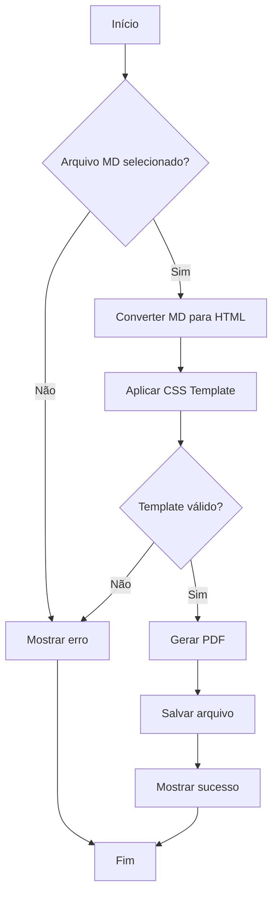
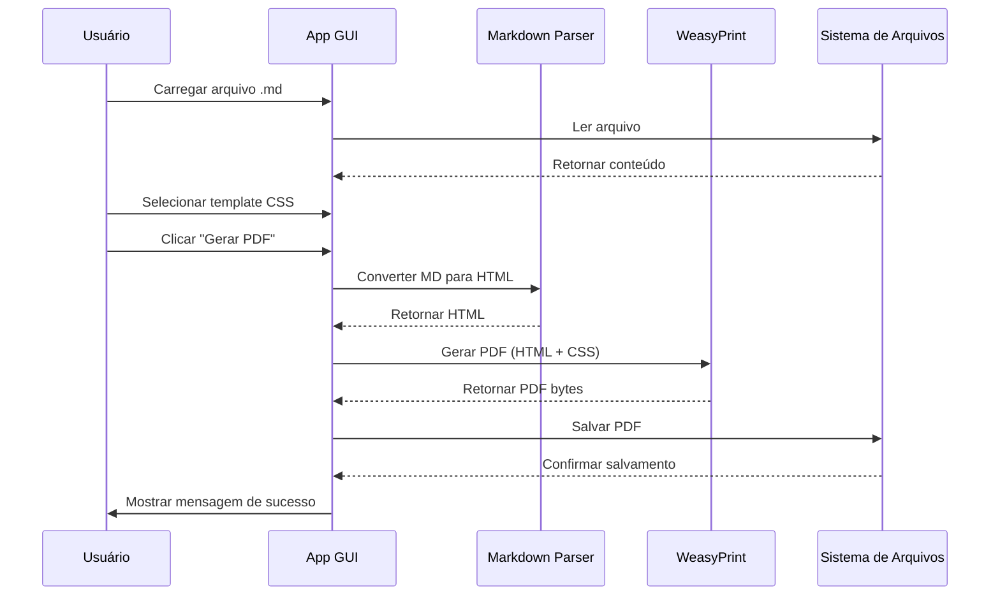
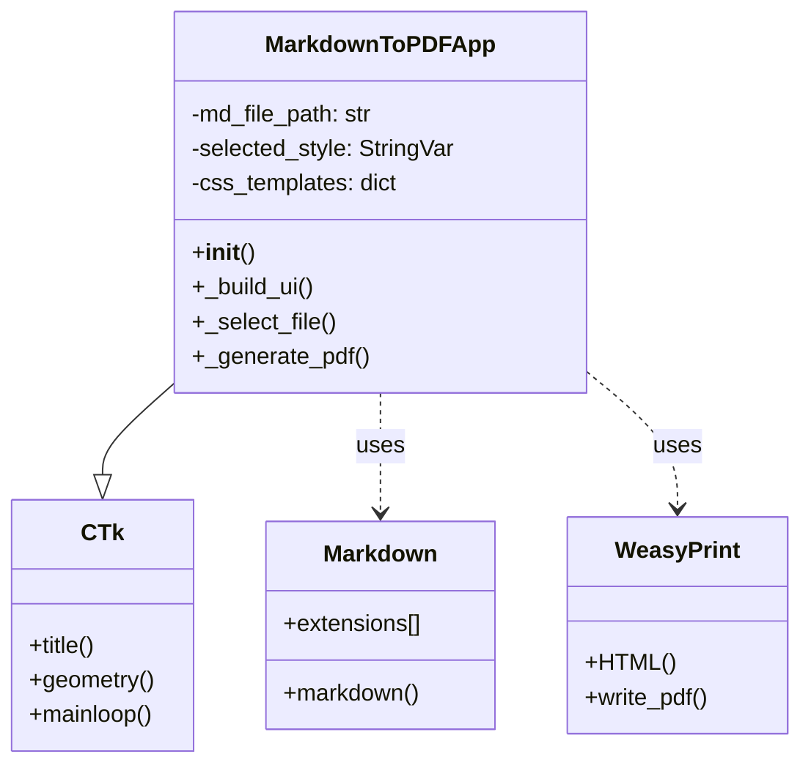
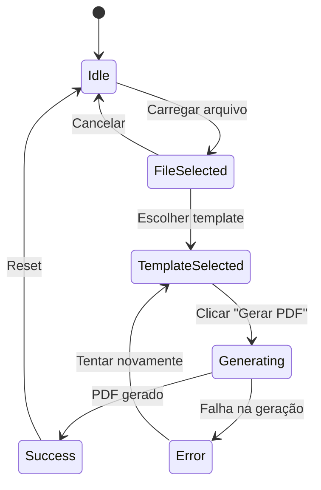
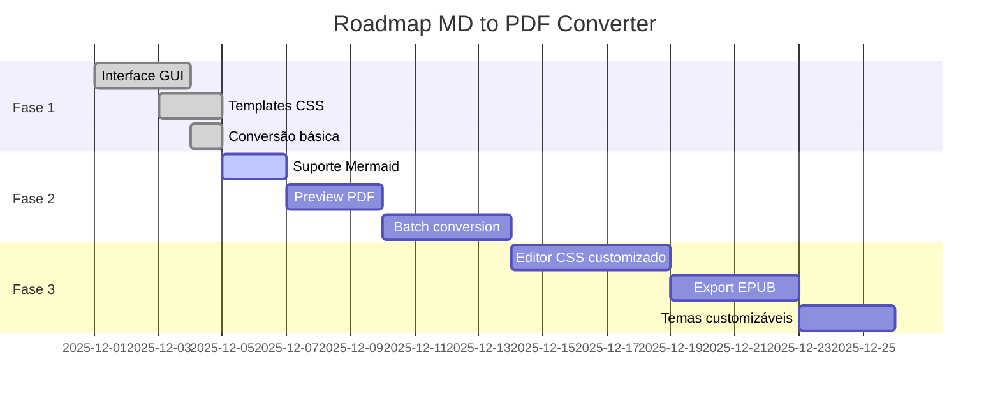
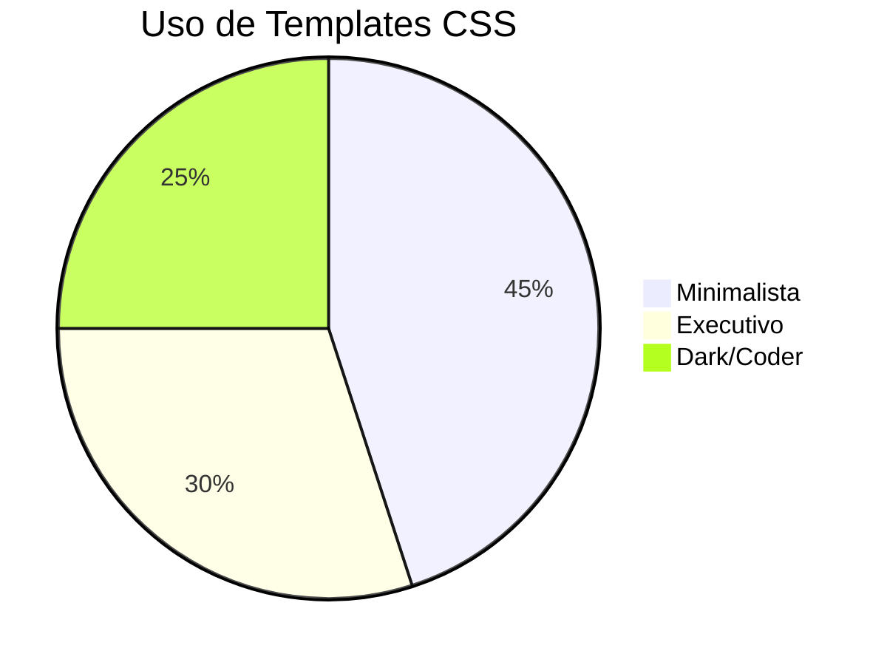
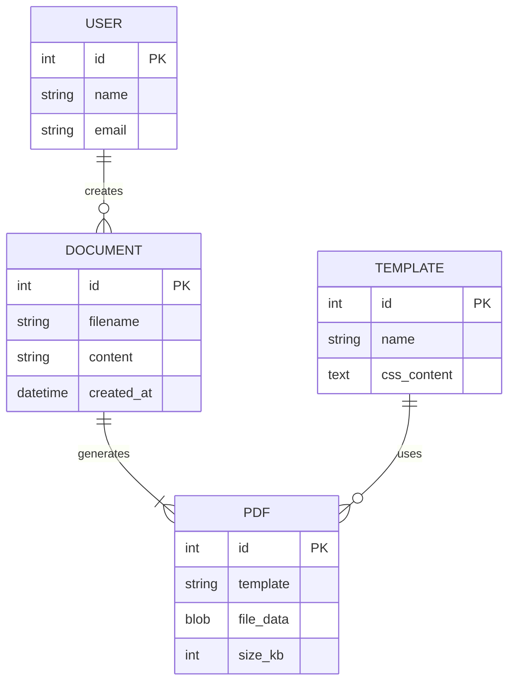
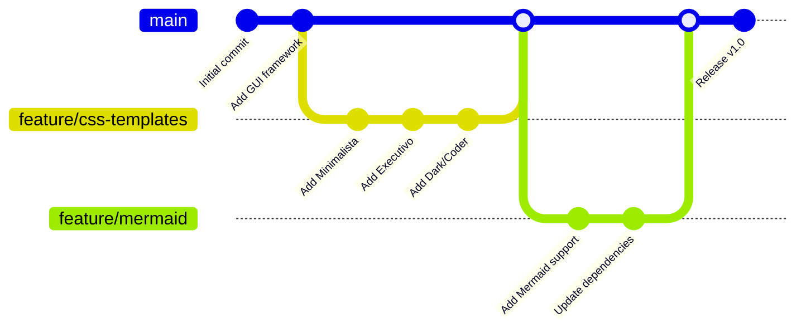

# 📘 Guia Completo de Markdown para Ebook

## Introdução

Este é um **exemplo completo** de documento Markdown que demonstra *todas as funcionalidades* suportadas pelo conversor MD to PDF, incluindo **diagramas Mermaid** e elementos visuais avançados!

---

## Capítulo 1: Formatação de Texto

### Texto Básico

Este é um parágrafo simples com texto corrido. A aplicação MD to PDF Converter suporta formatação completa de texto, incluindo **negrito**, *itálico*, ***negrito e itálico***, e até mesmo ~~texto riscado~~.

Você também pode usar `código inline` para destacar comandos ou variáveis no meio do texto.

### Citações

> "A tecnologia é melhor quando aproxima as pessoas." - Matt Mullenweg

> Esta é uma citação em bloco que pode conter múltiplas linhas.
> Use-a para destacar informações importantes ou citações de referência.

### Notas e Alertas

> ⚠️ **ATENÇÃO:** Este é um alerta importante!

> 💡 **DICA:** Use esta formatação para destacar informações úteis.

> ✅ **SUCESSO:** Operação concluída com êxito!

> ❌ **ERRO:** Algo deu errado. Verifique os logs.

---

## Capítulo 2: Listas

### Lista Não Ordenada

- Item principal 1
- Item principal 2
  - Subitem 2.1
  - Subitem 2.2
    - Subitem 2.2.1
- Item principal 3

### Lista Ordenada

1. Primeiro passo
2. Segundo passo
3. Terceiro passo
   1. Subpasso 3.1
   2. Subpasso 3.2
4. Quarto passo

### Lista de Tarefas

- [x] Criar aplicação MD to PDF
- [x] Adicionar 3 templates CSS
- [x] Implementar interface gráfica
- [x] Adicionar suporte a Mermaid
- [ ] Adicionar preview em tempo real
- [ ] Suporte a múltiplos arquivos

### Lista de Definições

Python
: Linguagem de programação de alto nível, interpretada e multi-paradigma.

Markdown
: Linguagem de marcação leve para formatação de texto.

PDF
: Portable Document Format - formato de arquivo desenvolvido pela Adobe.

---

## Capítulo 3: Tabelas Avançadas

### Tabela Simples

| Recurso | Minimalista | Executivo | Dark/Coder |
|---------|-------------|-----------|------------|
| Fonte Base | Merriweather | Open Sans | Inter |
| Fundo | Branco | Branco | Escuro |
| Ideal para | Leitura | Negócios | Código |

### Tabela com Alinhamento

| Esquerda | Centro | Direita |
|:---------|:------:|--------:|
| Texto 1  | Texto 2 | Texto 3 |
| ABC      | DEF     | GHI     |
| 123      | 456     | 789     |

### Tabela Complexa com Formatação

| Feature | Status | Priority | Assignee | Notes |
|---------|:------:|:--------:|:--------:|-------|
| **Login System** | ✅ Done | 🔴 High | @dev1 | Completed in sprint 1 |
| **Dashboard** | 🚧 In Progress | 🟡 Medium | @dev2 | ETA: Next week |
| **Reports** | ⏳ Pending | 🟢 Low | @dev3 | Waiting for data |
| **API Integration** | ✅ Done | 🔴 High | @dev1 | v2.0 ready |

---

## Capítulo 4: Diagramas Mermaid

### Fluxograma de Processo



### Diagrama de Sequência



### Diagrama de Classes



### Diagrama de Estados



### Gráfico de Gantt (Roadmap)



### Diagrama de Pizza (Estatísticas)



### Diagrama ER (Entidade-Relacionamento)



### Git Graph



---

## Capítulo 5: Blocos de Código com Syntax Highlighting

### Python com Classes

```python
class MarkdownToPDFConverter:
    """
    Conversor profissional de Markdown para PDF.

    Attributes:
        css_templates (dict): Dicionário de templates CSS
        markdown_extensions (list): Extensões habilitadas
    """

    def __init__(self, templates=None):
        self.css_templates = templates or self._load_default_templates()
        self.markdown_extensions = [
            'tables', 'fenced_code', 'codehilite',
            'nl2br', 'sane_lists', 'attr_list'
        ]

    def convert(self, md_content: str, template: str) -> bytes:
        """
        Converte conteúdo Markdown em PDF.

        Args:
            md_content: Conteúdo em formato Markdown
            template: Nome do template CSS a usar

        Returns:
            bytes: PDF gerado em formato binário

        Raises:
            ValueError: Se template não existir
        """
        html = markdown.markdown(
            md_content,
            extensions=self.markdown_extensions
        )

        css = self.css_templates.get(template)
        if not css:
            raise ValueError(f"Template '{template}' não encontrado")

        full_html = self._build_html(html, css)
        return HTML(string=full_html).write_pdf()

    @staticmethod
    def _build_html(content: str, css: str) -> str:
        """Constrói HTML completo com CSS inline."""
        return f"""
        <!DOCTYPE html>
        <html lang="pt-BR">
        <head>
            <meta charset="UTF-8">
            <style>{css}</style>
        </head>
        <body>{content}</body>
        </html>
        """

# Exemplo de uso
converter = MarkdownToPDFConverter()
pdf_bytes = converter.convert("# Meu Ebook", "minimalista")
```

### JavaScript/TypeScript

```javascript
// Sistema de conversão MD to PDF em JavaScript
class MarkdownConverter {
    constructor(config = {}) {
        this.templates = config.templates || this.loadDefaultTemplates();
        this.options = {
            ...this.defaultOptions,
            ...config.options
        };
    }

    async convert(markdownText, templateName) {
        try {
            // Converter MD para HTML
            const html = await this.parseMarkdown(markdownText);

            // Aplicar template CSS
            const styled = this.applyTemplate(html, templateName);

            // Gerar PDF
            const pdf = await this.generatePDF(styled);

            return {
                success: true,
                data: pdf,
                metadata: this.getMetadata()
            };
        } catch (error) {
            console.error('Erro na conversão:', error);
            return {
                success: false,
                error: error.message
            };
        }
    }

    // Arrow function
    parseMarkdown = async (text) => {
        const marked = await import('marked');
        return marked.parse(text);
    }
}

// Uso com Promises
const converter = new MarkdownConverter();
converter.convert(mdContent, 'executivo')
    .then(result => console.log('PDF gerado!', result))
    .catch(err => console.error('Falha:', err));
```

### Bash/Shell Script

```bash
#!/bin/bash

# Script de automação para conversão em lote
# Autor: Dev Team
# Data: 2025-12-05

set -e  # Para no primeiro erro

# Configurações
INPUT_DIR="./markdown_files"
OUTPUT_DIR="./pdfs"
TEMPLATE="${1:-minimalista}"

# Cores para output
RED='\033[0;31m'
GREEN='\033[0;32m'
YELLOW='\033[1;33m'
NC='\033[0m' # No Color

# Função para log
log_info() {
    echo -e "${GREEN}[INFO]${NC} $1"
}

log_error() {
    echo -e "${RED}[ERROR]${NC} $1"
}

log_warning() {
    echo -e "${YELLOW}[WARNING]${NC} $1"
}

# Criar diretório de saída
mkdir -p "$OUTPUT_DIR"

# Contar arquivos
total_files=$(find "$INPUT_DIR" -name "*.md" | wc -l)
log_info "Encontrados $total_files arquivos Markdown"

# Loop através dos arquivos
count=0
for md_file in "$INPUT_DIR"/*.md; do
    if [ -f "$md_file" ]; then
        filename=$(basename "$md_file" .md)
        output_file="$OUTPUT_DIR/${filename}.pdf"

        log_info "[$((++count))/$total_files] Convertendo: $filename"

        # Converter usando Python
        if python3 md_to_pdf_app.py "$md_file" "$output_file" "$TEMPLATE"; then
            log_info "✓ Sucesso: $output_file"
        else
            log_error "✗ Falha: $md_file"
        fi
    fi
done

log_info "Conversão concluída! Total: $count arquivos"
```

### SQL

```sql
-- Schema para banco de dados de documentos
CREATE TABLE users (
    id INTEGER PRIMARY KEY AUTOINCREMENT,
    username VARCHAR(50) UNIQUE NOT NULL,
    email VARCHAR(100) UNIQUE NOT NULL,
    created_at TIMESTAMP DEFAULT CURRENT_TIMESTAMP
);

CREATE TABLE documents (
    id INTEGER PRIMARY KEY AUTOINCREMENT,
    user_id INTEGER NOT NULL,
    filename VARCHAR(255) NOT NULL,
    markdown_content TEXT NOT NULL,
    template VARCHAR(50) DEFAULT 'minimalista',
    created_at TIMESTAMP DEFAULT CURRENT_TIMESTAMP,
    updated_at TIMESTAMP DEFAULT CURRENT_TIMESTAMP,
    FOREIGN KEY (user_id) REFERENCES users(id) ON DELETE CASCADE
);

CREATE TABLE pdf_exports (
    id INTEGER PRIMARY KEY AUTOINCREMENT,
    document_id INTEGER NOT NULL,
    file_size_kb INTEGER,
    export_date TIMESTAMP DEFAULT CURRENT_TIMESTAMP,
    FOREIGN KEY (document_id) REFERENCES documents(id) ON DELETE CASCADE
);

-- Índices para performance
CREATE INDEX idx_docs_user ON documents(user_id);
CREATE INDEX idx_exports_doc ON pdf_exports(document_id);

-- Query complexa com JOIN
SELECT
    u.username,
    d.filename,
    d.template,
    COUNT(p.id) as total_exports,
    MAX(p.export_date) as last_export
FROM users u
INNER JOIN documents d ON u.id = d.user_id
LEFT JOIN pdf_exports p ON d.id = p.document_id
WHERE d.created_at >= DATE('now', '-30 days')
GROUP BY u.username, d.filename
HAVING total_exports > 0
ORDER BY total_exports DESC
LIMIT 10;
```

### HTML/CSS

```html
<!DOCTYPE html>
<html lang="pt-BR">
<head>
    <meta charset="UTF-8">
    <meta name="viewport" content="width=device-width, initial-scale=1.0">
    <title>MD to PDF Converter</title>
    <style>
        :root {
            --primary-color: #3498db;
            --secondary-color: #2ecc71;
            --dark-bg: #0d1117;
            --light-text: #e6edf3;
        }

        body {
            font-family: 'Inter', -apple-system, system-ui, sans-serif;
            background: linear-gradient(135deg, var(--dark-bg) 0%, #1a1f2e 100%);
            color: var(--light-text);
            padding: 2rem;
        }

        .container {
            max-width: 1200px;
            margin: 0 auto;
            background: rgba(255, 255, 255, 0.05);
            border-radius: 12px;
            padding: 2rem;
            box-shadow: 0 8px 32px rgba(0, 0, 0, 0.3);
        }

        h1 {
            background: linear-gradient(90deg, var(--primary-color), var(--secondary-color));
            -webkit-background-clip: text;
            -webkit-text-fill-color: transparent;
            font-size: 2.5rem;
            margin-bottom: 1rem;
        }
    </style>
</head>
<body>
    <div class="container">
        <h1>MD to PDF Converter</h1>
        <p>Transforme seus arquivos Markdown em PDFs profissionais!</p>
    </div>
</body>
</html>
```

### JSON

```json
{
  "app_config": {
    "name": "MD to PDF Converter",
    "version": "1.0.0",
    "author": "Dev Team",
    "license": "MIT",
    "dependencies": {
      "customtkinter": ">=5.2.0",
      "markdown": ">=3.5.0",
      "weasyprint": ">=60.0",
      "pygments": ">=2.17.0"
    }
  },
  "templates": [
    {
      "id": "minimalista",
      "name": "Minimalista",
      "description": "Fundo branco, fonte serifada",
      "font_family": "Merriweather",
      "background": "#ffffff",
      "primary_color": "#2c3e50",
      "features": ["margens_generosas", "texto_justificado"]
    },
    {
      "id": "executivo",
      "name": "Executivo",
      "description": "Visual corporativo",
      "font_family": "Open Sans",
      "background": "#ffffff",
      "primary_color": "#1e3a5f",
      "features": ["cabecalhos_destacados", "tabelas_estilizadas"]
    },
    {
      "id": "dark_coder",
      "name": "Dark/Coder",
      "description": "Tema escuro para código",
      "font_family": "Fira Code",
      "background": "#0d1117",
      "primary_color": "#58a6ff",
      "features": ["syntax_highlighting", "fonte_monospace"]
    }
  ],
  "statistics": {
    "total_conversions": 1247,
    "most_used_template": "minimalista",
    "avg_file_size_kb": 245,
    "success_rate": 98.5
  }
}
```

### YAML

```yaml
# Configuração da aplicação MD to PDF
app:
  name: MD to PDF Converter
  version: 1.0.0
  debug: false

window:
  title: "MD to PDF Converter - Professional Ebook Generator"
  width: 700
  height: 550
  resizable: false
  theme: dark

templates:
  minimalista:
    font: Merriweather
    background: "#ffffff"
    color: "#2c3e50"
    margins: 80px

  executivo:
    font: Open Sans
    background: "#ffffff"
    color: "#1e3a5f"
    headers:
      border_color: "#3498db"
      border_width: 2px

  dark_coder:
    font: Inter
    code_font: Fira Code
    background: "#0d1117"
    color: "#e6edf3"
    syntax_theme: github-dark

markdown_extensions:
  - tables
  - fenced_code
  - codehilite
  - nl2br
  - sane_lists
  - attr_list
  - def_list
  - footnotes
  - abbr
```

---

## Capítulo 6: Elementos Visuais Avançados

### Badges e Shields


### Emojis e Símbolos

#### Emojis Comuns
🎉 🚀 💻 📚 ✅ ❌ ⚠️ 💡 🔥 ⭐ 📄 🎯 🛠️ 📊 🌙 ☀️ 🌈

#### Símbolos Especiais
© ® ™ € $ ¥ £ § ¶ † ‡ • ◦ ▪ ▫ ► ◄ ▲ ▼ ← → ↑ ↓ ⇐ ⇒ ⇑ ⇓

#### Símbolos Matemáticos
∞ ± × ÷ ≠ ≈ ≤ ≥ ∑ ∏ √ ∫ ∂ ∇ α β γ δ ε θ λ μ π σ ω

#### Checkboxes e Status
☐ Pendente
☑ Parcialmente concluído
☒ Cancelado
✓ Concluído
✗ Falhou

### Texto com Formatação Especial

#### Subscrito e Sobrescrito (simulado)
H~2~O (água)
E = mc^2^ (fórmula de Einstein)

#### Texto Destacado
==Texto destacado em amarelo==
^^Texto sublinhado^^

#### Abreviações
HTML
CSS
JSON
XML

*[HTML]: HyperText Markup Language
*[CSS]: Cascading Style Sheets
*[JSON]: JavaScript Object Notation
*[XML]: eXtensible Markup Language

---

## Capítulo 7: Links e Referências

### Links Externos

- [Documentação Python](https://docs.python.org/3/)
- [CustomTkinter GitHub](https://github.com/TomSchimansky/CustomTkinter)
- [WeasyPrint Docs](https://doc.courtbouillon.org/weasyprint/)
- [Markdown Guide](https://www.markdownguide.org/)
- [Mermaid Documentation](https://mermaid.js.org/)

### Links com Título

Visite a [documentação oficial do Markdown](https://www.markdownguide.org/ "Guia Completo de Markdown") para aprender mais.

### Links de Referência

Este é um [link de referência][1] e este é [outro link][doc-oficial].

[1]: https://www.python.org "Python Official"
[doc-oficial]: https://www.markdownguide.org "Markdown Guide"

### Links Internos (Âncoras)

- [Voltar para Introdução](#introdução)
- [Ir para Diagramas Mermaid](#capítulo-4-diagramas-mermaid)
- [Ver Tabelas](#capítulo-3-tabelas-avançadas)

### URLs Automáticos

https://www.github.com
https://www.python.org
contact@example.com

---

## Capítulo 8: Notas de Rodapé

Este texto tem uma nota de rodapé[^1] e outra nota[^nota-importante].

Markdown é fantástico[^2] para documentação técnica.

[^1]: Esta é a primeira nota de rodapé com informações adicionais.
[^nota-importante]: Esta nota contém informações críticas sobre o funcionamento do sistema.
[^2]: Criado por John Gruber em 2004.

---

## Capítulo 9: Imagens Avançadas

### Imagem Simples


### Imagem com Título


### Imagem Alinhada

<div align="center">


*Legenda: Imagem centralizada com legenda*

</div>

### Múltiplas Imagens

| Minimalista | Executivo | Dark/Coder |
|:-----------:|:---------:|:----------:|
|  |  |  |

---

## Capítulo 10: Elementos HTML Inline

### Botões Simulados

<button style="background: #3498db; color: white; padding: 10px 20px; border: none; border-radius: 5px; cursor: pointer;">
Clique Aqui
</button>

### Detalhes Colapsáveis

<details>
<summary>📖 Clique para expandir: Informações Técnicas</summary>

Este é um bloco de conteúdo colapsável que fica oculto até o usuário clicar.

Pode conter **qualquer tipo de Markdown**:
- Listas
- Código
- Tabelas
- Etc.

```python
def hello():
    print("Conteúdo expandido!")
```

</details>

### Tags Coloridas

<span style="background: #2ecc71; color: white; padding: 2px 8px; border-radius: 3px;">NOVO</span>
<span style="background: #e74c3c; color: white; padding: 2px 8px; border-radius: 3px;">IMPORTANTE</span>
<span style="background: #f39c12; color: white; padding: 2px 8px; border-radius: 3px;">EM BREVE</span>

### Linha Horizontal Estilizada

---

<hr style="border: 2px solid #3498db; border-radius: 2px;">

---

## Capítulo 11: Comparativo Final de Templates

### Análise Detalhada

| Critério | 📖 Minimalista | 💼 Executivo | 🌙 Dark/Coder |
|----------|---------------|-------------|---------------|
| **Uso Principal** | Livros, E-books | Relatórios, Propostas | Docs Técnicas, Código |
| **Fonte Base** | Merriweather (serifada) | Open Sans (sans-serif) | Inter + Fira Code |
| **Fundo** | Branco puro | Branco | Escuro (#0d1117) |
| **Margens** | 80px (generosas) | 70px | 60px |
| **Legibilidade** | ⭐⭐⭐⭐⭐ | ⭐⭐⭐⭐ | ⭐⭐⭐⭐⭐ (tela) |
| **Impressão** | ⭐⭐⭐⭐⭐ | ⭐⭐⭐⭐⭐ | ⭐⭐ |
| **Código** | ⭐⭐⭐ | ⭐⭐⭐⭐ | ⭐⭐⭐⭐⭐ |
| **Tabelas** | ⭐⭐⭐ | ⭐⭐⭐⭐⭐ | ⭐⭐⭐⭐ |

### Recomendações por Caso de Uso

#### 📖 Use Minimalista para:
- Romance, ficção, literatura
- Teses e dissertações acadêmicas
- Manuais técnicos impressos
- Livros didáticos
- Poesia e prosa

#### 💼 Use Executivo para:
- Relatórios anuais corporativos
- Propostas comerciais
- Business plans
- White papers
- Apresentações formais

#### 🌙 Use Dark/Coder para:
- Tutoriais de programação
- Documentação de API
- Livros de código (code books)
- Guides técnicos
- Markdown para leitura em tela/tablet

---

## Conclusão

Este guia demonstrou **TODAS** as funcionalidades avançadas do **MD to PDF Converter**:

✅ Formatação de texto completa
✅ Listas de todos os tipos
✅ Tabelas complexas com alinhamento
✅ **10 tipos de diagramas Mermaid**
✅ Blocos de código com syntax highlighting (7 linguagens)
✅ Elementos visuais avançados
✅ Links, imagens e referências
✅ Notas de rodapé
✅ HTML inline
✅ Badges e emojis

### Próximos Passos

1. ✅ Carregue este arquivo na aplicação
2. ✅ Teste os 3 templates CSS
3. ✅ Compare os PDFs gerados
4. ✅ Escolha o template ideal
5. ✅ Converta seus próprios documentos!

---

## Estatísticas deste Documento

| Métrica | Valor |
|---------|-------|
| **Palavras** | ~3.500 |
| **Linhas de código** | 250+ |
| **Capítulos** | 11 |
| **Tabelas** | 10 |
| **Diagramas Mermaid** | 7 |
| **Blocos de código** | 8 |
| **Imagens** | 4 |
| **Links** | 15+ |

---

**Desenvolvido com ❤️ usando Python + CustomTkinter + WeasyPrint + Mermaid**

*Data de criação: 2025-12-05*
*Versão: 2.0 - Extended Edition*

---

> 💡 **Dica Final:** Este documento serve como template completo. Use-o como base para criar seus próprios ebooks profissionais com todos os recursos visuais do Markdown moderno!

**Fim do Documento** ✨🚀
