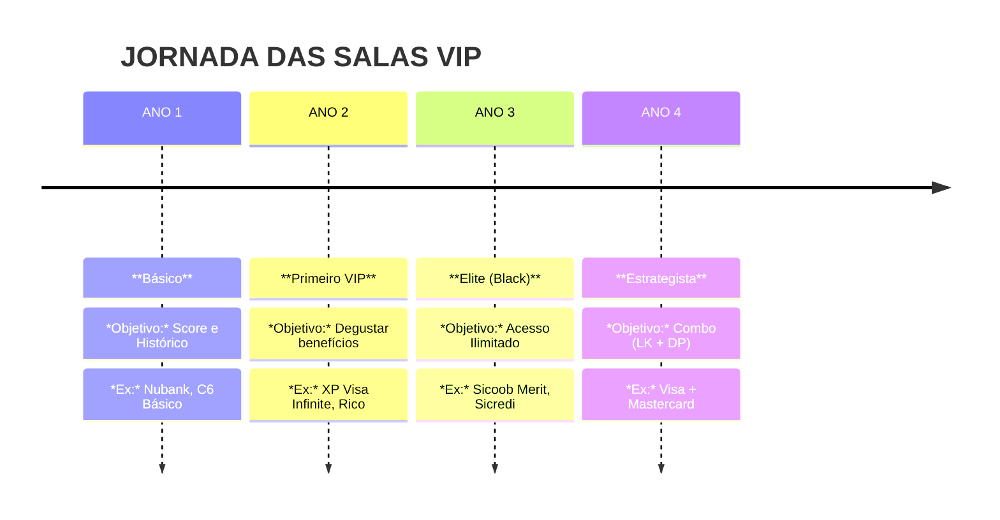
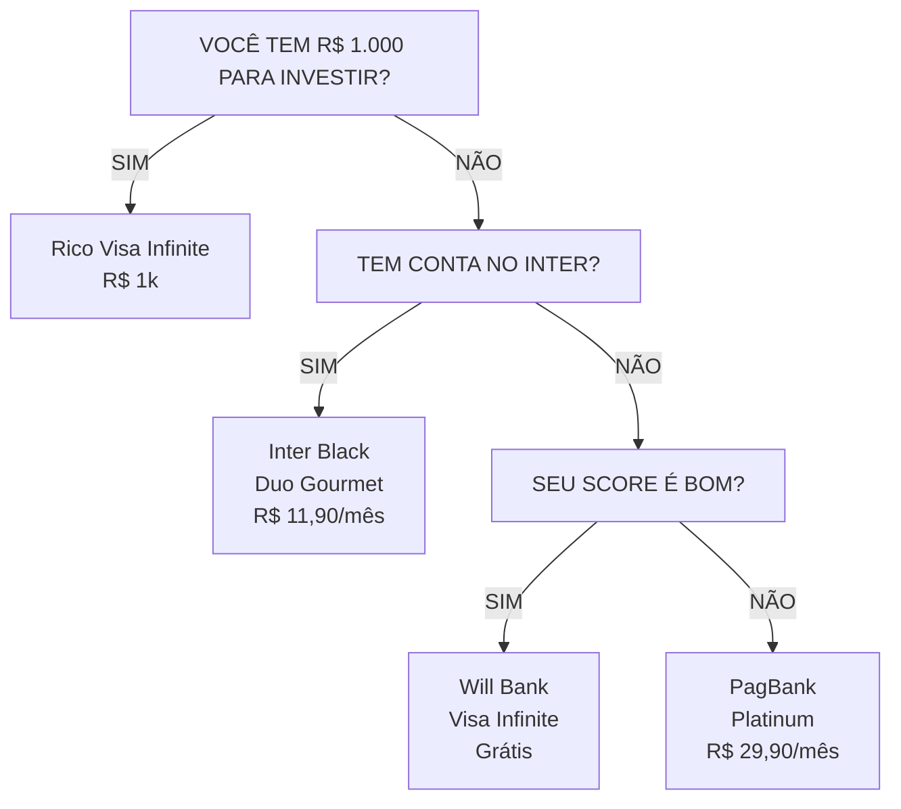
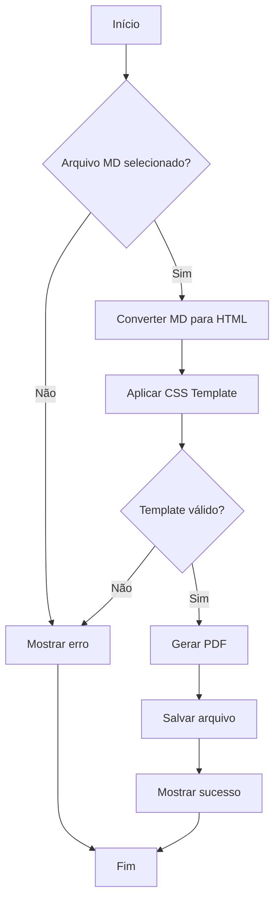
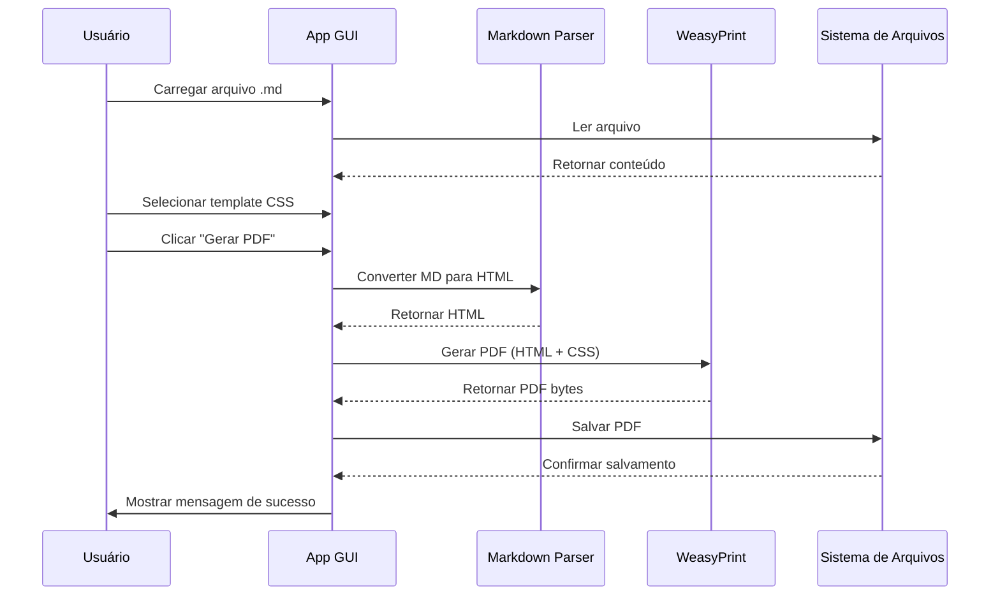
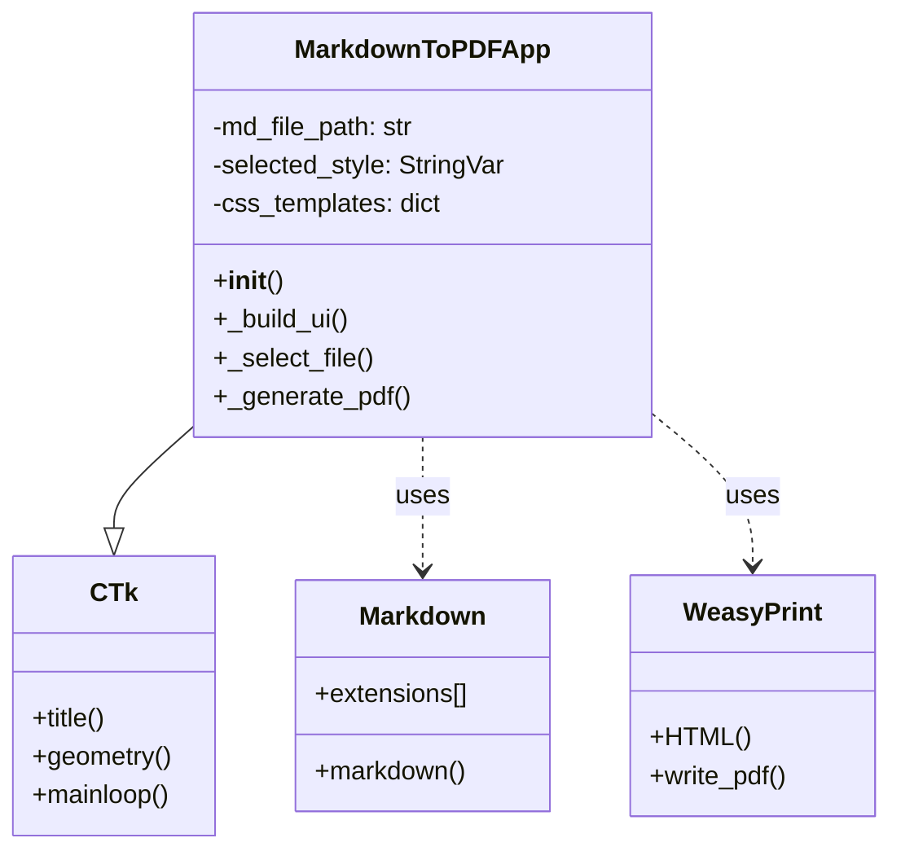
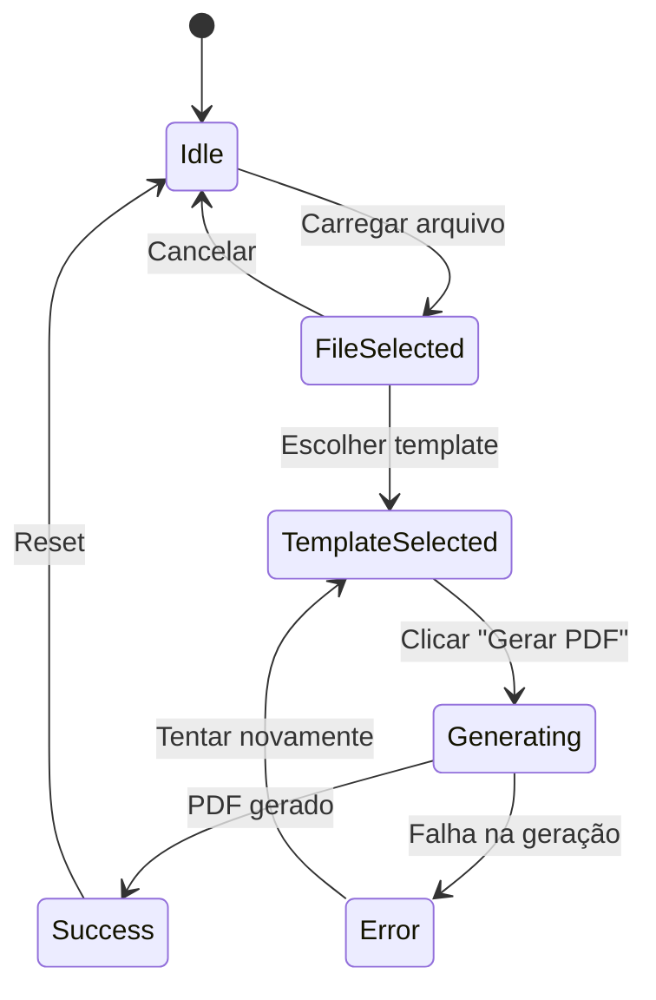
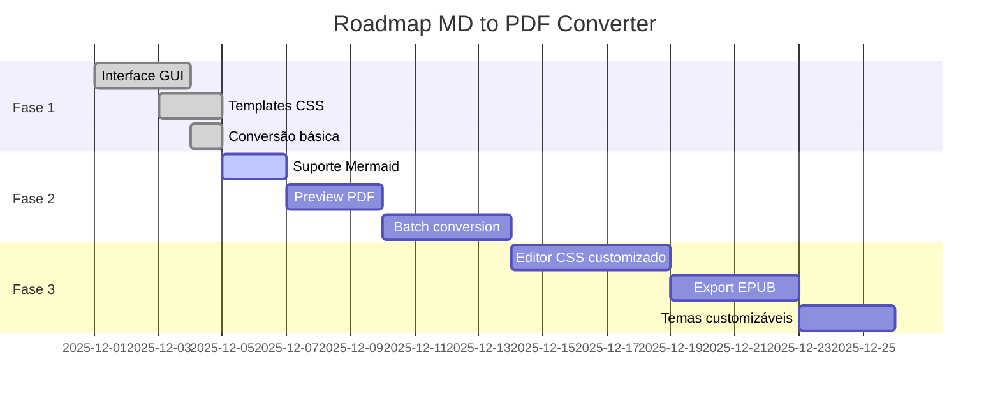
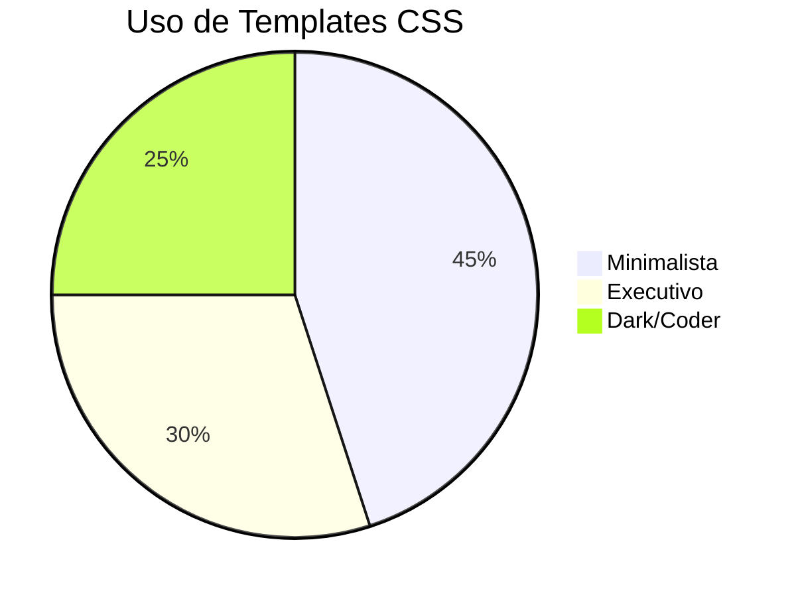
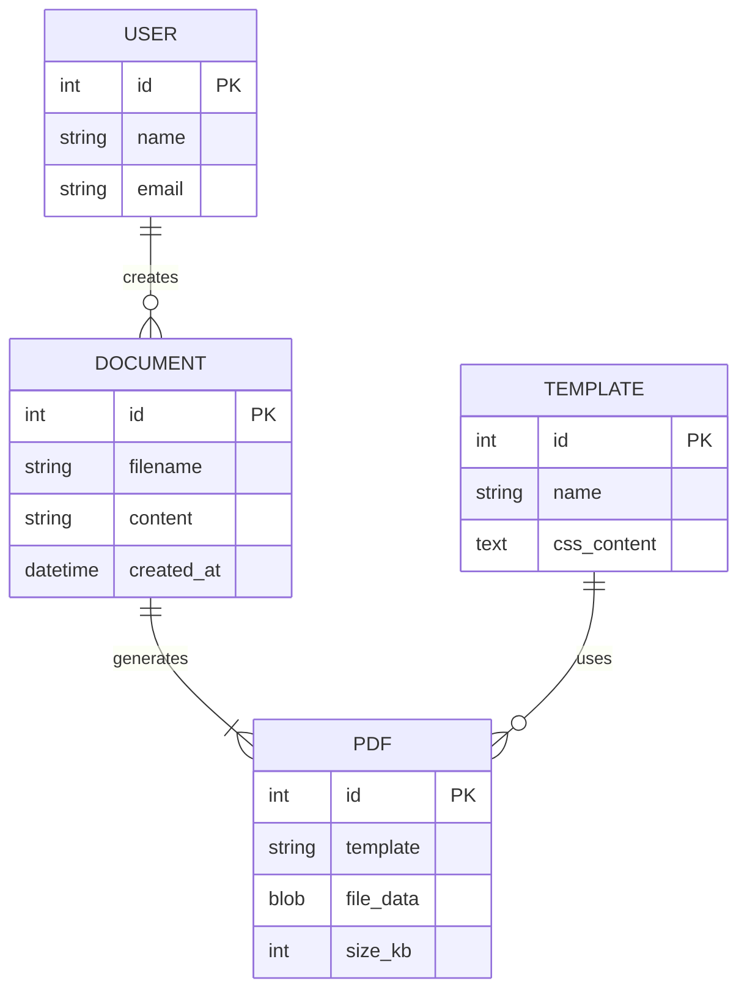
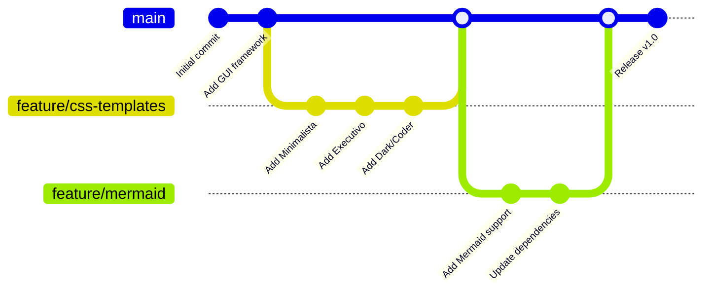

#### **Estratégia 3: O Calendário de Maximização**

Planeje o ANO INTEIRO de acessos.

**Exemplo de Planejamento**:

| Mês | Viagem | Aeroporto | Cartão a Usar | Motivo |
|---------|-------------|-------------|-------------|-------------|
| Mar | SP → RJ | GRU/SDU | Inter Black (ilimitado) | Viagem rápida, uso ilimitado |
| Jul | SP → Miami | GRU/MIA | XP Infinite (2/4 acessos) | Internacional, vale a pena |
| Set | SP → POA | GRU/POA | Inter Black (ilimitado) | Doméstico, uso ilimitado |
| Dez | SP → Orlando | GRU/MCO | C6 Carbon (4/4 acessos) | Último do ano, queimar acessos |

**Sacou a lógica?** Você PLANEJA onde vai usar cada acesso pra não desperdiçar.

### A Planilha Mestra (Template Completo)
#### 💳 ABA 1: Inventário de Cartões (O Arsenal)
*Onde você cadastra o que tem na carteira.*

| Cartão | 🏳️ Bandeira | 💎 Programa | 🔢 Acessos | 📅 Renovação | 💰 Anuidade | 🎯 Meta Isenção | Status |
|---------|-------------|-------------|-------------|-------------|-------------|-------------|-------------|
| **XP Visa Inf.** | Visa | Dragon Pass | 4 | 01/2026 | Grátis | R$ 5k Invest. | ✅ Ativo |
| **C6 Carbon** | Master | LoungeKey | Ilimitado | 06/2025 | 12x R$ 85 | R$ 50k Invest. | ⚠️ Atenção |
| **Inter Black** | Master | LoungeKey | 6 | 12/2025 | Grátis | Duo Gourmet | ✅ Ativo |

---

#### ✈️ ABA 2: Controle de Uso (O Gasto)
*Onde você registra cada entrada na sala VIP para não estourar a cota.*

| Data | 📍 Aeroporto | 🛋️ Lounge | 💳 Cartão Usado | 📉 Restantes | 📝 Obs |
|---------|-------------|-------------|-------------|-------------|-------------|
| 10/02 | GRU (T3) | Espaço Safra | XP Visa Inf. | **3** | Eu + 1 convidado |
| 15/05 | MIA | Turkish Lounge | C6 Carbon | **Ilim.** | Jantar ótimo |

---

# 📘 Guia Completo de Markdown para Ebook

## Introdução

Este é um **exemplo completo** de documento Markdown que demonstra *todas as funcionalidades* suportadas pelo conversor MD to PDF, incluindo **diagramas Mermaid** e elementos visuais avançados!

---

## Capítulo 1: Formatação de Texto


### Texto Básico

Este é um parágrafo simples com texto corrido. A aplicação MD to PDF Converter suporta formatação completa de texto, incluindo **negrito**, *itálico*, ***negrito e itálico***, e até mesmo ~~texto riscado~~.

Você também pode usar `código inline` para destacar comandos ou variáveis no meio do texto.

### Citações

> "A tecnologia é melhor quando aproxima as pessoas." - Matt Mullenweg

> Esta é uma citação em bloco que pode conter múltiplas linhas.
> Use-a para destacar informações importantes ou citações de referência.

### Notas e Alertas

> ⚠️ **ATENÇÃO:** Este é um alerta importante!

> 💡 **DICA:** Use esta formatação para destacar informações úteis.

> ✅ **SUCESSO:** Operação concluída com êxito!

> ❌ **ERRO:** Algo deu errado. Verifique os logs.

---

## Capítulo 2: Listas

### Lista Não Ordenada

- Item principal 1
- Item principal 2
  - Subitem 2.1
  - Subitem 2.2
    - Subitem 2.2.1
- Item principal 3

### Lista Ordenada

1. Primeiro passo
2. Segundo passo
3. Terceiro passo
   1. Subpasso 3.1
   2. Subpasso 3.2
4. Quarto passo

### Lista de Tarefas

- [x] Criar aplicação MD to PDF
- [x] Adicionar 3 templates CSS
- [x] Implementar interface gráfica
- [x] Adicionar suporte a Mermaid
- [ ] Adicionar preview em tempo real
- [ ] Suporte a múltiplos arquivos

### Lista de Definições

Python
: Linguagem de programação de alto nível, interpretada e multi-paradigma.

Markdown
: Linguagem de marcação leve para formatação de texto.

PDF
: Portable Document Format - formato de arquivo desenvolvido pela Adobe.

---

## Capítulo 3: Tabelas Avançadas

### Tabela Simples

| Recurso | Minimalista | Executivo | Dark/Coder |
|---------|-------------|-----------|------------|
| Fonte Base | Merriweather | Open Sans | Inter |
| Fundo | Branco | Branco | Escuro |
| Ideal para | Leitura | Negócios | Código |

### Tabela com Alinhamento

| Esquerda | Centro | Direita |
|:---------|:------:|--------:|
| Texto 1  | Texto 2 | Texto 3 |
| ABC      | DEF     | GHI     |
| 123      | 456     | 789     |

### Tabela Complexa com Formatação

| Feature | Status | Priority | Assignee | Notes |
|---------|:------:|:--------:|:--------:|-------|
| **Login System** | ✅ Done | 🔴 High | @dev1 | Completed in sprint 1 |
| **Dashboard** | 🚧 In Progress | 🟡 Medium | @dev2 | ETA: Next week |
| **Reports** | ⏳ Pending | 🟢 Low | @dev3 | Waiting for data |
| **API Integration** | ✅ Done | 🔴 High | @dev1 | v2.0 ready |

---

## Capítulo 4: Diagramas Mermaid

### Fluxograma de Processo



### Diagrama de Sequência



### Diagrama de Classes



### Diagrama de Estados



### Gráfico de Gantt (Roadmap)



### Diagrama de Pizza (Estatísticas)



### Diagrama ER (Entidade-Relacionamento)



### Git Graph



---

## Capítulo 6: Elementos Visuais Avançados

### Badges e Shields


### Emojis e Símbolos

#### Emojis Comuns
🎉 🚀 💻 📚 ✅ ❌ ⚠️ 💡 🔥 ⭐ 📄 🎯 🛠️ 📊 🌙 ☀️ 🌈

#### Símbolos Especiais
© ® ™ € $ ¥ £ § ¶ † ‡ • ◦ ▪ ▫ ► ◄ ▲ ▼ ← → ↑ ↓ ⇐ ⇒ ⇑ ⇓

#### Símbolos Matemáticos
∞ ± × ÷ ≠ ≈ ≤ ≥ ∑ ∏ √ ∫ ∂ ∇ α β γ δ ε θ λ μ π σ ω

#### Checkboxes e Status
☐ Pendente
☑ Parcialmente concluído
☒ Cancelado
✓ Concluído
✗ Falhou

### Texto com Formatação Especial

#### Subscrito e Sobrescrito (simulado)
H~2~O (água)
E = mc^2^ (fórmula de Einstein)

#### Texto Destacado
==Texto destacado em amarelo==
^^Texto sublinhado^^

#### Abreviações
HTML
CSS
JSON
XML

*[HTML]: HyperText Markup Language
*[CSS]: Cascading Style Sheets
*[JSON]: JavaScript Object Notation
*[XML]: eXtensible Markup Language

---

## Capítulo 7: Links e Referências

### Links Externos

- [Documentação Python](https://docs.python.org/3/)
- [CustomTkinter GitHub](https://github.com/TomSchimansky/CustomTkinter)
- [WeasyPrint Docs](https://doc.courtbouillon.org/weasyprint/)
- [Markdown Guide](https://www.markdownguide.org/)
- [Mermaid Documentation](https://mermaid.js.org/)

### Links com Título

Visite a [documentação oficial do Markdown](https://www.markdownguide.org/ "Guia Completo de Markdown") para aprender mais.

### Links de Referência

Este é um [link de referência][1] e este é [outro link][doc-oficial].

[1]: https://www.python.org "Python Official"
[doc-oficial]: https://www.markdownguide.org "Markdown Guide"

### Links Internos (Âncoras)

- [Voltar para Introdução](#introdução)
- [Ir para Diagramas Mermaid](#capítulo-4-diagramas-mermaid)
- [Ver Tabelas](#capítulo-3-tabelas-avançadas)

### URLs Automáticos

https://www.github.com
https://www.python.org
contact@example.com

---

## Capítulo 8: Notas de Rodapé

Este texto tem uma nota de rodapé[^1] e outra nota[^nota-importante].

Markdown é fantástico[^2] para documentação técnica.

[^1]: Esta é a primeira nota de rodapé com informações adicionais.
[^nota-importante]: Esta nota contém informações críticas sobre o funcionamento do sistema.
[^2]: Criado por John Gruber em 2004.

---

## Capítulo 9: Imagens Avançadas

### Imagem Simples


### Imagem com Título


### Imagem Alinhada

<div align="center">


*Legenda: Imagem centralizada com legenda*

</div>

### Múltiplas Imagens

| Minimalista | Executivo | Dark/Coder |
|:-----------:|:---------:|:----------:|
|  |  |  |

---

## Capítulo 10: Elementos HTML Inline

### Botões Simulados

<button style="background: #3498db; color: white; padding: 10px 20px; border: none; border-radius: 5px; cursor: pointer;">
Clique Aqui
</button>

### Detalhes Colapsáveis

<details>
<summary>📖 Clique para expandir: Informações Técnicas</summary>

Este é um bloco de conteúdo colapsável que fica oculto até o usuário clicar.

Pode conter **qualquer tipo de Markdown**:
- Listas
- Código
- Tabelas
- Etc.

```python
def hello():
    print("Conteúdo expandido!")
```

</details>

### Tags Coloridas

<span style="background: #2ecc71; color: white; padding: 2px 8px; border-radius: 3px;">NOVO</span>
<span style="background: #e74c3c; color: white; padding: 2px 8px; border-radius: 3px;">IMPORTANTE</span>
<span style="background: #f39c12; color: white; padding: 2px 8px; border-radius: 3px;">EM BREVE</span>

### Linha Horizontal Estilizada

---

<hr style="border: 2px solid #3498db; border-radius: 2px;">

---

## Capítulo 11: Comparativo Final de Templates

### Análise Detalhada

| Critério | 📖 Minimalista | 💼 Executivo | 🌙 Dark/Coder |
|----------|---------------|-------------|---------------|
| **Uso Principal** | Livros, E-books | Relatórios, Propostas | Docs Técnicas, Código |
| **Fonte Base** | Merriweather (serifada) | Open Sans (sans-serif) | Inter + Fira Code |
| **Fundo** | Branco puro | Branco | Escuro (#0d1117) |
| **Margens** | 80px (generosas) | 70px | 60px |
| **Legibilidade** | ⭐⭐⭐⭐⭐ | ⭐⭐⭐⭐ | ⭐⭐⭐⭐⭐ (tela) |
| **Impressão** | ⭐⭐⭐⭐⭐ | ⭐⭐⭐⭐⭐ | ⭐⭐ |
| **Código** | ⭐⭐⭐ | ⭐⭐⭐⭐ | ⭐⭐⭐⭐⭐ |
| **Tabelas** | ⭐⭐⭐ | ⭐⭐⭐⭐⭐ | ⭐⭐⭐⭐ |

### Recomendações por Caso de Uso

#### 📖 Use Minimalista para:
- Romance, ficção, literatura
- Teses e dissertações acadêmicas
- Manuais técnicos impressos
- Livros didáticos
- Poesia e prosa

#### 💼 Use Executivo para:
- Relatórios anuais corporativos
- Propostas comerciais
- Business plans
- White papers
- Apresentações formais

#### 🌙 Use Dark/Coder para:
- Tutoriais de programação
- Documentação de API
- Livros de código (code books)
- Guides técnicos
- Markdown para leitura em tela/tablet

---

## Conclusão

Este guia demonstrou **TODAS** as funcionalidades avançadas do **MD to PDF Converter**:

✅ Formatação de texto completa
✅ Listas de todos os tipos
✅ Tabelas complexas com alinhamento
✅ **10 tipos de diagramas Mermaid**
✅ Blocos de código com syntax highlighting (7 linguagens)
✅ Elementos visuais avançados
✅ Links, imagens e referências
✅ Notas de rodapé
✅ HTML inline
✅ Badges e emojis

### Próximos Passos

1. ✅ Carregue este arquivo na aplicação
2. ✅ Teste os 3 templates CSS
3. ✅ Compare os PDFs gerados
4. ✅ Escolha o template ideal
5. ✅ Converta seus próprios documentos!

---

## Estatísticas deste Documento

| Métrica | Valor |
|---------|-------|
| **Palavras** | ~3.500 |
| **Linhas de código** | 250+ |
| **Capítulos** | 11 |
| **Tabelas** | 10 |
| **Diagramas Mermaid** | 7 |
| **Blocos de código** | 8 |
| **Imagens** | 4 |
| **Links** | 15+ |

---

**Desenvolvido com ❤️ usando Python + CustomTkinter + WeasyPrint + Mermaid**

*Data de criação: 2025-12-05*
*Versão: 2.0 - Extended Edition*

---

> 💡 **Dica Final:** Este documento serve como template completo. Use-o como base para criar seus próprios ebooks profissionais com todos os recursos visuais do Markdown moderno!

**Fim do Documento** ✨🚀
