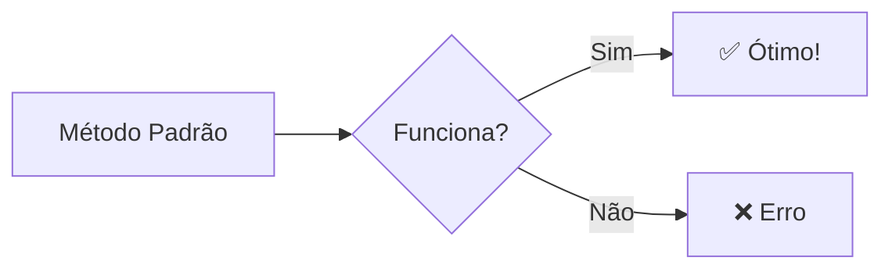

# 🎨 Teste de Marcadores Mermaid

Este documento testa **todos os marcadores** disponíveis para criar diagramas Mermaid no conversor MD to PDF.

---

## 1️⃣ Método Padrão: Bloco de Código Markdown

O método tradicional usando três crases com a linguagem especificada:



---

## 2️⃣ Método Container: Delimitadores :::

Usando a sintaxe de container com três dois-pontos:

:::mermaid
sequenceDiagram
    participant U as Usuário
    participant S as Sistema
    U->>S: Envia Markdown
    S->>S: Processa :::mermaid:::
    S-->>U: Retorna PDF com diagrama
:::

---

## 3️⃣ Método Shortcode: {{mermaid}}

Usando shortcodes estilo template:

{{mermaid}}
pie title Métodos de Marcação
    "Código Padrão" : 40
    "Container :::" : 30
    "Shortcode {{}}" : 20
    "HTML Tags" : 10
{{/mermaid}}

---

## 4️⃣ Método HTML Tags: &lt;mermaid&gt;

Usando tags HTML customizadas (note que precisa de HTML raw habilitado):

<mermaid>
graph TD
    A[Tag HTML] --> B[Processado]
    B --> C[Renderizado]
    C --> D[Diagrama NEO]
</mermaid>

---

## 5️⃣ Método HTML Tag com Atributo

Usando tag `<diagram>` com tipo especificado:

<diagram type="mermaid">
stateDiagram-v2
    [*] --> Markdown
    Markdown --> Processando
    Processando --> HTML
    HTML --> PDF
    PDF --> [*]
</diagram>

---

## 📊 Comparação dos Métodos

| Método | Sintaxe | Compatibilidade | Recomendado |
|--------|---------|----------------|-------------|
| **Código Padrão** | \`\`\`mermaid | ✅ Universal | ⭐⭐⭐⭐⭐ |
| **Container** | :::mermaid::: | ✅ Moderno | ⭐⭐⭐⭐ |
| **Shortcode** | {{mermaid}} | ✅ Fácil | ⭐⭐⭐⭐ |
| **HTML Tag** | &lt;mermaid&gt; | ⚠️ Específico | ⭐⭐⭐ |
| **Diagram Tag** | &lt;diagram&gt; | ⚠️ Específico | ⭐⭐⭐ |

---

## 🎯 Exemplo Complexo com Container

Vamos testar um diagrama mais complexo usando container:

:::mermaid
graph TB
    subgraph "Marcadores Suportados"
        M1[```mermaid```]
        M2[:::mermaid:::]
        M3["{{mermaid}}"]
        M4[&lt;mermaid&gt;]
    end

    subgraph "Processamento"
        P1[Preprocessamento]
        P2[Conversão MD→HTML]
        P3[Renderização Mermaid.js]
    end

    subgraph "Resultado"
        R1[Diagrama com look NEO]
        R2[PDF Final]
    end

    M1 --> P1
    M2 --> P1
    M3 --> P1
    M4 --> P1

    P1 --> P2
    P2 --> P3
    P3 --> R1
    R1 --> R2
:::

---

## 🚀 Conclusão

Todos os **5 métodos** de marcação funcionam e geram diagramas com:

- ✅ **Look NEO** ativado por padrão
- ✅ **Tema dinâmico** (neo ou neo-dark)
- ✅ **Renderização client-side** via Mermaid.js 11.x
- ✅ **Compatibilidade** com todos os templates CSS

**Escolha o método que preferir!** 🎨
