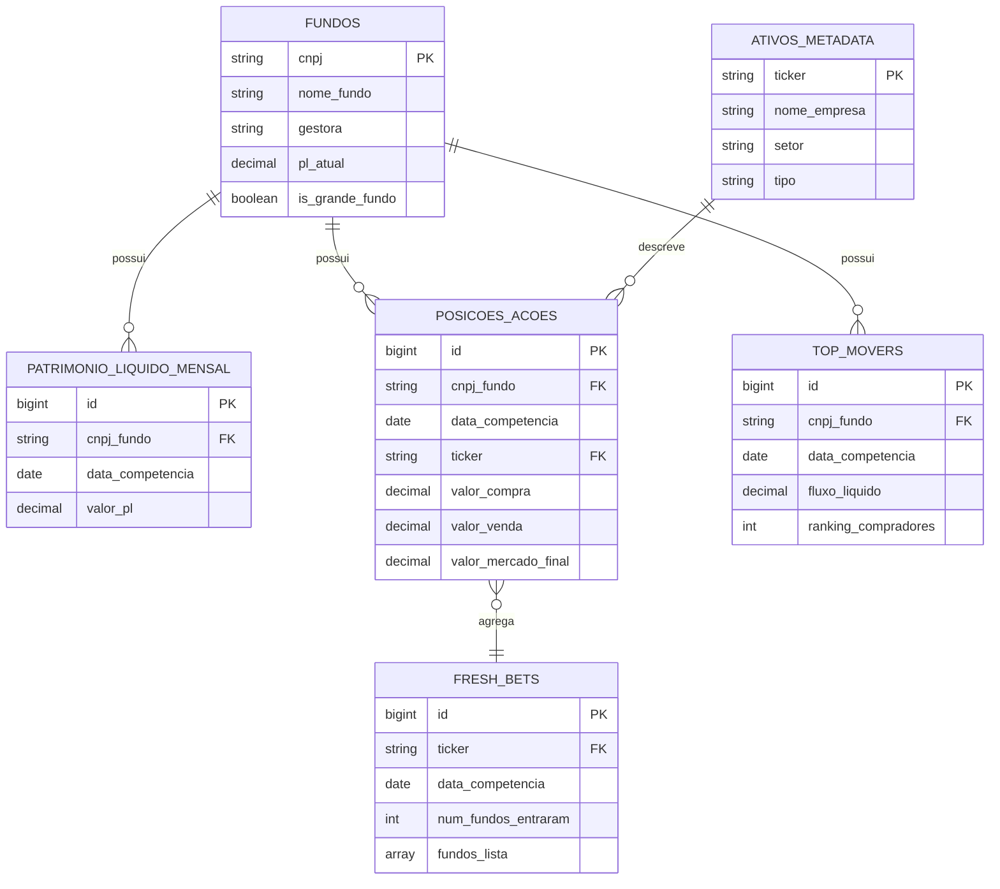

# 🏗️ Arquitetura de Dados - Radar Institucional

Documentação da estrutura de dados, fluxo ETL e decisões arquiteturais.

---

## 📊 Diagrama Entidade-Relacionamento (ER)



---

## 🔄 Fluxo de Dados (ETL Pipeline)

### Visão Geral

```
┌─────────────┐
│  CVM        │
│  (CSV raw)  │  ← Fonte de dados (mensal)
└──────┬──────┘
       │
       ▼
┌─────────────┐
│  EXTRAÇÃO   │  1. Ler CSVs
│  (Python)   │  2. Detectar encoding
└──────┬──────┘  3. Validar schema
       │
       ▼
┌─────────────┐
│  LIMPEZA    │  4. Corrigir encoding
│  (Python)   │  5. Normalizar dados
└──────┬──────┘  6. Converter tipos
       │
       ▼
┌─────────────┐
│  FILTROS    │  7. Apenas ações
│  (Python)   │  8. Grandes fundos
└──────┬──────┘  9. Posições relevantes
       │
       ▼
┌─────────────┐
│  AGREGAÇÃO  │  10. Top Movers
│  (Python)   │  11. Fresh Bets
└──────┬──────┘  12. Popularidade
       │
       ▼
┌─────────────┐
│  CARGA      │  13. Upload Supabase
│  (Batch)    │  14. Upsert em lotes
└──────┬──────┘  15. Validação
       │
       ▼
┌─────────────┐
│  SUPABASE   │  ← Armazenamento final
│  (PostgreSQL│
└─────────────┘
```

### Detalhamento por Fase

#### 1. EXTRAÇÃO

**Input:** Arquivos CSV da CVM
- `cda_fi_BLC_1_202510.csv` até `cda_fi_BLC_8_202510.csv` (balancetes)
- `cda_fi_PL_202510.csv` (patrimônio líquido)

**Processamento:**
- Auto-detecção de encoding (chardet)
- Leitura com pandas (separador `;`)
- Concatenação de múltiplos BLCs

**Output:** DataFrames brutos

**Volume:** ~591k linhas (balancetes) + ~25k linhas (PL)

---

#### 2. LIMPEZA

**Operações:**
```python
# CNPJs
'00.017.024/0001-53' → '00017024000153'

# Datas
'31/10/2025' → '2025-10-31'

# Valores
'1.234,56' → 1234.56

# Encoding
'T�tulos P�blicos' → 'Títulos Públicos'
```

**Output:** DataFrames limpos e tipados

---

#### 3. FILTROS

**Pipeline de redução:**
```
591k linhas (total)
  ↓ Filtro: Apenas 'Ações'
412k linhas (-30%)
  ↓ Filtro: Grandes fundos (PL > R$ 50M)
165k linhas (-60%)
  ↓ Filtro: Tipos válidos (ON, PN, Units)
148k linhas (-10%)
  ↓ Filtro: Posições relevantes (> R$ 100k)
~50k linhas (-67%)
```

**Redução total: ~91%**

**Output:** DataFrame filtrado para o MVP

---

#### 4. AGREGAÇÕES

**Top Movers:**
```sql
SELECT
    cnpj_fundo,
    SUM(valor_compra) as total_compras,
    SUM(valor_venda) as total_vendas,
    (total_compras - total_vendas) as fluxo_liquido,
    RANK() OVER (ORDER BY fluxo_liquido DESC) as ranking
FROM posicoes_acoes
GROUP BY cnpj_fundo
```

**Fresh Bets (requer 2 meses):**
```python
# Comparar mês atual vs anterior
novas_entradas = (
    (qtd_mes_atual > 0) & (qtd_mes_anterior == 0)
)

# Agrupar por ticker
consenso = novas_entradas.groupby('ticker').agg({
    'cnpj_fundo': 'count',  # Num fundos
    'valor': 'sum'           # Volume
})
```

**Output:** Tabelas agregadas prontas para upload

---

#### 5. CARGA

**Estratégia de Upload:**
1. **Upsert** (INSERT ... ON CONFLICT UPDATE)
2. **Lotes de 1000** registros
3. **Retry** automático (3 tentativas)
4. **Ordem de dependência:**
   - fundos (dimensão)
   - ativos_metadata (dimensão)
   - patrimonio_liquido_mensal
   - posicoes_acoes (maior volume)
   - top_movers
   - fresh_bets

**Performance:**
- ~50k registros em 2-4 minutos
- Paralelização possível (futuro)

---

## 🗄️ Modelo de Dados Estrela (Star Schema)

```
         ┌──────────────┐
         │   ATIVOS     │
         │  (dimensão)  │
         └──────┬───────┘
                │
                │
         ┌──────▼───────┐
         │   POSICOES   │  ◄─────┐
         │    (fato)    │        │
         └──────┬───────┘        │
                │                │
    ┌───────────┴───────────┐    │
    │                       │    │
┌───▼───┐            ┌──────▼────▼───┐
│FUNDOS │            │   PL MENSAL   │
│(dim)  │            │   (dimensão)  │
└───────┘            └───────────────┘
```

**Tabelas de Fato:**
- `posicoes_acoes` - Principal (150k linhas/mês)
- `top_movers` - Agregada (~300 linhas/mês)
- `fresh_bets` - Agregada (~50 linhas/mês)

**Tabelas de Dimensão:**
- `fundos` - Cadastro de fundos (~300 únicos)
- `ativos_metadata` - Info dos ativos (~500 únicos)
- `patrimonio_liquido_mensal` - PL mensal (~900 linhas/3 meses)

---

## 🎯 Decisões Arquiteturais

### 1. Por que Pré-calcular Agregações?

**Problema:** Calcular Top Movers em tempo real = query complexa em 150k linhas

**Solução:** Calcular no ETL, armazenar em `top_movers`

**Trade-offs:**
- ✅ Queries super rápidas no frontend (<50ms)
- ✅ Carga no servidor reduzida
- ❌ Dados duplicados (posições + top_movers)
- ❌ Mais espaço no banco (~5%)

**Conclusão:** Vale a pena. Performance > armazenamento.

---

### 2. Por que UPSERT em vez de INSERT?

**Contexto:** Dados da CVM podem ser atualizados

**Solução:** `ON CONFLICT UPDATE` permite reprocessar meses anteriores

**Vantagens:**
- ✅ Correções de dados retroativas
- ✅ Reprocessamento sem duplicatas
- ✅ Idempotência (executar 2x = mesmo resultado)

---

### 3. Por que Filtrar no ETL em vez do Banco?

**Opção A:** Upload tudo → Filtrar com WHERE no SELECT
**Opção B:** Filtrar no ETL → Upload só o necessário

**Escolha:** Opção B

**Razões:**
- ✅ Reduz 91% do volume de dados
- ✅ Menor uso de storage (grátis: 500MB)
- ✅ Queries mais rápidas
- ❌ Menos flexível (mudar filtro = reprocessar)

**Conclusão:** Para MVP, vale a pena.

---

### 4. Por que Array em `fresh_bets.fundos_lista`?

**Alternativa:** Tabela normalizada `fresh_bets_fundos`

**Escolha:** Array PostgreSQL

**Razões:**
- ✅ Menos JOINs (performance)
- ✅ Mais simples para o MVP
- ✅ Supabase tem bom suporte a arrays
- ❌ Menos relacional

**Uso:**
```sql
SELECT * FROM fresh_bets
WHERE '00017024000153' = ANY(fundos_lista);
```

---

## 📈 Estimativas de Volume

### Por Período

| Período | Posições | Top Movers | Fresh Bets |
|---------|----------|------------|------------|
| 1 mês | ~50k | ~300 | ~50 |
| 3 meses | ~150k | ~900 | ~150 |
| 12 meses | ~600k | ~3.6k | ~600 |

### Tamanho em Disco

| Tabela | 1 mês | 3 meses | 12 meses |
|--------|-------|---------|----------|
| posicoes_acoes | ~15 MB | ~45 MB | ~180 MB |
| top_movers | ~50 KB | ~150 KB | ~600 KB |
| fresh_bets | ~10 KB | ~30 KB | ~120 KB |
| **Total** | ~20 MB | ~60 MB | ~240 MB |

**Conclusão:** Cabe no free tier do Supabase (500 MB) com folga.

---

## 🔐 Segurança e RLS (Row Level Security)

### Políticas Implementadas

**Leitura Pública (MVP):**
```sql
CREATE POLICY "public_read" ON posicoes_acoes
  FOR SELECT USING (true);
```

**Escrita Restrita:**
- Apenas service_role key (backend ETL)
- Nenhum usuário pode escrever via frontend

### Futuro (Autenticação)

```sql
-- Exemplo: Usuários premium veem mais dados
CREATE POLICY "premium_access" ON posicoes_acoes
  FOR SELECT
  USING (
    auth.jwt()->>'subscription' = 'premium'
    OR data_competencia >= NOW() - INTERVAL '1 month'
  );
```

---

## ⚡ Otimizações de Performance

### 1. Índices Estratégicos

```sql
-- Query mais comum: filtrar por data
CREATE INDEX idx_posicoes_data ON posicoes_acoes(data_competencia);

-- Drill-down em fundos
CREATE INDEX idx_posicoes_fundo_data ON posicoes_acoes(cnpj_fundo, data_competencia);

-- Busca de ações
CREATE INDEX idx_posicoes_ticker ON posicoes_acoes(ticker);
```

**Impacto:** Queries 10-100x mais rápidas

---

### 2. Particionamento (Futuro)

**Quando:** >1M de registros

**Estratégia:**
```sql
CREATE TABLE posicoes_acoes (
    ...
) PARTITION BY RANGE (data_competencia);

CREATE TABLE posicoes_2025_01 PARTITION OF posicoes_acoes
    FOR VALUES FROM ('2025-01-01') TO ('2025-02-01');
```

---

### 3. Materializedviews (Futuro)

**Exemplo:**
```sql
CREATE MATERIALIZED VIEW mv_ativos_populares AS
SELECT
    ticker,
    COUNT(DISTINCT cnpj_fundo) as num_fundos,
    SUM(valor_mercado_final) as volume
FROM posicoes_acoes
WHERE data_competencia = (SELECT MAX(data_competencia) FROM posicoes_acoes)
GROUP BY ticker;

-- Refresh diário
REFRESH MATERIALIZED VIEW mv_ativos_populares;
```

---

## 🧪 Qualidade de Dados

### Validações Implementadas

**No ETL:**
- ✅ Schema correto (colunas obrigatórias)
- ✅ CNPJs válidos (14 dígitos)
- ✅ Valores numéricos não-nulos
- ✅ Datas válidas
- ✅ Sem duplicatas

**Pós-Upload:**
- ✅ Contagem de registros (origem = destino)
- ✅ Integridade referencial
- ✅ Somas agregadas conferem

### Métricas de Qualidade

```sql
-- Fundos órfãos (erro de FK)
SELECT COUNT(*) FROM posicoes_acoes pa
LEFT JOIN fundos f ON pa.cnpj_fundo = f.cnpj
WHERE f.cnpj IS NULL;
-- Esperado: 0

-- Soma de fluxos deve ser ~0
SELECT SUM(fluxo_liquido) FROM top_movers
WHERE data_competencia = '2025-10-31';
-- Esperado: Próximo de 0 (compras = vendas)
```

---

## 🔄 Atualização de Dados

### Frequência

- **CVM publica:** Mensalmente (dia 15 do mês seguinte)
- **ETL executa:** Manualmente (usuário decide quando)
- **Frontend:** Sempre mostra dados mais recentes no banco

### Processo de Atualização

```bash
# 1. Baixar novos dados da CVM
wget https://dados.cvm.gov.br/.../cda_fi_BLC_1_202511.csv

# 2. Executar ETL
python main.py
> [1] Processar arquivos CVM
> [2] Upload para Supabase

# 3. Frontend detecta automaticamente
# Busca: SELECT DISTINCT data_competencia FROM posicoes_acoes;
```

---

## 📊 Monitoramento

### Métricas para Acompanhar

```sql
-- 1. Volume de dados
SELECT
    'posicoes_acoes' as tabela,
    COUNT(*) as registros,
    pg_size_pretty(pg_total_relation_size('posicoes_acoes')) as tamanho
FROM posicoes_acoes;

-- 2. Últimos uploads
SELECT
    data_competencia,
    COUNT(*) as registros,
    created_at
FROM posicoes_acoes
GROUP BY data_competencia, DATE(created_at)
ORDER BY created_at DESC;

-- 3. Performance de queries
SELECT
    query,
    calls,
    mean_exec_time,
    max_exec_time
FROM pg_stat_statements
ORDER BY mean_exec_time DESC
LIMIT 10;
```

---

## 🚀 Escalabilidade

### Limites Atuais (MVP)

- **Registros:** ~600k (12 meses)
- **Storage:** ~240 MB
- **Queries/dia:** <10k
- **Usuários:** <100

### Quando Escalar?

**Sinais:**
- Storage > 400 MB (80% do limite)
- Queries lentas (>500ms)
- Usuários > 1.000

**Soluções:**
1. Upgrade Supabase (Pro: $25/mês, 8GB)
2. Particionamento de tabelas
3. Cache (Redis)
4. CDN para assets estáticos

---

**Fim da Arquitetura de Dados**
